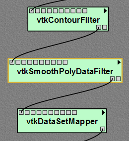
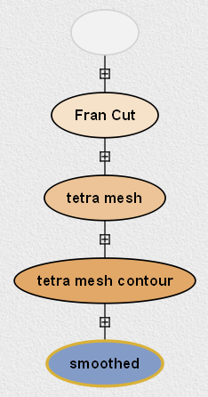
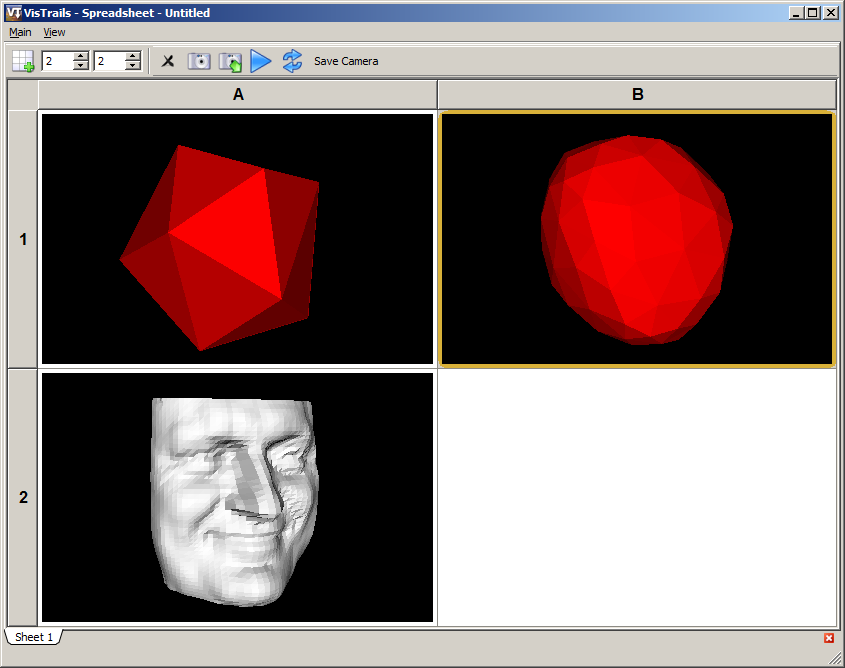
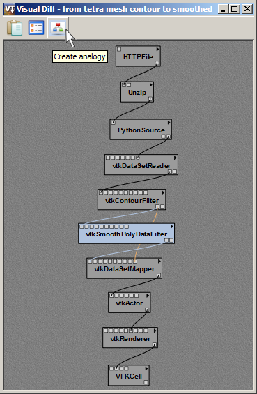
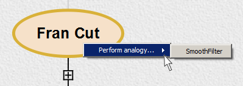
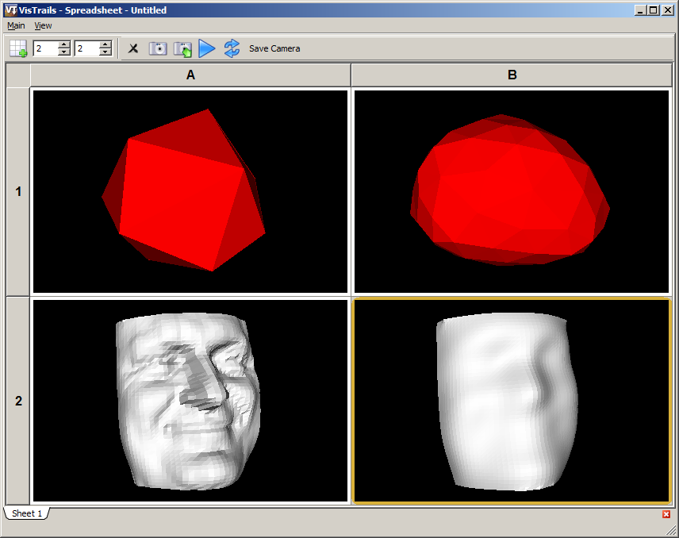
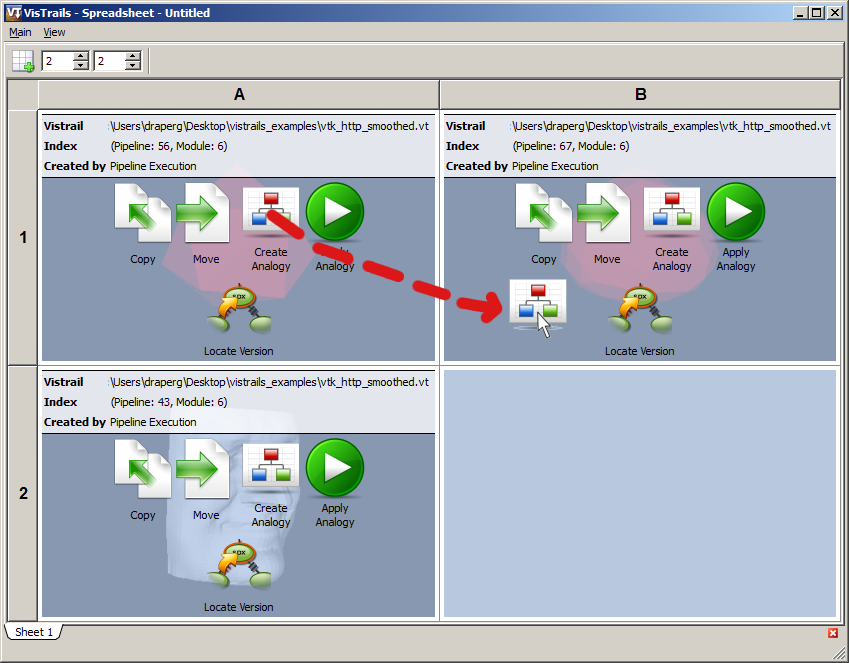
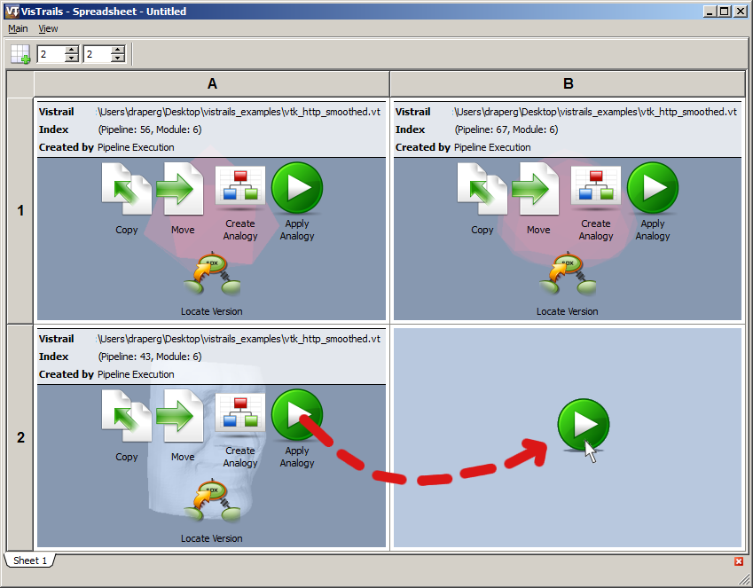

.. _chap-analogies:

***************************************
Using Analogies to Update Workflows
***************************************

.. index:: analogy

In Chapter :ref:`chap-version_tree`, we saw how the provenance data maintained by |vistrails| allows you to compare different versions of a workflow. In Chapter :ref:`chap-querying`, you learned how this same provenance information forms the basis of an elegant Query by Example mechanism, letting you find all versions of a workflow that match a given arrangement of modules. In this chapter, we will see yet another benefit of the |vistrails| provenance architecture. Through a process we call *visualization by analogy*, you can reuse pipeline information to create new visualizations semi-automatically without directly editing the workflow.

Visualization by Analogy
========================

The main idea behind visualization by analogy is as follows. Given two versions of a workflow (called the "source" and "target" versions, respectively), |vistrails| can automatically find the differences between them and apply those differences to another (potentially unrelated) workflow. This powerful feature lets you create a new visualization without having to add or remove modules to/from the pipeline. |vistrails| takes care of these details for you behind the scenes.

There are two distinct user interfaces for constructing visualizations by analogy. In the first, you set up the analogy in the ``Visual Diff`` window. In the second, you interact with the Spreadsheet. Both ways are logically equivalent, and which method you use will be largely a matter of personal preference.

Before explaining either approach, however, let's first set up the vistrail that we'll be using as a running example in this chapter.

.. topic:: Try it now!

   Open the "vtk\_http.vt" vistrail, located in the examples directory of the |vistrails| distribution. If the ``tetra mesh contour`` version is not selected, go to the ``History`` view and select it. This will be our "source" workflow. Execute this workflow, and take a look at the resultant visualization in the Spreadsheet.

   We will now create our "target" workflow.  Switch to the ``Pipeline`` view and add a new module, ``vtkSmoothPolyDataFilter`` between the ``vtkContourFilter`` and ``vtkDataSetMapper`` modules. Your modified pipeline should resemble the one shown in Figure :ref:`Modified pipeline for use in our example <fig-analogy_setupa>`.

   Next, let's adjust some of the parameters for the new module. Select the ``vtkSmoothPolyDataFilter`` module. In the ``Module Information`` panel, select ``SetNumberOfIterations`` and type 20 in the input box. Then, select ``SetRelaxationFactor`` enter 0.5. Now, execute this workflow, and compare the two results in the Spreadsheet.

   Return to the ``History`` view, and give your new version a meaningful tag such as ``smoothed`` (Figure :ref:`Corresponding version tree <fig-analogy_setupb>`). Finally, select the ``Fran Cut`` version and execute it too. Your spreadsheet should now resemble the one shown in Figure :ref:`Analogy example... <fig-analogy_spreadsheet1>`.

.. %\begin{figure}
.. %\centering
.. %\includegraphics[width=2in,clip=false]{analogy_setup.png}
.. %\caption{Modified pipeline for use in our example.}
.. %\label{fig-analogy_setup}
.. %\end{figure}

.. fig-analogy_setup

.. _fig-analogy_setupa:

   Modified pipeline for use in our example.

.. _fig-analogy_setupb:

   Corresponding version tree.

.. _fig-analogy_spreadsheet1:

   Analogy example - \(top left\) Original tetrahedral mesh model. \(top right\) Smoothed tetrahedral mesh. \(bottom left\) "Fran Cut" model.

Using the Visual Diff Window
============================

.. index:: 
   pair: analogy; visual diff

By creating an analogy, you're telling |vistrails| to analyze and store the differences between the "source" and "target" versions of a workflow.  Then when you apply that analogy to another (perhaps completely different) version of the workflow, |vistrails| attempts to make similar types of changes to this other workflow.

One way to create an analogy is to run a ``Visual Diff`` between the "source" and "target" workflows. Recall from Chapter :ref:`chap-version_tree` that to perform a ``Visual Diff`` between two versions of a workflow, you need to drag the icon for one version atop the icon for the other. However, in the case of analogies, the sequence is important. In order for the analogy to work correctly, the icon for the *source* version of the workflow must be dragged atop the icon for the *target* version (not vice versa).

In the toolbar of the ``Diff Properties`` window, there is a button whose tooltip is labeled ``Create Analogy`` (Figure :ref:`Click the Create Analogy button... <fig-analogy_diff>`).  Clicking the ``Create Analogy`` will open up a dialog that lets you give this analogy a descriptive name. 
Once the analogy has a name, you can then apply it to any version of the workflow. This is done by returning to the ``History`` view, and selecting then right-clicking the version you want to apply the analogy to. A menu will appear, showing you a list of available analogies. Choose the one you want, and |vistrails| will attempt to apply the selected analogy to this version of the workflow.

.. _fig-analogy_diff:

   Click the ``Create Analogy`` button in the ``Diff Properties`` window to create a named analogy.

.. topic:: Try it now!

   In the ``History`` view, drag the ``tetra mesh contour`` icon (the "source" version) atop the ``smoothed`` icon (the "target" version). A ``Visual Diff`` window will open. Click the ``Create Analogy`` button in the toolbar and then choose a name for this analogy, for example "SmoothFilter."  Close the  ``Visual Diff`` window. Select the ``Fran Cut`` icon in the ``History`` view so that it is highlighted, then right-click to access the ``Perform analogy`` menu. Choose the name of the analogy you just made (Figure :ref:`Access the Perform analogy menu by right-clicking... <fig-analogy_menu>`). A new version icon will appear as a child of the current icon. Select the new icon, and click ``Execute`` to run this new version of the workflow. The resulting visualization will appear in the Spreadsheet (Figure :ref:`Result of applying a smoothing analogy to a different workflow <fig-analogy_spreadsheet2>`).

.. _fig-analogy_menu:

   Access the ``Perform analogy`` menu by right-clicking on a selected icon in the version tree.

.. _fig-analogy_spreadsheet2:

   Result of applying a smoothing analogy to a different workflow.

Using the Spreadsheet
=====================

You can also create and apply analogies directly in the Spreadsheet, without the use of the ``Visual Diff`` window. The Spreadsheet uses a simple "drag and drop" interface to manipulate analogies, and many users find it simpler to work with than the method described above. The drawback is that the Spreadsheet does not allow you to name your analogies like the ``Visual Diff`` window does.

The Spreadsheet must be in Editing Mode in order to use analogies. Please refer to Chapter :ref:`chap-spreadsheet` for more information about the Spreadsheet's modes. Identify the two cells representing the "source" and "target" visualizations for which you wish to create an analogy. Drag the ``Create Analogy`` icon *from* the "source" *to* the "target." This creates an analogy that you can use to apply changes to other workflows. To apply an analogy to another version, drag the ``Apply Analogy`` icon *from* the cell containing a visualization to which you want to apply the analogy, *to* an empty cell. A new version of the workflow will be created, and rendered in the designated cell.

The following example illustrates how to use analogies within the Spreadsheet. If you completed the previous "Try it now!" exercise, first clear the cell containing the smoothed version of the ``Fran Cut`` model, so that it won't interfere with the present example. The Spreadsheet should again resemble Figure :ref:`Analogy example... <fig-analogy_spreadsheet1>`.

.. topic:: Try it now!

   Switch to the Spreadsheet's Editing Mode by hitting 'Ctrl-Shift-E.' Create the analogy by dragging the ``Create Analogy`` icon from the top-left cell over to the top-right cell (Figure :ref:`Drag the Create Analogy icon from the source cell... <fig-analogies-dnd1>`). Next, apply this analogy to the ``Fran Cut`` model by dragging the ``Apply Analogy`` icon from the bottom-left cell over to the bottom-right cell (Figure :ref:`Drag the Apply Analogy icon from the cell you wish to modify... <fig-analogies-dnd2>`). Hit 'Ctrl-Shift-I' to return to Interactive Mode, and see the result of your analogy. It should resemble the output of the first example, as shown in Figure :ref:`Result of applying a smoothing analogy... <fig-analogy_spreadsheet2>`.

.. _fig-analogy_dnd:

.. _fig-analogies-dnd1:

   Drag the ``Create Analogy`` icon *from* the "source" cell *to* the "target" cell to create an analogy.

.. _fig-analogies-dnd2:

   Drag the ``Apply Analogy`` icon *from* the cell you wish to modify *to* an empty cell.

Regardless of whether you use the ``Visual Diff`` interface or the Spreadsheet interface to create your analogy, the end result is the same. To verify this, you can inspect the ``Pipeline`` view for the newly created version of the workflow. All the module(s) necessary to implement the analogy's behavior are automatically inserted by |vistrails| at the correct locations in the pipeline.

Notes
=====

.. %While it is also possible to create analogies among three or more versions of a workflow, this is an advanced feature and is not covered in this user's guide.

Creating visualizations by analogy is a relatively new feature of |vistrails|, and as such is not yet fully mature. Although it works well for the examples presented herein, our algorithm may fail to create intuitive visualizations on other pipelines. Furthermore, it is not yet possible to save an analogy, nor apply an analogy to a vistrail other than the one in which it was created. Please contact the |vistrails| development team with any bug reports and/or suggestions.