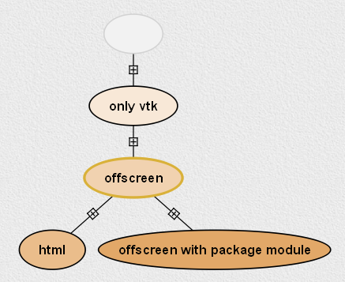
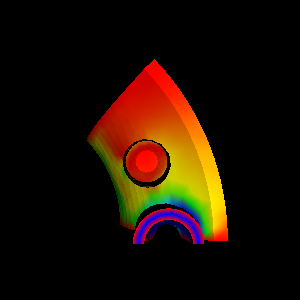
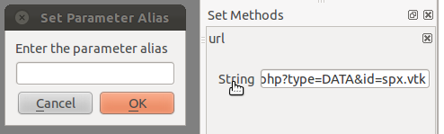

.. _chap-cli:

**********************
Command-line Arguments
**********************

Starting |vistrails| via the Command Line
=========================================

.. index:: command line arguments

|vistrails| supports a number of command-line arguments that let you modify certain attributes and behaviors of the program. When invoking |vistrails| from the command line, the arguments are placed after the "run.py" filename. For example,

   ``python vistrails/run.py -b``

starts |vistrails| in batch mode. Table :ref:`table-batch-cli` contains a complete list of the command line switches supported by \vistrails. Each command line switch has both a short form and a long form. The two forms are logically equivalent, and which one you use is a matter of personal preference. The short form consists of a single minus sign "-" followed by a single letter. The longer form uses two minus signs "--" followed by a descriptive word. For example, the above command for batch mode could have been written as:

   ``python vistrails/run.py --batch``

In addition to the explicit switches listed in Table :ref:`table-batch-cli`, the |vistrails| command line also lets you indicate the filename of the vistrail you wish to open. For example, assuming your "examples" directory is one level above your current working directory, this is how you would tell |vistrails| to load the "lung.vt" example at startup:

   ``python vistrails/run.py examples/lung.vt``

Moreover, if you want |vistrails| to start on a *specific version* of the pipeline within the vistrail, you can indicate that version's tag name on the command line. The filename and version tag should be separated by a colon. For example, to start |vistrails| with the ``colormap`` version of the "lung.vt" vistrail, use:

   ``python vistrails/run.py examples/lung.vt:colormap``

In the event that the version you want to open contains a space in its tag name, simply surround the entire "filename:tag" pair in double quotes. For example:

   ``python vistrails/run.py "examples/lung.vt:Axial View"``

You can also open up multiple vistrails at once by listing more than one vistrail file on the command line. This causes the vistrails to be opened in separate tabs, just as if you had opened them via the GUI. For example:

   ``python vistrails/run.py examples/lung.vt examples/head.vt``

You can specify version tags in conjunction with multiple filenames. Here is an example of an elaborate command-line invocation that opens two vistrails and sets each one to a specific version:

   ``python vistrails/run.py "examples/lung.vt:Axial View" examples/head.vt:bone``

.. topic:: Note:

   As of this writing, the |vistrails| development team is refactoring the implementation of many of the command-line switches presented in Table :ref:`table-batch-cli`. As such, depending on your version of |vistrails|, the results you achieve may not match those described. For a list of known issues with the command line switches, please refer to the |vistrails| website.

.. raw::latex
   \begin{table}
   \caption{Command line arguments supported by VisTrails.}
   \label{table:batch:cli}
   \begin{center}
   \begin{tabular}{ | l | l | p{3in} | }
   \hline 
   \textbf{Short form} & \textbf{Long form} & \textbf{Description} \\
   \hline 
     -h & -$\,$-help & Print a help message and exit. \\
   \hline
     -S \emph{/path} & -$\,$-startup=\emph{/path} &
                           Set user configuration directory (default is \texttt{$\sim$/.vistrails})
   %% (Not fully working. see Ticket 213)
   \\
   \hline
     -? & &                Print a help message and exit. \\
   \hline
     -v & -$\,$-version &      Print version information and exit. \\
   \hline
     -V \emph{num} &  -$\,$-verbose=\emph{num} &
                           Set verboseness level (0--2, default=0, higher means
                           more verbose). \\
   \hline
     -b & -$\,$-noninteractive & Run in non-interactive (batch) mode. \\
   \hline
     -n & -$\,$-nosplash &       Do not display splash screen on startup. \\
    \hline
     -q \emph{file} & -$\,$-quickstart=\emph{file} &
                             Start VisTrails using the specified static registry. \\
   \hline
     -c \emph{num} & -$\,$-cache=\emph{num} &
                           Enable/disable caching (0 to disable, nonzero to enable. Default is enabled). \\
   \hline
     -m \emph{num} & -$\,$-movies=\emph{num} &
                           Set automatic movie creation on spreadsheet (0 or 1,
                           default=1). Set this to zero to work around VTK bug
                           with offscreen renderer and OpenGL texture3D mappers. \\
   \hline
     -s & -$\,$-multiheads &     Display the Builder and Spreadsheet on different
                           screens (if available).
   \\
   \hline
     -x & -$\,$-maximized &      Maximize Builder and Spreadsheet windows at startup. \\
   \hline
     -D & -$\,$-detachHistoryView &  Detach the history view from the builder window. \\
   \hline
     -l & -$\,$-nologger &       Disable logging. \\
   \hline
     -d & -$\,$-debugsignals &   Debug Qt Signals. \\
   \hline
     -a \emph{params} & -$\,$-parameters=\emph{params} &
                           Set workflow parameters (non-interactive mode only). \\
   \hline
     -e \emph{dir} & -$\,$-dumpcells=\emph{dir} &
                           Set directory to dump spreadsheet cells before exiting (non-interactive mode only). \\
   \hline
     -G & -$\,$-workflowgraph &
                           Save workflow graph in specified directory without running 
			   the workflow (non-interactive mode only).
   \hline
     -U & -$\,$-evolutiongraph &
                           Save evolution graph in specified directory without running
			   any workflowDump images in pdf format (non-interactive mode only).
  \hline
     -p & -$\,$-pdf &
                           Dump images in pdf format (non-interactive mode only).
   \hline
     -g & -$\,$-noSingleInstance &
                           Run VisTrails without the single instance restriction. \\
   \hline
     -t \emph{host} & -$\,$-host=\emph{host} & Set hostname or IP address of database server. \\
   \hline
     -r \emph{port} & -$\,$-port=\emph{port} & Set database port. \\
   \hline
     -f \emph{dbName} & -$\,$-db=\emph{dbName} & Set database name. \\
   \hline
     -u \emph{userName} & -$\,$-user=\emph{userName} & Set database username. \\
   \hline
   \end{tabular}
   \end{center}
   \end{table}

.. tabularcolumns:: |l|l|p{7.5cm}|
   
.. _table-batch-cli:

.. csv-table:: Command line arguments supported by |vistrails|.
   :header: **Short form**, **Long form**, **Description**
   :widths: 10, 15, 20

   -h, :math:`--`\ help, Print a help message and exit.
   -S */path*, -\ -startup=\ */path*, Set user configuration directory (default is :math:`\sim`\ ``/.vistrails``)
   -?, , Print a help message and exit.
   -v, --version, Print version information and exit.
   -V *num*, --verbose=\ *num*, "Set verboseness level (0--2, default=0, higher means more verbose)."
   -b, --noninteractive, Run in non-interactive (batch) mode.
   -n, --nosplash, Do not display splash screen on startup.
   -q *file*, --quickstart=\ *file*, Start VisTrails using the specified static registry. 
   -c *num*, --cache=\ *num*, "Enable/disable caching (0 to disable, nonzero to enable. Default is enabled)."
   -m *num*, --movies=\ *num*, "Set automatic movie creation on spreadsheet (0 or 1, default=1). Set this to zero to work around VTK bug with offscreen renderer and OpenGL texture3D mappers."
   -s, --multiheads, Display the Builder and Spreadsheet on different screens (if available).
   -x, --maximized, Maximize Builder and Spreadsheet windows at startup.
   -P, --parameterExploration, execute Parameter Exploration.
   -l, --nologger, Disable logging.
   -d, --debugsignals, Debug Qt Signals.
   -a *params*, --parameters=\ *params*, Set workflow parameters (non-interactive mode only).
   -e *dir*, --dumpcells=\ *dir*, Set directory to dump spreadsheet cells before exiting (non-interactive mode only).
   -G, --workflowgraph, Save workflow graph in specified directory without running the workflow (non-interactive mode only).
   -U, --evolutiongraph, Save evolution graph in specified directory without running any workflow (non-interactive mode only).
   -p, --pdf, Dump images in pdf format (non-interactive mode only).
   -g, --noSingleInstance, Run VisTrails without the single instance restriction. 
   -t *host*, --host=\ *host*, Set hostname or IP address of database server.
   -r *port*, --port=\ *port*, Set database port.
   -f *dbName*, --db=\ *dbName*, Set database name.
   -u *userName*, --user=\ *userName*, Set database username.

.. index:: configuration directory

Specifying a User Configuration Directory
=========================================

In addition to the default .vistrails directory, VisTrails allows you to create and use additional configuration directories.  First, you will need to create a new directory.  This is done by running:
 ``python vistrails/run.py -S /path_to_new_directory/new_directory_name``.  

This will both create a new directory containing default configuration files and directories, and launch VisTrails, which will use the newly created files for configuration.  The user is then free to add desired configurations to the new directory.  Once a configuration directory exists, subsequent calls using the directory name (``python vistrails/run.py -S /path_to_directory/existing_directory``) will launch VisTrails using the 'existing_directory' for configuration and a new directory will not be created.

**Note:** If you would like to copy configuration directories, you must change the references in copy_of_directory/startup.xml to point to the new directory instead of the original.

.. _sec-cli-db:

Passing Database Parameters on the Command Line
===============================================

As discussed in Chapter :ref:`chap-database`, |vistrails| can read and write vistrails stored in a relational database as well as in a filesystem. |vistrails| allows you to specify the name of the database server, the database name, the port number, and the username on the command line. This potentially saves you the trouble of filling out the same information on the database connection dialog. Note that, for security reasons, |vistrails| does not allow you to include a database password on the command line; you must still type your password into the database connection dialog when |vistrails| opens.

The last four rows of Table :ref:`table-batch-cli` show the command-line switches that pertain to database connectivity. Be advised that these switches were designed primarily for use by VTL files (see Section :ref:`sec-cli-vtl`) and as such, are not necessarily user-friendly. In particular, these switches are ignored unless you also specify the vistrail ID and version name on the command line. For example, to open the ``contour`` version of the the "spx" vistrail (whose ID is 5) from the database "vistrails" residing on the host "vistrails.sci.utah.edu" with a username of "vistrails":

   ``python vistrails/run.py --host=vistrails.sci.utah.edu --db=vistrails --user=vistrails 5:contour``

Once |vistrails| opens, you will be prompted to enter the password. Upon successful authentication, the vistrail is loaded from the database and opened to the pipeline corresponding to the specified version.

.. _sec-cli-vtl:

Using "Vistrail Link" Files
^^^^^^^^^^^^^^^^^^^^^^^^^^^^^

As discussed in Chapter :ref:`chap-database`, one of the advantages of storing your vistrails on a database is that you can collaborate with others without having to pass around a .vt file or force all users to use a shared filesystem. A disadvantage is that you need to remember the parameters with which to connect to the database. Using a "Vistrail Link" (VTL) file reduces this inconvenience, and also eliminates the need to include the associated command-line switches to connect to the database.

A VTL is a very small text (XML) file that contains the parameters required to load a vistrail from a database. VTL files are intended for use with a |vistrails|-enabled wiki. You can open a VTL either by saving the file and passing its filename to the command line, or by configuring your web browser to do this for you. Here is the syntax for using a VTL file on the command line:

   ``python vistrails/run.py sample.vtl``

Internally, |vistrails| parses the VTL file and loads the vistrail from the database exactly as if you had included its full parameter list on the command line.

.. topic:: Note:

   VTL is a relatively new feature of |vistrails|, and as such is neither fully developed nor completedly documented. Please contact the |vistrails| development team with any bug reports and/or suggestions.

.. _sec-cli-batch:

Running |vistrails| in Batch Mode
=================================

.. index::
   single: batch mode
   single: non-interactive mode

Although |vistrails| is primarily intended to be run as an interactive, graphical client application, it also supports non-interactive use. |vistrails| can thus be invoked programmatically, \eg as part of a shell script. You can tell |vistrails| to start in non-interactive mode by using the "-b" or "--batch" command line switch when launching \vistrails. [#]_

Running |vistrails| in non-interactive mode has little effect, however, without an additional command line argument indicating which vistrail to load. Since we are running |vistrails| as part of a batch process, it only makes sense to execute vistrails whose output is something tangible, such as a file. A vistrail whose only output is an interactive rendering in a ``VTKCell``, for instance, would not be well-suited for running in batch mode.

Consider the following example. The "offscreen.vt" vistrail (included in the "examples" directory) has a variety of output options, depending on which version you select in the ``History`` view (Figure :ref:`The different versions of the offscreen.vt vistrail... <fig-batch-version_tree>`). The version tagged ``only vtk`` displays its output as an interactive VTK rendering. The version tagged ``html`` creates a simple web page in the Spreadsheet. The ``offscreen`` version, however, outputs an image file named "image.png". Since its output (a file) can be easily accessed outside of |vistrails|, this version is an ideal candidate for running in batch mode.  To try it, invoke |vistrails| as shown, specifying both the name of the vistrail file and the desired version:

   ``python vistrails/run.py -b examples/offscreen.vt:offscreen``

.. _fig-batch-version_tree:

   The different versions of the "offscreen.vt" vistrail offer various forms of output.

As you would expect, this command runs to completion without opening any windows. Instead, it silently loads the requested pipeline, executes it, and closes.
Assuming it ran correctly, this pipeline should have created a file named "image.png" in the current directory.  When you view this file, it should resemble the picture in Figure :ref:`Running the offscreen version of offscreeen.vt in batch mode... <fig-batch-image_png>`.

.. _fig-batch-image_png:

   Running the ``offscreen`` version of "offscreen.vt" in batch mode produces an image named "image.png".

Running a Specific Workflow in Batch Mode
^^^^^^^^^^^^^^^^^^^^^^^^^^^^^^^^^^^^^^^^^

To run a specific workflow in batch mode, call |Vistrails| with the following options:

   ``python vistrails/run.py -b path_to_vistrails_file:pipeline``

where pipeline can be a version **tag name** or version **id**.

.. topic:: Note

   If you downloaded the MacOS X bundle, you can run |vistrails| from the command line via the following commands in the terminal.  Change the current directory to wherever VisTrails was installed (often /Applications), and then type:  ``Vistrails.app/Contents/MacOS/vistrails [<cmd_line_options>]``

Running a Workflow with Specific Parameters
^^^^^^^^^^^^^^^^^^^^^^^^^^^^^^^^^^^^^^^^^^^

An alias is a name assigned to a parameter that allows you to reference that parameter in batch mode. An alias is created by clicking on the type of an existing parameter in VisTrails, then entering a name for it.

.. _fig-batch-create_alias:

   Example of creating an alias

Users can change workflow parameters that have an alias through the command line.

For example, offscreen pipeline in offscreen.vt always creates the file called image.png. If you want generate it with a different filename:

``python vistrails/run.py -b examples/offscreen.vt:offscreen --parameters="filename=other.png"``

filename in the example above is the alias name assigned to the parameter in the value method inside the String module. When running a pipeline from the command line, VisTrails will try to start the spreadsheet automatically if the pipeline requires it. For example, this other execution will also start the spreadsheet (attention to how $ characters are escaped when running on bash):

``python vistrails/run.py -b examples/head.vt:aliases --parameters="isovalue=30\$&\$diffuse_color=0.8, 0.4, 0.2"``

You can also execute more than one pipeline on the command line:

``python vistrails/run.py -b examples/head.vt:aliases ../examples/spx.vt:spx \ --parameters="isovalue=30"``

Use --parameters only once regardless the number of pipelines.

.. %TODO should we cover aliases here?

Accessing a Database in Batch Mode
^^^^^^^^^^^^^^^^^^^^^^^^^^^^^^^^^^

As discussed in Section :ref:`sec-cli-db`, you can specify most of the parameters of your database connection on the command line, but the password must be entered through the GUI. This poses a problem for running |vistrails| in non-interactive mode, since no database connection dialog will be opened. If your batch process needs to access vistrails stored on a database, the current workaround is to create a special account on the database (probably one with read-only access) that does *not* require a password, and use this account for connecting to the database in batch mode.

Using |vistrails| as a Server
^^^^^^^^^^^^^^^^^^^^^^^^^^^^^

.. index:: server

Using the VisTrails server mode, it is possible to execute workflows and control VisTrails through another application. For example, the CrowdLabs Web portal (http://www.crowdlabs.org) accesses a VisTrails sever to execute workflows, retrieve and display vistrail trees and workflows.

The way you access the server is by doing XML-RPC calls. In the current VisTrails release, we include a set of PHP scripts that can talk to a VisTrails server instance. They are in "extensions/http" folder. The files are reasonably well documented. Also, it should be not difficult to create python scripts to access the server (just use xmlrpclib module).

Note that the VisTrails server requires the provenance and workflows to be in a database. More detailed instructions on how to setup the server and the database are available in :ref:`chap-vistrails-server` and in :ref:`sec-database-setup`.

If what you want is just to execute a series of workflows in batch mode, a simpler solution would be to use the VisTrails client in batch mode (see Section :ref:`sec-cli-batch`). 

Executing Workflows in Parallel
===============================

The VisTrails server can only execute pipelines in parallel if there's more than one instance of VisTrails running. The command

``self.rpcserver=ThreadedXMLRPCServer((self.temp_xml_rpc_options.server, self.temp_xml_rpc_options.port))``

starts a multithreaded version of the XML-RPC server, so it will create a thread for each request received by the server. The problem is that Qt/PyQT doesn't allow these multiple threads to create GUI objects.  Only the main thread can. To overcome this limitation, the multithreaded version can instantiate other single threaded versions of VisTrails and put them in a queue, so workflow executions and other GUI-related requests, such as generating workflow graphs and history trees can be forwarded to this queue, and each instance takes turns in answering the request. If the results are in the cache, the multithreaded version answers the requests directly.

Note that this infrastructure works on Linux only. To make this work on Windows, you have to create a script similar to start_vistrails_xvfb.sh (located in the scripts folder) where you can send the number of other instances via command-line options to VisTrails. The command line options are:

``python vistrails_server.py --host=<ADDRESS> --port=<PORT> -O<NUMBER_OF_OTHER_VISTRAILS_INSTANCES> [-M]&``

If you want the main vistrails instance to be multithreaded, use the -M at the end.

After creating this script, update function start_other_instances in vistrails/gui/application_server.py lines 1007-1023 and set the script variable to point to your script. You may also have to change the arguments sent to your script (line 1016: for example, you don't need to set a virtual display). You will need to change the path to the stop_vistrails_server.py script (on line 1026) according to your installation path.

Executing Parameter Explorations from the Command Line
======================================================

Named parameter explorations can be executed from the command line in different ways using the -P flag. The parameter after the vistrail will then indicate the parameter exploration name in place of the workflow version. To open vistrails and execute a parameter exploration named "final" in terminator.vt run:

``python vistrails/run.py -P terminator.vt:final``

To only show the spreadsheet run:

``python vistrails/run.py -P -i terminator.vt:final``

To execute the spreadsheet in batch mode, and to output the spreadsheet as images to a directory, use the -b flag and specify a directory with the -e flag:

``python vistrails/run.py -P -b -e ./final_images terminator.vt:final``

This will create an image for each cell and also create a composite image for each sheet in the spreadsheet.

Finding Methods Via the Command Line
====================================

We have tried to make some methods more accessible in the console via an api. You can import the api via import api in the console and see the available methods with dir(api). To open a vistrail:

.. code-block:: python

   import api
   api.open_vistrail_from_file('/Applications/VisTrails/examples/terminator.vt')

To execute a version of a workflow, you currently have to go through the controller:

.. code-block:: python

   api.select_version('Histogram')
   api.get_current_controller().execute_current_workflow()

Currently, only a subset of VisTrails functionality is directly available from the api. However, since VisTrails is written in python, you can dig down starting with the VistrailsApplication or controller object to expose most of our internal methods. If you have suggestions for calls to be added to the api, please let us know.

One other feature that we're working on, but is still in progress is the ability to construct workflows via the console. For example:

.. code-block:: python

   vtk = load_package('org.vistrails.vistrails.vtk')
   vtk.vtkDataSetReader() # adds a vtkDataSetReader module to the pipeline
   # click on the new module
   a = selected_modules()[0] # get the one currently selected module
   a.SetFile('/vistrails/examples/data/head120.vtk') # sets the SetFile\  
                    parameter for the data set reader
   b = vtk.vtkContourFilter() # adds a vtkContourFilter module to the\
                    pipeline and saves to var b
   b.SetInputConnection0(a.GetOutputPort0()) # connects a's GetOutputPort0\
                    port to b's SetInputConnection0

.. rubric:: Footnotes
.. [#] The parameter "-b" stands for "batch." In this chapter, we use the terms "batch mode" and "non-interactive mode" synonymously.
