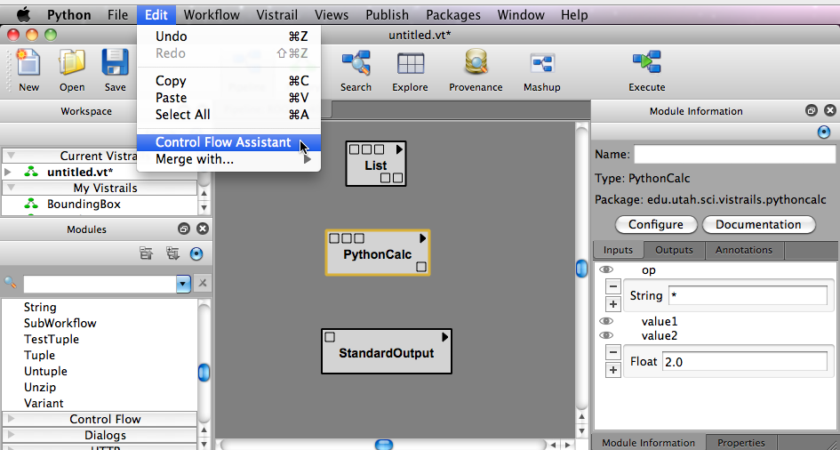
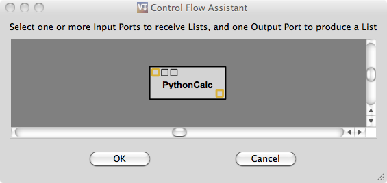
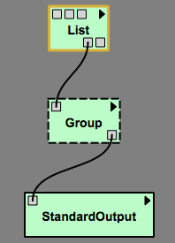
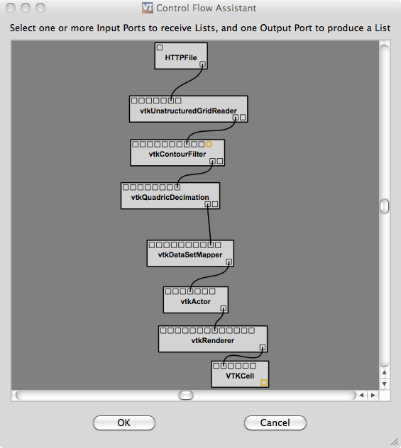

.. _chap-controlflow-assistant:

**************************
The Control Flow Assistant
**************************

.. index:: control flow assistant

Using the Control Flow Assistant (CFA)
======================================

In order to simplify the process of creating a control flow loop that uses the Map module, VisTrails has a Control Flow Assistant (CFA).
To use the CFA, you must:

1) Enable all ports (in the Module Information panel) that you wish to use as inputs or outputs.
2) Select the modules in the workflow that will form the basis of your mapped input-output loop.
3) Go to 'Edit->Control Flow Assistant' to launch the CFA using the selected modules.
4) Select the input ports that you wish to loop over using List modules as input.
5) Select the output port that you wish to use for the values in the output List.
6) Click OK, and the CFA will generate the control flow structure as a Group module.
7) Connect a List input to each of the inputs on the control flow Group.
8) Connect the Group's output List (output port 'Result') to a suitable module/port, or create a PythonSource module to handle the List output.

Note: All existing connections to input and output ports selected in steps 4 and 5 will be removed.

List Input
^^^^^^^^^^

By default, the List inputs will be used sequentially, one from each List, which requires that all List inputs be the same length.  As another option, the Group created by the CFA has a boolean 'UseCartesianProduct' parameter.  If this parameter is set to 'true' then the cartesian product of all of the input Lists will be used as the input for the Map.  Use caution when using this parameter, as the number of inputs can grow very rapidly with just a few List inputs.

List Output
^^^^^^^^^^^

There are several ways to handle the output List.  One option would be to send the output List to a StandardOutput module to display its contents.  Another option is to simply ignore the output List, in the case where you just want part of the workflow to execute multiple times using different inputs.  For example, if the mapped portion of the workflow contains a VTKCell, and you just want to generate a new VTKCell for each input, you should select the 'self' port of the VTKCell module when choosing the output port in the CFA, and then ignore the output List.  For more specialized handling of the output List, you may wish to create a PythonSource module.

Custom List
^^^^^^^^^^^

For advanced users, the default behavior, or cartesian product behavior may not be sufficient for your needs.  If this is the case, the 'UserDefinedInputList' parameter allows you to manually specify the input list.  If this parameter is defined, it will override any input lists already defined or connected.  The format for this user-provided input list must be a list of lists of tuples.  Each inner list represents a single loop execution, and contains tuples (or single values for functions taking only one argument) representing the arguments for each input function to be used in that loop execution.  The order of the argument tuples in the inner lists should match the order in which the functions appear on the module generated by the CFA.

For example, if the loop has two input functions defined, in order, as SetXY(x, y) and SetZ(z), and we want two executions of the loop, the input list would be:
[[(x1, y1), z1], [(x2, y2), z2]]

Parameter Exploration
^^^^^^^^^^^^^^^^^^^^^

.. index::
   pair: parameter exploration; control flow
   pair: parameters; exploring

One useful purpose for the CFA is to provide a version-based approach to parameter exploration.  To create a parameter exploration for a workflow, you could simply select all modules in the workflow, making sure the ports for the desired parameters are enabled, then launch the CFA and select the ports of the parameters you wish to explore.  By providing a list for each parameter, you can create a parameter exploration that directly uses the version tree.

.. topic:: Try it Now!

   Processing a List of values with PythonCalc:

   1) Go to 'Edit->Preferences', select the 'Module Packages' tab, and enable the 'pythonCalc' package if it is not already enabled.
   2) Click on File->New to start a new VisTrail.
   3) Add the following modules from the module registry to the VisTrail:
      a) One 'PythonCalc' module from the 'pythonCalc' package
      b) One 'List' module from the 'Basic Modules' package
      c) One 'StandardOutput' module from the 'Basic Modules' package
   4) Set the List 'value' parameter to: [1.0, 2.0, 3.0, 4.0, 5.0]
   5) Set the PythonCalc 'op' parameter to: '*'
   6) Set the PythonCalc 'value2' parameter to: 2.0
   7) With the PythonCalc module selected, go to 'Edit->Control Flow Assistant' (see Figure :ref:`Example 1.1 <fig-assistant>`):

      a) Click on the input port 'value1' and ensure it is highlighted
      b) Click on the output port 'value' and ensure it is highlighted
      c) Click 'OK' to close the window and build the loop structure as a Group module (see Figure :ref:`Example 1.2 <fig-select>`)
   8) Connect the 'List' module's output port 'value' to the 'Group' module's input port 'value1'.
   9) Connect the 'Group' module's output port 'Result' to the 'StandardOutput' module's input port 'value' (see Figure :ref:`Example 1.3 <fig-pipeline>`)
   10) Execute the current workflow.
   11) In your Standard Output console, you should see a List containing the computation for each element in the input list: [2.0, 4.0, 6.0, 8.0, 10.0]

.. _fig-assistant:

   Example 1.1 - Running the Control Flow Assistant

.. _fig-select:

   Example 1.2 - Selecting relevant ports.

.. _fig-pipeline:

   Example 1.3 - The connected pipeline.

.. topic:: Try it Now!

   Performing a Parameter Exploration:

   1) Go to 'File->Open', explore to the VisTrails examples folder, and open 'spx.vt'
   2) Open the History view and select the version tagged as 'decimate'.
   3) Open the Pipeline view.
   4) Select the 'vtkContourFilter' module and enable the 'SetValue' input port by clicking to the left of 'SetValue' in the Module Information panel (see Figure :ref:`Example 2.1 <fig-cfassistant-enable-port>`).
   5) Click on 'Edit->Select All'.
   6) With all modules selected, go to 'Edit->Control Flow Assistant':

      a) Click on the 'vtkContourFilter' module's input port 'SetValue' and ensure it is highlighted
      b) Click on the 'VTKCell' module's output port 'self' and ensure it is highlighted (see Figure :ref:`Example 2.2 <fig-cfassistant-enable-port>`)
      c) Click 'OK' to close the window and build the loop structure as a Group module
   7) Select the newly created 'Group' module, and set the 'SetValue' parameter to: [(0, 0.5), (0, 0.75), (0, 1.0)]
   8) Execute the current workflow.
   9) In your VisTrails Spreadsheet, you should see three visualizations, one for each set of input parameters to the 'SetValue' port of 'vtkContourFilter' (see Figure :ref:`Example 2.3 <fig-cfassistant-results>`).

.. _fig-cfassistant-enable-port:

.. figure:: figures/cfassistant/enable_port.png
   :align: center
   :width: 30%

   Example 2.1 - Enabling a port for use with the control flow assistant.

.. _fig-cfassistant-select:

   Example 2.2 - Selecting relevant ports.

.. _fig-cfassistant-results:

   Example 2.3 - The spreadsheet results using the list: [(0, 0.5), (0, 0.75), (0, 1.0)] as input to the contour filter via the control flow assistant.

