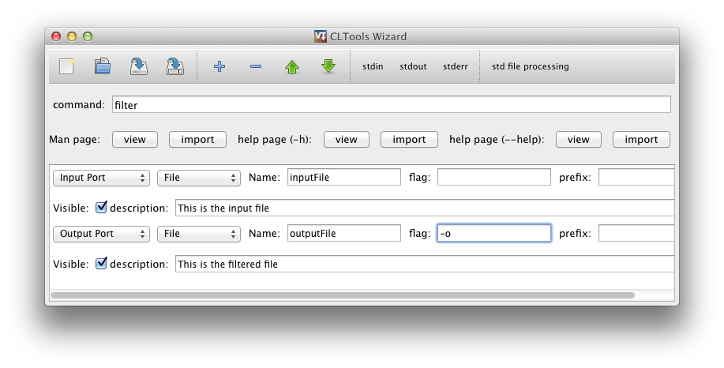
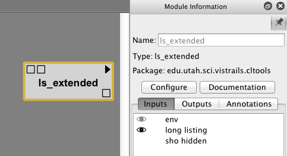
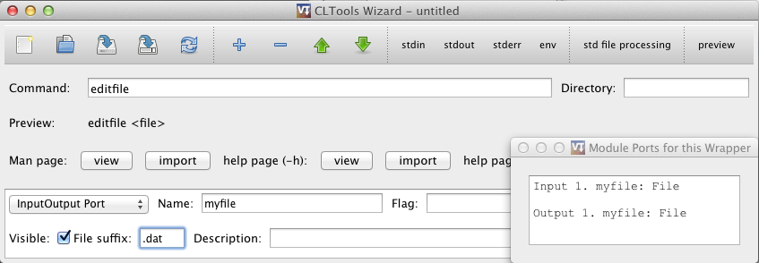

.. _chap-cltools:

*************************************************
Wrapping command line tools using package CLTools 
*************************************************

.. index:: wrapping command line tools using package CLTools

Package CLTools
===============

The package CLTools provide a way to wrap command line tools so that
they can be used as modules in VisTrails. It includes a wizard that
simplifies the creation of wrappers. To use the package, enable
CLTools in the package configuration window. The package will be empty
until you add a wrapper for a command line tool. When you have added a
wrapper you need to reload the wrappers by either pressing the reload
button in the wizard, reloading the CLTools package, or selecting
Packages->CLTools->Reload All Scripts on the menu.

Using the CLTools Wizard
^^^^^^^^^^^^^^^^^^^^^^^^

You can run the Wizard from within VisTrails. First, make sure the
CLTools package is enabled. Then, on the menu, select
Packages->CLTools->Open Wizard.

Or, to launch the wizard from the command line run:
``python vistrails/package/CLTools/wizard.py``

The wizard allows you to create and edit wrappers for command line
tools. Input/output ports can be created as arguments to the command
or using pipes (stdin, stdout, or stderr).  :ref:`Figure 1.1
<fig-cltools-wizard>` shows the main interface. Command line arguments
can be added, removed and rearranged. Pipes can be added and
configured. There is a preview line where you can see how your command
will look when executed. You can also push the preview button to see
which ports will be available for the vistrails module, as shown in
the bottom right. This example shows some of the most common ways to
specify arguments. In order: The standard output is used as a string
output port, an integer attribute using the **-i** flag, a boolean
flag **-A** that can be turned on or off, an input file using a
prefix, an output file using the **-o** flag, and finally a simple
string input. Note the way arguments correspond to ports in the bottom
right.

.. _fig-cltools-wizard:

.. figure:: figures/CLTools/wizard.png
   :align: center
   :width: 100%

   Figure 1.1 - CLTools Wizard main window

Arguments can represent either  input ports, output ports, both, or constant
strings.  Ports can  handle  different types  such  as boolean  flags,
strings, integers, floats, or files. Lists of  strings and files are also possible. Each
argument can have a flag before it such as ``-f`` or a prefix such as ``--file=``.

A file ending can be specified for files that are used as outputs using **file suffix**. 

You can view and import flags from man and help pages (See :ref:`Figure 1.2
<fig-cltools-import>`).

.. _fig-cltools-import:

.. figure:: figures/CLTools/import.png
   :align: center
   :width: 100%

   Figure 1.2 - Import Arguments Window

Files should be saved as {modulename}.clt in the directory .vistrails/CLTools/

Supported flags::

   -c   Import a command with arguments automatically
        For example, to create a wrapper for ls with two flags -l and -A run:
        python wizard.py -c ls -l -A

.. topic:: Try it Now!

    Create a wrapper that takes a file as input and generate a file as output using ``-o``. The ports should always be visible. The command looks like::

        filter infile -o outfile

    Your wrapper should look like in figure :ref:`Figure 1.3 <fig-cltools-inputoutput>`. Note that the order of the arguments is always preserved:

.. _fig-cltools-inputoutput:
    

   Figure 1.3 - An infile outfile wrapper

Port visibility
^^^^^^^^^^^^^^^

:ref:`Figure 1.4 <fig-cltools-visibility>` shows how the **visible**
setting affects ports in VisTrails. Visible ports are meant to be
connected to other modules, and are shown as square input or output
ports on the module, while non-visible ports are meant to be optional,
or added as parameters on the input port list to the right. Non-visible
ports can be made visible on the module by clicking on the left side
of the ports pane, so that a eye icon is displayed. The example below has 2 visible input ports and one visible output port. The input list to the right shows available inputs, bot visible and non-visible. The first input in the input list to the right is visible by default,
which is shown by a greyed-out eye. The second port is non-visible by
default but has been made visible as shown by the eye icon. The second
input is non-visible but can be made visible on the module by clicking
so that the eye icon becomes visible.

.. _fig-cltools-visibility:

   Figure 1.4 - Port visibility in VisTrails

Environment Variables
^^^^^^^^^^^^^^^^^^^^^

There are three ways to set environment variables in CLTools. If your
environment variables is platform-dependent, you should set the
**env** configuration variable for the CLTools package. In VisTrails, go to the
Preferences->Module Packages dialog, select **CLTools**, make sure it
is enabled, and select **Configure...**. Set the **env** variable to
the preferred environment. Separate name and value using **=** and
variables using **;**, like this::

    PATH=/my/custom/path;DEBUG=;MYVAR=32

If you want to specify the variables in your workflow, you can enable the **env** input port on your module by checking the **env** option in the top toolbar in the CLTools wizard. Then you can specify environment variables either as parameters to your module or by connecting the **env** input port to other modules. Multiple parameters can be specified as a single string or by adding multiple **env** parameters. These variables overrides variables specified using the other two methods.

For modules that always need the same environment variables, they can be added to the module by editing the .clt file directly and adding an **env** entry in the options section as shown below. These variables overrides the ones specified in the CLTools configuration::

    {
        "command": "ls", 
        "options": {
            "env": "MYVAR=/my/custom/path;MYVAR2=64"
        }
    }

Note that if you replace e.g. the **PATH** variable, you should
include the existing path, which can be found by running e.g. ``echo
$PATH`` on the command line.

Setting working directory
^^^^^^^^^^^^^^^^^^^^^^^^^

The **Directory** field to the right of the command field can be used
to specify the working directory where the command will be
executed. It does **not** specify the directory where the command is
found. Use the PATH enviroment variable for that.

InputOutput files
^^^^^^^^^^^^^^^^^

The **InputOutput** port should be used for commands that modifies a
file in-place, so that it is used both as and input and an output. An
example of using the InputOutput module is shown in :ref:`Figure 1.5
<fig-cltools-inputoutputport>`. When executed, the input file will be
copied to a temporary file before it is passed to the command and used
as an output. This is because you should not (if you can avoid it)
modify the inputs to your modules, because they may be used by other
modules, or re-executed by the same module. It may be useful to set
the file suffix attribute to make sure the copied file is of the same
type as the original. There is currently no way of passing the original
file to the command, since it is discouraged. But if this is
necessary in a particular case, CLTools can be easily modified to do
this.

.. _fig-cltools-inputoutputport:

   Figure 1.5 - Example of an InputOutput port

Creating a standalone package
^^^^^^^^^^^^^^^^^^^^^^^^^^^^^

When you have a working set of wrappers and want to distribute them,
you should put them in a separate module package. This allows you to
name and version your package, and makes sure there are no conflicts
with modules using the same name as yours. One warning: workflows
using the old modules will need to be recreated to use the modules in
this new package instead, so it is better to start building workflows
after a separate package has been created. Below are the steps to
follow in order to set up a new package.

1) Create a new directory in ``$HOME/.vistrails/userpackages/``
2) Copy ``__init__.py`` and ``init.py`` from ``vistrails/packages/CLTools`` to this new directory
3) Update **name**, **identifier**, and **version** in ``__init__.py`` to the desired values
4) Move all desired tools (\*.clt files) to this new directory
5) Enable and test your new package!

File Format
^^^^^^^^^^^

The wrapper is stored as a `JSON <http://www.json.org/>`_ file and can be edited using a text editor if needed. It uses the following schema:

ROOT is a dict with the following possible keys:

* **command** (required) - value is the command to execute like "cat" or "/home/tommy/cat"
* **stdin** - handle stdin - value is a 3-list ["port name", CLASS, OPTIONDICT]
* **stdout** - handle stdout - value is a 3-list ["port name", CLASS, OPTIONDICT]
* **stderr** - handle stdout - value is a 3-list ["port name", CLASS, OPTIONDICT]
* **args** - list of ordered arguments that can either be constants, inputs, or outputs. See ARG.
* **dir** - value is the working directory to execute the command from
* **options** - a dict of module options - see OPTIONDICT

OPTIONDICT is a dict with module specific options, recognized options are:

* **std_using_files** - connect files to pipes so that they need not be stored in memory. This is useful for large files but may be unsafe since it does not use subprocess.communicate
* **env** - A list of environment variables to set when executing the command, with entries separated by **;** and key/value pairs separated by **=**. This overrides all other environment variables set, except for the env_port, and should only be used when they are not expected to change. It can only be set by editing the .clt files directly with a text editor.
* **env_port** - Set to add an input port **env** for specifying the environment variables to use, this overrides all other environment variables set

ARG is a 4-list containing [TYPE, "name", KLASS, ARGOPTIONDICT]
TYPE is one of:

* **input** - create input port for this arg
* **output** - create output port for this arg
* **inputoutput** - create both input and output port for this arg. The type must be **File** and a copy of the original file will be processed and used as output.
* **constant** - use "port name" directly as a constant string

CLASS indicates the port type and can be one of the following. **String** is used by default.

* **File** - A vistrails **File** type. The filename will be used as the argument
* **String** - A vistrails **String** type. The string will be used as the argument
* **Integer** - A vistrails **Integer** type. Its string value will be used as the argument
* **Float** - A vistrails **Float** type. Its string value will be used as the argument
* **Flag** - A vistrails **Bool** type. A boolean flag that when set to true will add the value of the argument  to the command.
* **List** - A list of values of the type specified by the **type** option. All values in the list will be added as arguments.

ARGOPTIONDICT is a dict containing argument options. recognized options are:

* **type**: **CLASS** - used by List-types to specify subtype.
* **flag**: **name** - Append name as a short-style flag before the specified argument. If type is **List** it is appended before each item
* **prefix**: **name** - Append name as a long-style prefix to the final argument. If it is also a list it is appended to each item.
* **required**: None - Makes the port always visible in VisTrails.
* **suffix**: **name** - Specifies the file ending for created files

.. topic:: Try it Now!

    Wrap the command "cat" that takes 2 files as input named "first" and "second". Also take a list of files as input named "rest".
    Catch stdout as file, name it "combined".
    Catch stderr as string, name it "stderr".
    Show "first" and "combined" by default.

    Your wrapper should now look like this::
        
        {"command": "cat",
         "args": [["input", "first", "File", {"required":""}],
                  ["input", "second", "File", {}],
                  ["input", "rest", "List", {"type":"File"}]],
        "stdout": ["combined", "File", {"required":""}],
        "stderr": ["stderr", "String", {}]
        }

    Save as ``{yourhomedirectory}/.vistrails/CLTools/cat.clt``
    Reload CLTools package in VisTrails. Test the new module.
