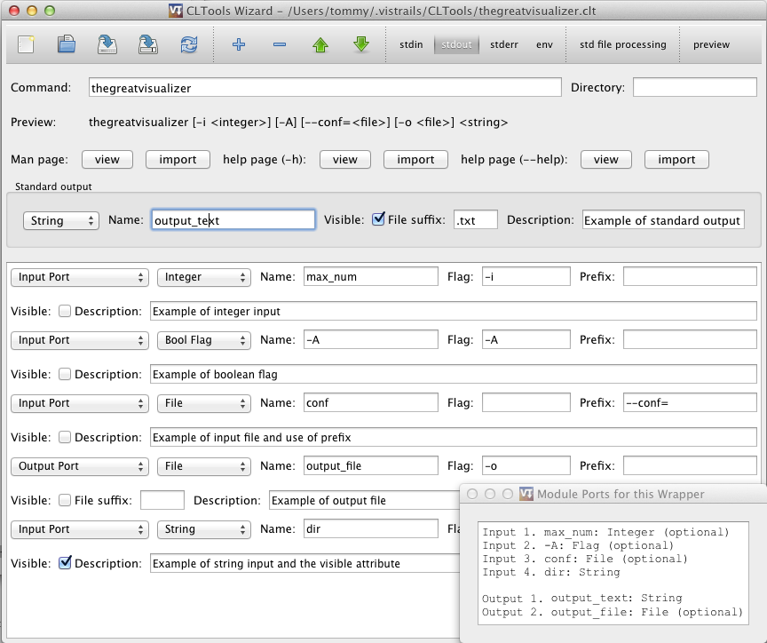
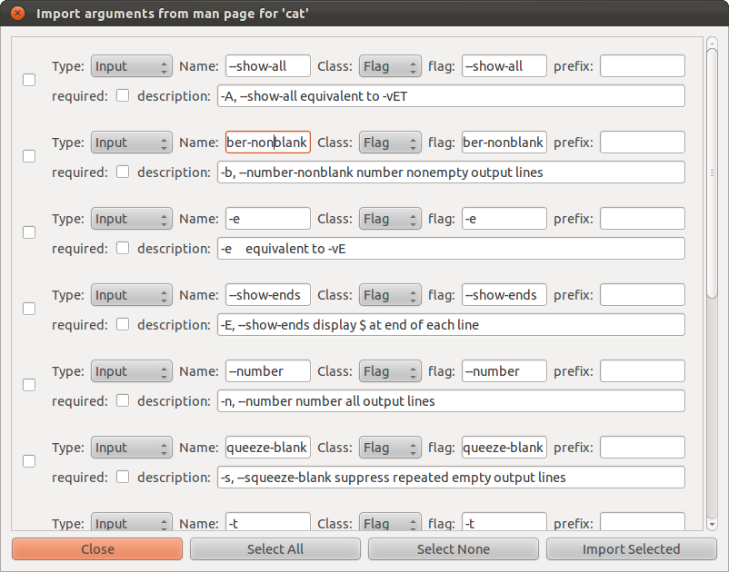

.. _chap-cltools:

*************************************************
Wrapping command line tools using package CLTools 
*************************************************

.. index:: wrapping command line tools using package CLTools

Package CLTools
===============

The package CLTools provide a way to wrap command line tools so that they can be used as modules in VisTrails. It includes a wizard that simplifies the creation of wrappers. To use the package, enable CLTools in the package configuration window. The package will be empty until you add a wrapper for a command line tool.

Using the CLTools Wizard
^^^^^^^^^^^^^^^^^^^^^^^^

To launch the wizard run:
``python vistrails/package/CLTools/wizard.py``

The  wizard  allows  you  to  create  and edit  a  wrappers  for  command  line
tools. Input/output ports  can be created as arguments to  the command or using
pipes    (stdin,    stdout,    or    stderr).    :ref:`Figure    1.1
<fig-cltools-wizard>` shows  the main interface. Command line  arguments can be
added, removed and rearranged. Pipes can be added and configured.

.. _fig-cltools-wizard:

   Figure 1.1 - CLTools Wizard main window

Arguments can either represent input ports, output ports, or constant strings. Ports can handle different types such as boolean flags, strings, or files. Lists of strings and files are also possible. Each argument can have a flag before it or a prefix such as ``--file=``.

You can view and import flags from man and help pages (See :ref:`Figure 1.2
<fig-cltools-import>`).

   Figure 1.2 - Import Arguments Window

Files should be saved as {modulename}.clt in the directory .vistrails/CLTools/

Supported flags::

   -c   Import a command with arguments automatically
        For example, to create a wrapper for ls with two flags -l and -A run:
        python wizard.py -c ls -l -A

.. _fig-cltools-import:

Setting environment variables
^^^^^^^^^^^^^^^^^^^^^^^^^^^^^
If your commands need to set environment variables, such as the PATH variable, this can be done by setting the **env** configuration variable for the CLTools package.

Go to the Preferences->Module Packages dialog, select **CLTools**, make sure it is enabled, and select **Configure...**. Set the **env** variable to the preferred environment. Separate name and value using **=** and variables using **;**.

Note that if you replace e.g. the **PATH** variable, you should include the existing path, which can be found by running ``echo $PATH`` on the command line.

Creating a standalone package
^^^^^^^^^^^^^^^^^^^^^^^^^^^^^

Creating a separate package is useful when you want to distribute your wrappers. It allows you to specify a custom package name and to put versions on your package. Here are the steps to set up a new package.

1) Create a new directory in ``.vistrails/userpackages/``
2) Copy ``__init__.py`` and ``init.py`` from ``vistrails/packages/CLTools`` to the new directory
3) Update **name**, **identifier**, and **version** in ``__init__.py`` to the desired values
4) Move all desired tools (\*.clt files) to the new directory
5) Test the new package

File Format
^^^^^^^^^^^

The wrapper is stored as a `JSON <http://www.json.org/>`_ file following syntax:

ROOT is a dict with the following possible keys:

* **command** (required) - value is the command to execute like "cat" or "/home/tommy/cat"
* **stdin** - handle stdin - value is a 3-list ["port name", CLASS, OPTIONDICT]
* **stdout** - handle stdout - value is a 3-list ["port name", CLASS, OPTIONDICT]
* **stderr** - handle stdout - value is a 3-list ["port name", CLASS, OPTIONDICT]
* **args** - list of ordered arguments that can either be constants, inputs, or outputs. See ARG.
* **options** - a dict of module options - see OPTIONDICT

OPTIONDICT is a dict with module specific options, recognized options are:

* **std_using_files** - connect files to pipes so that they need not be stored in memory. This is useful for large files but may be unsafe since it does not use subprocess.communicate

ARG is a 4-list containing [TYPE, "name", KLASS, ARGOPTIONDICT]
TYPE is one of:

* **input** - create input port for this arg
* **output** - create output port for this arg
* **constant** - use "port name" directly as a constant string

CLASS indicates the port type and can be one of the following. **String** is used by default.

* **File** - A vistrails **File** type. The filename will be used as the argument
* **String** - A vistrails **String** type. The string will be used as the argument
* **Flag** - A vistrails **Bool** type. If set to true the value of the **Flag** option will be used as the argument value. 
* **List** - A list of values of the type specified by the **type** option. All values in the list will be added as arguments.

ARGOPTIONDICT is a dict containing argument options. recognized options are:

* **type**: **CLASS** - used by List-types to specify subtype.
* **flag**: **name** - Append name as a constant before the specified argument. If type is **List** it is appended before each item
* **prefix**: **name** - Append name as a prefix to the final argument. If it is also a list it is appended to each item.
* **required**: "" - Makes the port always visible in VisTrails.

.. topic:: Try it Now!

    Wrap the command "cat" that takes 2 files as input named "first" and "second". Also take a list of files as input named "rest".
    Catch stdout as file, name it "combined".
    Catch stderr as string, name it "stderr".
    Show "first" and "conbined" by default.

    Your wrapper should now look like this::
        
        {"command": "cat",
         "args": [["input", "first", "File", {"required":""}],
                  ["input", "second", "File", {}],
                  ["input", "rest", "List", {"type":"File"}]],
        "stdout": ["combined", "File", {"required":""}],
        "stderr": ["stderr", "String", {}]
        }

    Save as ``{yourhomedirectory}/.vistrails/CLTools/cat.clt``
    Reload CLTools package in VisTrails. Test the new module.

