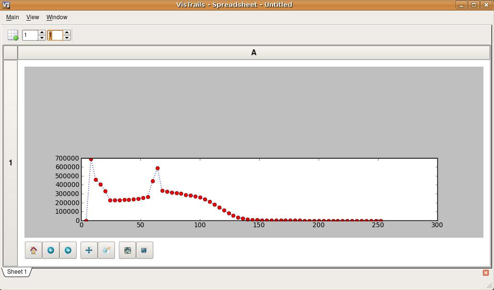
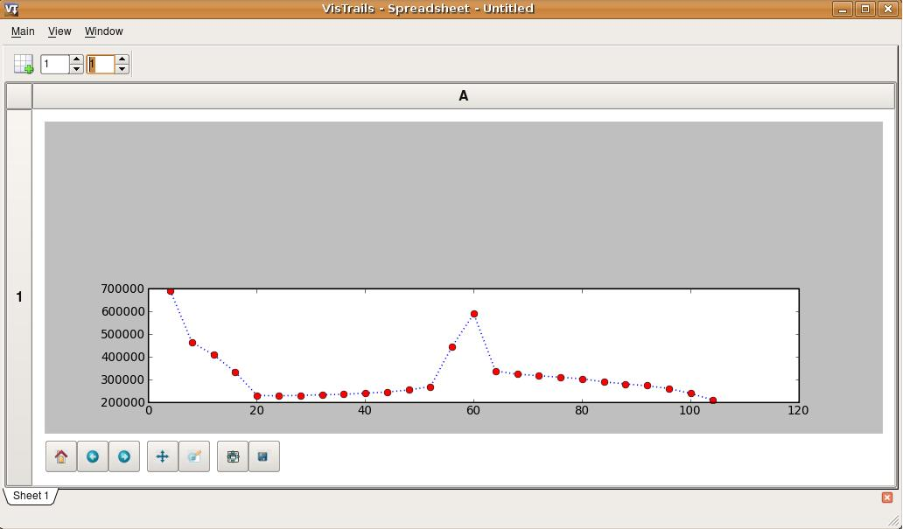
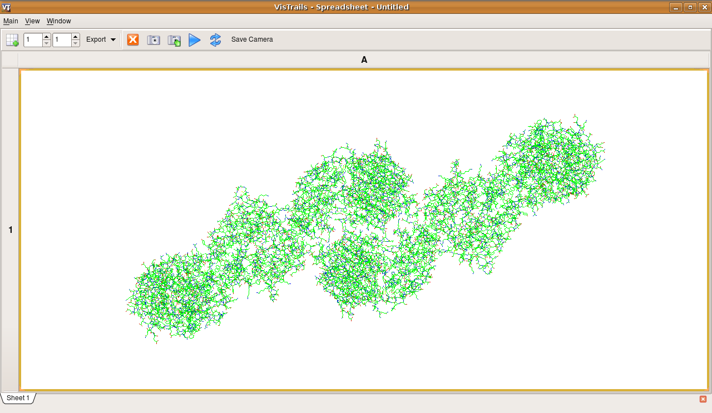

.. _chap-controlflow:

*************************
Control Flow in VisTrails
*************************

Scientific workflows usually follow a dataflow model, but, in some cases,
control structures, including loops and conditionals, are necessary to
accomplish certain tasks. |vistrails| provides the ``Control Flow``
package to support these and other structures.  To create your own ``Control Flow`` modules, please refer to the Developer's Guide (:ref:`chap-controlflowdev`).  Or, if you would like to use the Control Flow Assistant, to simplify the process described in this chapter, please refer to :ref:`chap-controlflow-assistant`.

This package also provides some related modules that operate on lists.

The Map operator
================

In functional programming, ``map`` is a high-order function that applies 
a given function to a list (each element of the list is processed using this 
function) and returns a sequence of results. The ``Map`` module 
provides this functionality for workflows in |vistrails|. Note that this
module provides simple looping as it can be used to iterate through a list
of inputs.

The Map module has four input ports:

* "FunctionPort": this port receives the module (via the "self" output port) that represents the function to be applied for each element of the input list; if the function uses more than one module, you must use a ``Group`` (see Chapter :ref:`chap-grouping`) or a ``SubWorkflow`` and connect that composite module to this port;
* "InputPort": this port receives a list of the names of the input ports that represent the individual arguments of the function;
* "OutputPort": this port receives the name of the output port that represents the individual result of the function;
* "InputList": this port receives the input list for the loop; it must be a list of tuples if more than one function input port was chosen.

The output port "Result" produces a list of results, one for each element in the input list.

.. topic:: Try it Now!

  To better show how to use the ``Map`` module, let's use a workflow as
  an example. Inside the "examples" directory of the |vistrails|
  distribution, open the "triangle_area.vt" vistrail. Now, select the
  "Surface Area" version. This version basically calculates the area
  of a given isosurface. We are going to modify this version, in order to
  calculate the areas of the isosurface given by contour values in a list.
  Then, we will create a 2D plot to show all the areas.

  Begin by deleting the ``StandardOutput`` modules, and the connection between the ``vtkDataSetReader`` and the ``vtkContourFilter`` modules. Then, drag the following modules to the canvas:

   * ``Map``
   * ``CartesianProduct``
   * ``List`` (under "Basic Modules")
   * ``MplSource`` (under "matplotlib")
   * ``MplFigure`` (under "matplotlib")
   * ``MplFigureCell`` (under "matplotlib")
   * ``InputPort`` (under "Basic Modules") - you will need two of them
   * ``OutputPort`` (under "Basic Modules")
   * ``PythonSource`` (under "Basic Modules")

Notice that when you drag ``Map`` to the pipeline canvas it will be drawn in a different shape from the other modules. This is a visual cue to help distinguish control modules from other modules. All control modules have the same shape.

.. topic:: Next Step!

  Select the ``vtkContourFilter`` module and delete its method "SetValue" in the ``Set Methods`` container. Then, make this port visible by clicking on the first column left of its name in the "inputs" tab to toggle the eye icon..

  Connect the modules as shown in Figure :ref:`fig-controlflow-calculate_area`.

.. _fig-controlflow-calculate_area:

.. figure:: figures/controlflow/CalculateArea.png
   :align: center
   :width: 1.8in

   Connecting a subset of the modules to be grouped as a ``SubWorkflow``

These modules represent the function we wish to map: each element of the input list will be processed using them. Because we have more than one module, we need to create a ``Group`` or a ``SubWorkflow`` to identify the entire function. The ``InputPort`` and the ``OutputPort`` modules are
necessary to expose these ports in the ``Group``/``SubWorkflow``
structure.

.. topic:: Next Step!

  In this example, we will use a ``SubWorkflow`` structure. Select all the modules shown in Figure :ref:`fig-controlflow-calculate_area`, go to the ``Workflow`` menu, and then click on ``Create SubWorkflow``. You can name it ``CalculateArea``. Enable the ``self`` output port in the 'outputs' panel: you will need it to connect to the "Map" module

.. topic:: Note

   When using ``Map``, the module (or subworkflow) used as function port in the map module MUST be a function, i.e., it can only define 1 output port.

.. topic:: Next Step!

  Now, select the ``MplSource`` module and open its configuration dialog. Inside it, add two input ports of type ``List``: "InputList" and "X_Values". Also, copy the code listed below, in order to create the necessary information for the 2D plot, into the source text area and save your changes.

.. code-block:: python

   subplot(212)

   dashes = [1, 3]
   xaxis = []

   for i in xrange(len(InputList)):
       xaxis.append(X_values[i][1])

   l, = plot(xaxis, InputList, marker="o", markerfacecolor="red",
             markersize=7, label="IsoSurface Areas", linewidth=1.5)

   l.set_dashes(dashes)

.. topic:: Next Step!

  Next, edit the ``PythonSource`` module by adding an output port "result" of type ``List``, copying the following code to the source text area, and saving these changes.  The code will create a range of contour values that we will use as our input list.

.. code-block:: python

   result = []

   for i in xrange(4, 256, 4):
       result.append(i)

.. topic:: Next Step!

  It may be helpful to identify this ``PythonSource`` module by labeling it as ``RangeList``. Connect all the modules as shown in Figure :ref:`fig-controlflow-map_workflow`.

.. _fig-controlflow-map_workflow:

.. figure:: figures/controlflow/Map_Workflow.png
   :align: center
   :width: 4in

   All the modules connected in the canvas

.. topic:: Next Step!

  You will set some parameters now:

  * ``HTTPFile``: set the parameter "url" to http://www.sci.utah.edu/~cscheid/stuff/head.120.vtk
  * ``List``: set the parameter "value" to *[0]*
  * ``Map``: set the parameter "InputPort" to *["SetValue"]* and the parameter "OutputPort" to *GetSurfaceArea*

The workflow is now ready to be executed. When you execute the workflow, you will
see the SubWorkflow ``CalculateArea`` executing several times (one time
for each value of the input list). It's important to notice that, although only the
module connected to ``Map`` (in this example, the SubWorkflow
``Calculate Area``) will be in the loop, the modules above it will be also
used in each loop iteration; the difference is that they are going to be executed
only for the first iteration; in all other iterations, the results will be taken
from the cache.

When the workflow finishes its execution, the |vistrails| Spreadsheet will contain
a 2D plot (Figure :ref:`fig-controlflow-map_spreadsheet`).

.. _fig-controlflow-map_spreadsheet:

   The result in the |vistrails| Spreadsheet

This example can be found in the version "Surface Area with Map", inside
the "triangle_area.vt" vistrail.

Filtering results
=================

When computing large lists of results, it can be useful to selectively reduce the list during execution to avoid unnecessary computation.

The ``Filter`` module was developed to address this issue. It receives an
input list and, based on a specified boolean condition, returns only elements of
the list that satisfy the condition. Its ports are the same as those in the
``Map`` module. The difference between these modules is related to the
function module: in ``Filter``, the output of that module is not the value to
keep, but a boolean indicating whether to keep (``True``) or discard
(``False``) the value from the original list.

.. topic:: Try it Now!

  To better understand how ``Filter`` works, let's modify our earlier example to filter out areas less than 200,000. With the previous vistrail open (you can use the "Surface Area with Map" version), add the following modules to the canvas:

  * ``Filter``
  * ``PythonSource`` (under "Basic Modules")

  Edit the configuration of ``PythonSource`` by adding an input port of type ``Float`` named "Area", and an output port of type ``Boolean`` named "Condition", and writing the following code inside the source text area:

.. code-block:: python

   if Area > 200000.00:
       Condition = True
   else:
       Condition = False

.. topic:: Next Step!

  Press the ``OK`` button. You can label this ``PythonSource`` as ``FilterCondition``. Now, reorganize the modules in the canvas as shown in Figure :ref:`fig-controlflow-mapandfilter_workflow`.

.. _fig-controlflow-mapandfilter_workflow:

.. figure:: figures/controlflow/MapAndFilter_Workflow.png
   :align: center
   :width: 3.8in

   The new organization of the modules in the canvas

.. topic:: Next Step!

  Select the ``Filter`` module and set the values of its parameters to the following:

  * "InputPort": *["Area"]*
  * "OutputPort": *Condition*

When you execute this workflow, it will generate another plot that is similar to the one from the ``Map`` example, but only areas above 200,000 are considered (Figure :ref:`fig-controlflow-mapandfilter_spreadsheet`).

.. _fig-controlflow-mapandfilter_spreadsheet:

   The result in the |vistrails| spreadsheet

This example is already inside the "triangle_area.vt" vistrail, in the
"Surface Area with Map and Filter" version.

Later in this chapter, you will see how to combine ``Map`` and ``Filter``
in one single module, by creating your own control structure.

Conditional module
==================

Conditional statements are a very important control flow structure frequently used
in programming languages, and the ``if`` structure is probably the most
common of these structures. In scientific workflows, for example, an ``if``
structure can be used to select the part of the pipeline to be executed based on a
boolean condition.

For this reason, the ``Control Flow`` package also includes an ``If``
module. Its input ports are:

* "Condition": this port receives a boolean value that will specify the direction of computation;
* "TruePort": this port receives the part of the workflow that will be executed if the condition value is ``True``; you don't need to group or make a SubWorkflow in this case: just connect the output port "self" of the last module in this port;
* "FalsePort": this port receives the part of the workflow that will be executed if the condition value is ``False``; as with the
* "TruePort" port, you don't need to group or make a SubWorkflow;
* "TrueOutputPorts": this port receives a list that contains the names of the output ports of the module connected to "TruePort" that you want the result of; this port is optional; 
* "FalseOutputPorts": this port receives a list that contains the names of the output ports of the module connected to "FalsePort" that you want the result of; this port is optional.

The ``If`` module has an output port named "Result" that returns a
list with the results of the specified output ports of "TrueOutputPorts" or
"FalseOutputPorts", depending on the condition value. If only one output
port is chosen, the result of this port will not be returned in a list. If
"TrueOutputPorts" or "FalseOutputPorts" are not enabled,
"Result" returns ``None``.

Let's do now a simple example to show how this module works. This example is
from the bioinformatics domain, and takes a string as the input.  If this string is a structure identifier, a web service from the European Bioinformatics Institute - EBI (http://www.ebi.ac.uk/) is used to put the structure into PDB format (a standard representation for macromolecular structure) and the ``VTK`` package is used to show the protein in
the |vistrails| Spreadsheet.  Otherwise, the input is assumed to be invalid and a message is generated in the Spreadsheet.

.. topic:: Try it Now!

  First, the EBI's web service must be enabled. For this, you need to add the following url to the ``wsdlList`` configuration:

  ``http://www.ebi.ac.uk/Tools/webservices/wsdl/WSDbfetch.wsdl``

  Don't forget to ensure that the ``webServices`` package is enabled in the  ``Preferences`` dialog. For more information about web services in |vistrails|, see Chapter :ref:`chap-webservices`.

  Now, you're going to drag the following modules to the canvas:

  * ``If``
  * ``fetchData`` (under "Methods" for the current web service)
  * ``vtkPDBReader`` (under "VTK")
  * ``vtkDataSetMapper`` (under "VTK")
  * ``vtkActor`` (under "VTK")
  * ``vtkRenderer`` (under "VTK")
  * ``VTKCell`` (under "VTK")
  * ``PythonSource`` (under "Basic Modules") - you will need three of them
  * ``String`` (under "Basic Modules")
  * ``RichTextCell`` (under "|vistrails| Spreadsheet")

  Select one of the ``PythonSource`` modules, and open its configuration dialog. Inside it, add one input port of type ``String``, named "PDB_format", and one output port of type ``File``, named "File". Then, write the following code:

.. code-block:: python
   :linenos:

   PDB_format = self.getInputFromPort('PDB_format')

   output = self.interpreter.filePool.create_file()
   file_ = open(str(output.name), 'w')
   file_.write(PDB_format)

   self.setResult('File', file_)

   file_.close()

.. topic:: Next Step!

  You can name this module as ``CreateFile``.  Now, set some paremeters of ``fetchData``:

  * "format": *pdb*
  * "style": *raw*

  Next, connect some modules as shown in Figure :ref:`fig-controlflow-if_group`.

.. _fig-controlflow-if_group:

.. figure:: figures/controlflow/If_Group.png
   :align: center
   :width: 1.5in

   Some modules of the workflow connected

The aim of this group of modules is to get the PDB format of the structure ID, through the web service,
and then make the visualization with the ``VTK`` package. This is the part of the workflow
that will be executed if the input is a structure identifier.

.. topic:: Next Step!

  Next, select another ``PythonSource`` module and open its configuration dialog too. One input port named "Structure", of type ``String``, and one output port named "Is_ID", of type ``Boolean``, must be added, as well as the code below:

.. code-block:: python
   :linenos:

   if"\n" in structure:
       lineLen = structure.index("\n")
   else:
       lineLen = -1
   if lineLen<1:
       lineLen = len(structure)

   if ":" in structure:
       index = structure.index(":")
   else:
       index = -1

   if (structure[0]!="ID ") and (index>0) and (index<lineLen):
       is_ID = True
   else:
       is_ID = False

   self.setResult("Is_ID", is_ID)

.. topic:: Next Step!

  Name this module as ``Is_ID``. This module will be the condition for the ``If`` structure.

  Now, select the last ``PythonSource`` module, and, inside its configuration, add one input port of type ``String``, named "Input", and one output port of type ``File``, named "html". Then, copy the code below:

.. code-block:: python
   :linenos:

   input = self.getInputFromPort("Input")

   output = self.interpreter.filePool.create_file()
   f = open(str(output.name), 'w')
   text = '<HTML><TITLE>Protein Visualization</TITLE><BODY BGCOLOR="#FFFFFF">'
   f.write(text)
   text = '<H2>Protein Visualization Workflow</H2>'
   f.write(text)
   text = '<H3>The following input is not an ID from a protein:</H3>'
   text += '<H4>' + str(input) + '</H4>'
   text += '<H3>The visualization cannot be done.</H3>'
   f.write(text)

   text = '</BODY></HTML>'
   f.write(text)

   self.setResult('html', f)

   f.close()

.. topic:: Next Step!

  Name this ``PythonSource`` as ``Not_ID``. This module will print a message in the |vistrails| Spreadsheet when the input is not a structure identifier.

  Finally, the ``String`` module can be named as ``Workflow_Input``, to make it clear that it takes the input of the workflow. Also, open the configuration dialog of ``RichTextCell`` to enable the output port "self", so it can be connected to the ``If`` module. Then, connect all the modules as shown in Figure :ref:`fig-controlflow-if_workflow`. 

.. _fig-controlflow-if_workflow:

.. figure:: figures/controlflow/If_Workflow.png
   :align: center
   :width: 3.0in

   All the modules connected

.. topic:: Next Step!

  In order to better organize the disposal of the modules, group all the modules shown in Figure :ref:`fig-controlflow-if_group` by selecting them, going to the ``Edit`` menu and clicking on ``Group``. Name it as ``Generate_Visualization``. Your workflow must correspond to the one shown in Figure :ref:`fig-controlflow-if_workflow_group`.

.. _fig-controlflow-if_workflow_group:

.. figure:: figures/controlflow/If_Workflow_Group.png
   :align: center
   :width: 3.8in

   The final workflow, using the ``Group`` structure

Note that this implementation follows exactly the initial specification of the workflow. If the input
is a structure identifier (``Is_ID`` returns ``True``), ``Generate_Visualization``
will be executed; otherwise (``Is_ID`` returns ``False``), ``Not_ID``
and ``RichTextCell`` will create an error message in the |vistrails| Spreadsheet.

.. topic:: Next Step!

  For the workflow execution, set the parameter "value" of the ``Workflow_Input`` module to *PDB:3BG0*. This entry is an ID from a protein; so, the condition will be ``True``, and the ``Generate_Visualization`` group will be executed, generating the visualization shown in Figure :ref:`fig-controlflow-if_spreadsheet_true`.

.. _fig-controlflow-if_spreadsheet_true:

   The visualization of the protein in the |vistrails| Spreadsheet

If you change the value from the input port "value" to *protein*, for example, the
condition will be ``False``, and the message shown in
Figure :ref:`fig-controlflow-if_spreadsheet_false` will be generated in the Spreadsheet.

.. _fig-controlflow-if_spreadsheet_false:

.. figure:: figures/controlflow/If_Spreadsheet_False.png
   :align: center
   :width: 3.8in

   The message in the Spreadsheet, generated when the input is not a structure ID

This example can be found inside the "examples" directory, in the
"protein_visualization.vt" vistrail. It was partially based on the workflow
"Structure_or_ID", which can be found at http://www.myexperiment.org/workflows/225.
