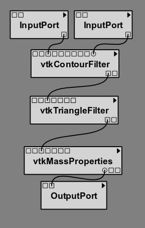
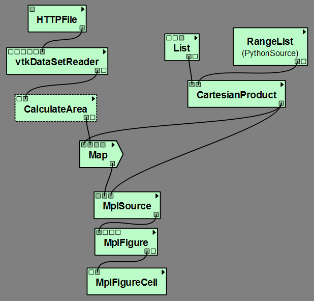
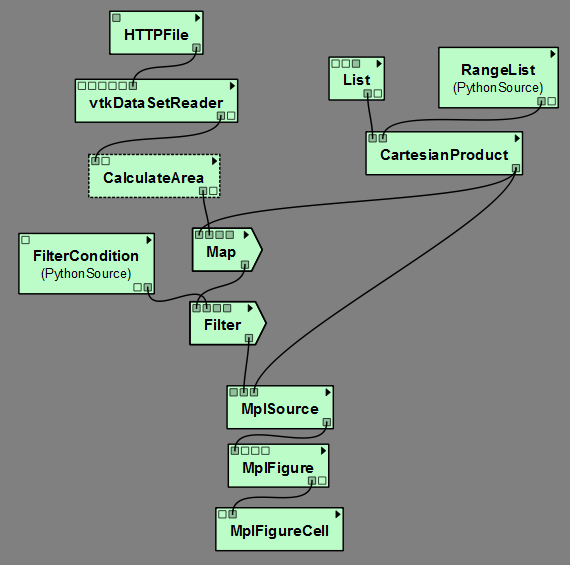
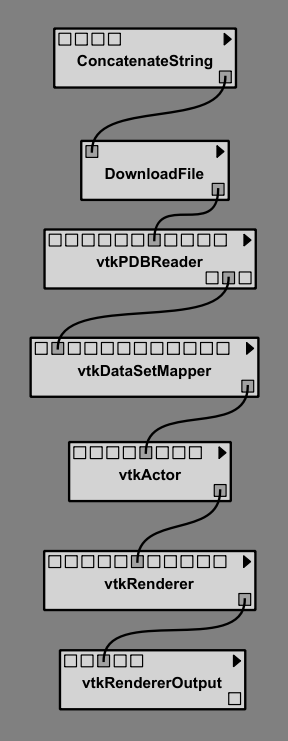
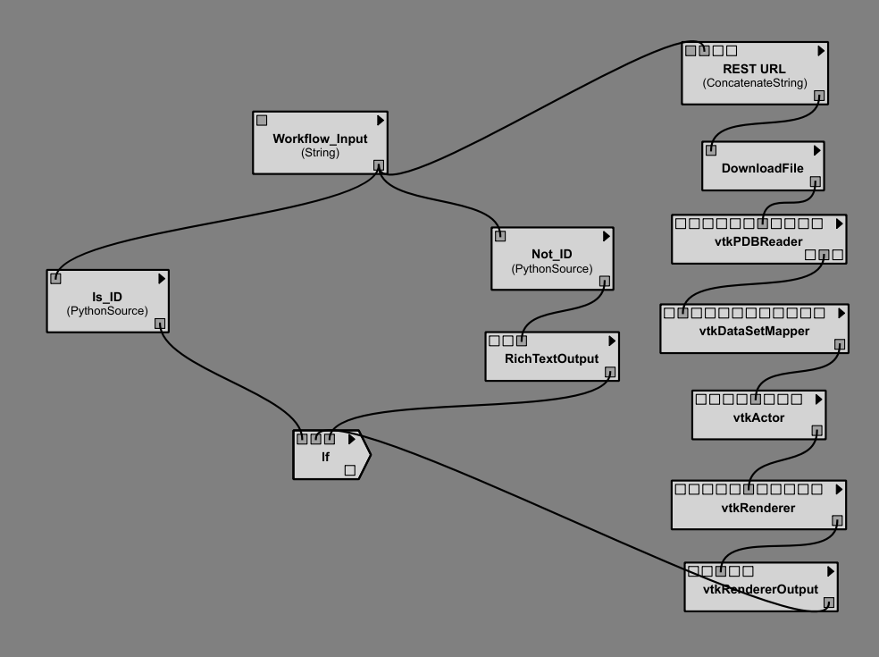
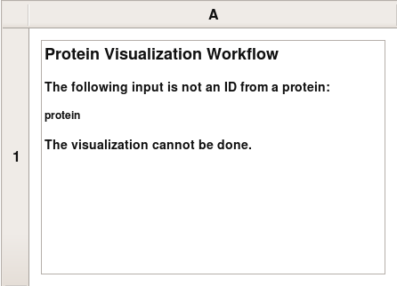

\DefineVerbatimEnvironment%
  {PythonSnippet}{Verbatim}
  {fontsize=\footnotesize,
    frame=single,
    numberblanklines=false,
    commandchars=\\\{}}

.. _chap-controlflow:

*************************
Control Flow in VisTrails
*************************

Scientific workflows usually follow a dataflow model, but, in some cases,
control structures, including loops and conditionals, are necessary to
accomplish certain tasks. |vistrails| provides the ``Control Flow``
package to support these and other structures.

The Map operator
================
In functional programming, ``map`` is a high-order function that applies 
a given function to a list (each element of the list is processed using this 
function) and returns a sequence of results. The ``Map`` module 
provides this functionality for workflows in \vistrails. Note that this
module provides simple looping as it can be used to iterate through a list
of inputs.

In order to use the ``Map`` module, a ``ListOfElements``
type representing a list of data structure is also provided. Two additional
modules help users combine elements of lists: ``Dot`` combines the
elements of two lists like the dot product (the first element of the first list
is combined with the first of the second one, the second element of the first
list is combined with the second of the second one, and so on), and
``Cross`` combines the elements as the cross product (all the possible
combinations between the elements of the lists); both modules return a list of
tuples. In addition to two lists of elements as input ports, they take an
optional boolean input named "CombineTuple". This input is useful
when one or both input lists have tuples as elements; if this port is selected,
and its value is ``False``, the elements of the list will not be
combined in just one tuple, \eg (1, 2) + 3 $\rightarrow$ ((1, 2), 3);
otherwise, the elements will be combined, \eg (1, 2) + 3 $\rightarrow$
(1, 2, 3).

The Map module has four input ports:
 "FunctionPort": this port receives the module (via the
"self" output port) that represents the function to be applied for
 each element of the input list; if the function uses more than one module,
 you must use a ``Group`` (see Chapter~:ref:`chap-creating`) or
 a ``SubWorkflow`` and
connect that composite module to this port;
 "InputPort": this port receives a list of the names of the
 input ports that represent the individual arguments of the function;
 "OutputPort": this port receives the name of the output port
 that represents the individual result of the function;
 "InputList": this port receives the input list for the loop;
it must be a list of tuples if more than one function input port was chosen.

The output port "Result" produces a list of results, one for each
 element in the input list.

To better show how to use the ``Map`` module, let's use a workflow as
an example. Inside the "examples" directory of the |vistrails|
distribution, open the "triangle$_$area.vt" vistrail. Now, select the
"Surface Area" version. This version basically calculates the area
of a given isosurface. We are going to modify this version, in order to
calculate the areas of the isosurface given by contour values in a list.
Then, we will create a 2D plot to show all the areas.

Begin by deleting the ``StandardOutput`` module, and the connection
between the ``vtkDataSetReader`` and the ``vtkContourFilter``
modules. Then, drag the following modules to the canvas:
 ``Map``
 ``ListOfElements``
 ``Cross``
 ``MplPlot`` (under "matplotlib")
 ``MplFigure`` (under "matplotlib")
 ``MplFigureCell`` (under "matplotlib")
 ``InputPort`` (under "Basic Modules") - you will need
two of them
 ``OutputPort`` (under "Basic Modules")
 ``PythonSource`` (under "Basic Modules")

Notice that when you drag ``Map`` to the pipeline canvas it will be
drawn in a different shape from the other modules. This is a visual cue to
help distinguish control modules from other modules. All control modules
have the same shape.

Select the ``vtkContourFilter`` module and delete its method "SetValue"
in the ``Set Methods`` container. Then, open its configuration dialog
(you can use the "Ctrl-E" or "Command-E" keyboard shortcut) and
enable this method (the input port "SetValue") by clicking on it,
and pressing ``OK``.

Then, connect the modules as shown in Figure~:ref:`fig-controlflow-calculate_area`.

These modules represent the function we wish to map: each element of the input list
will be processed using them. Because we have more than one module, we need to
create a ``Group`` or a ``SubWorkflow`` to identify the entire
function. The ``InputPort`` and the ``OutputPort`` modules are
necessary to expose these ports in the ``Group``/``SubWorkflow``
structure.

In this example, we will use a ``SubWorkflow`` structure. Select all the
modules shown in Figure~:ref:`fig-controlflow-calculate_area`, go to the
``Edit`` menu, and then click on ``Make SubWorkflow``. You can
name it ``CalculateArea``. Select this SubWorkflow and open its
configuration. When the configuration dialog opens, enable the output port
"self" and press ``OK``. You will need this port to connect to
the ``Map`` module.

Now, select the ``MplPlot`` module and open its configuration dialog. Inside
it, add two input ports of type ``ListOfElements``: "InputList" and
"X$_$Values". Also, copy the code listed below, in order to create the
necessary information for the 2D plot, into the source text area and save your
changes using the ``OK`` button.

Next, edit the ``PythonSource`` module by adding an output port "List"
of type ``ListOfElements``, copying the following code to the source text area,
and saving these changes.  The code will create a range of contour values that we will
use as our input list.

It may be helpful to identify this ``PythonSource`` module by labeling it as
``RangeList``. Connect all the modules as shown in
Figure~:ref:`fig-controlflow-map_workflow`.
.. _fig-controlflow-map_workflow:

   All the modules connected in the canvas

You will set some parameters now:
 ``HTTPFile``: set the parameter "url" to
\url{http://www.sci.utah.edu/~cscheid/stuff/head.120.vtk}
 ``ListOfElements``: set the parameter "value" to *[0]*
 ``Map``: set the parameter "InputPort" to
*[``SetValue'']* and the parameter "OutputPort" to
*GetSurfaceArea*

The workflow is now ready to be executed. When you execute the workflow, you will
see the SubWorkflow ``CalculateArea`` executing several times (one time
for each value of the input list). It's important to notice that, although only the
module connected to ``Map`` (in this example, the SubWorkflow
``Calculate Area``) will be in the loop, the modules above it will be also
used in each loop iteration; the difference is that they are going to be executed
only for the first iteration; in all other iterations, the results will be taken
from the cache.

When the workflow finishes its execution, the |vistrails| Spreadsheet will contain
a 2D plot (Figure~:ref:`fig-controlflow-map_spreadsheet`).
This example can be found in the version "Surface Area with Map", inside
the "triangle$_$area.vt" vistrail.

Filtering results
=================
When computing large lists of results, it can be useful to selectively reduce
the list during execution to avoid unnecessary computation.

The ``Filter`` module was developed to address this issue. It receives an
input list and, based on a specified boolean condition, returns only elements of
the list that satisfy the condition. Its ports are the same as those in the
``Map`` module. The difference between these modules is related to the
structure: in ``Filter``, the output port "FunctionPort" cannot
receive any function, but only a condition; in other words, the selected port in
"OutputPort" must return a boolean value or ``Filter`` will not
work. Thus, ``Filter`` will not return a list with boolean values as
``Map`` would do, but rather the elements of the input list for which
the condition evaluated to ``True``.

To better understand how ``Filter`` works, let's modify our earlier example
to filter out areas less than 200,000. With the previous vistrail open (you can
use the "Surface Area with Map" version), add the following modules to the
canvas:
 ``Filter``
 ``PythonSource`` (under "Basic Modules")

Edit the configuration of ``PythonSource`` by adding an input port of type
``Float`` named "Area", and an output port of type ``Boolean``
named "Condition", and writing the following code inside the source text
area:

Press the ``OK`` button. You can label this ``PythonSource`` as
``FilterCondition``. Now, reorganize the modules in the canvas as shown in
Figure~:ref:`fig-controlflow-mapandfilter_workflow`.
.. _fig-controlflow-mapandfilter_workflow:

   The new organization of the modules in the canvas

Select the ``Filter`` module and set the values of its parameters to the
following:
 "InputPort": *[``Area'']*
 "OutputPort": *Condition*

When you execute this workflow, it will generate another plot that is similar to
the one from the ``Map`` example, but only areas above 200,000 are
considered (Figure~:ref:`fig-controlflow-mapandfilter_spreadsheet`).
This example is already inside the "triangle$_$area.vt" vistrail, in the
"Surface Area with Map and Filter" version.

Later in this chapter, you will see how to combine ``Map`` and ``Filter``
in one single module, by creating your own control structure.

Conditional module
==================
Conditional statements are a very important control flow structure frequently used
in programming languages, and the ``if`` structure is probably the most
common of these structures. In scientific workflows, for example, an ``if``
structure can be used to select the part of the pipeline to be executed based on a
boolean condition.

For this reason, the ``Control Flow`` package also includes an ``If``
module. Its input ports are:
 "Condition": this port receives a boolean value that will specify the
direction of computation;
 "TruePort": this port receives the part of the workflow that will be
executed if the condition value is ``True``; you don't need to group or make
a SubWorkflow in this case: just connect the output port "self" of the
last module in this port;
 "FalsePort": this port receives the part of the workflow that will
be executed if the condition value is ``False``; as with the
"TruePort" port, you don't need to group or make a SubWorkflow;
 "TrueOutputPorts": this port receives a list that contains the names
of the output ports of the module connected to "TruePort" that you want the
result of; this port is optional; 
 "FalseOutputPorts": this port receives a list that contains the names
of the output ports of the module connected to "FalsePort" that you want the
result of; this port is optional.

The ``If`` module has an output port named "Result" that returns a
list with the results of the specified output ports of "TrueOutputPorts" or
"FalseOutputPorts", depending on the condition value. If only one output
port is chosen, the result of this port will not be returned in a list. If
"TrueOutputPorts" or "FalseOutputPorts" are not enabled,
"Result" returns ``None``.

Let's do now a simple example to show how exactly this module works. This example is
from the bioinformatics domain, and takes a string as the input; if it's a structure
identifier, a web service from the European Bioinformatics Institute, or simply EBI
(\url{http://www.ebi.ac.uk/}), a centre of researchs in bioinformatics,
is used to get the structure in the PDB format, a standard representation for
macromolecular structure, and then, the ``VTK`` package is used to show the protein in
the |vistrails| Spreadsheet; otherwise, the input is assumed to be invalid, and a message
is generated in the Spreadsheet too.

First, the EBI's web service must be enabled. For this, you nedd to add the following
url to the ``wsdlList`` configuration:

``ttp://www.ebi.ac.uk/Tools/webservices/wsdl/WSDbfetch.wsd``

Don't forget to ensure that the ``webServices`` package is enabled in the 
``Preferences`` dialog. For more information about web services in |vistrails|, see
Chapter~:ref:`chap-webservices`.

Now, you're going to drag the following modules to the canvas:
 ``If``
 ``fetchData`` (under "Methods" for the current web service)
 ``vtkPDBReader`` (under "VTK")
 ``vtkDataSetMapper`` (under "VTK")
 ``vtkActor`` (under "VTK")
 ``vtkRenderer`` (under "VTK")
 ``VTKCell`` (under "VTK")
 ``PythonSource`` (under "Basic Modules") - you will need
three of them
 ``String`` (under "Basic Modules")
 ``RichTextCell`` (under "|vistrails| Spreadsheet")

Select one of the ``PythonSource`` modules, and open its configuration dialog. Inside it,
add one input port of type ``String``, named "PDB$_$format", and one output port of
type ``File``, named "File". Then, write the following code:

You can name this module as ``CreateFile``.
Now, set some paremeters of ``fetchData``:

 "format": *pdb*
 "style": *raw*

Next, connect some modules as shown in Figure~:ref:`fig-controlflow-if_group`.
.. _fig-controlflow-if_group:

   Some modules of the workflow connected

The aim of this group of modules is to get the PDB format of the structure ID, through the web service,
and then make the visualization with the ``VTK`` package. This is the part of the workflow
that will be executed if the input is a structure identifier.

Next, select another ``PythonSource`` module and open its configuration
dialog too. One input port named "Structure", of type ``String``, and one
output port named "Is$_$ID", of type ``Boolean``, must be added, as well as the
code bellow:

\n" in structure:
    lineLen = structure.index("\\n")
else:
    lineLen = -1
if lineLen<1:
    lineLen = len(structure)

if ":" in structure:
    index = structure.index(":")
else:
    index = -1

if (structure[0]!="ID ") and (index>0) and (index<lineLen):
    is_ID = True
else:
    is_ID = False

self.setResult("Is_ID", is_ID)

Name this module as ``Is$_$ID``. This module will be the condition for the ``If``
structure.

Now, select the last ``PythonSource`` module, and, inside its configuration, add
one input port of type ``String``, named "Input", and one output port of
type ``File``, named "html". Then, copy the code bellow:

Name this ``PythonSource`` as ``Not$_$ID``. This module will print a message in the
|vistrails| Spreadsheet when the input is not a structure identifier.

Finally, the ``String`` module can be named as ``Workflow$_$Input``, to make it
clear that it takes the input of the workflow. Also, open the configuration dialog of
``RichTextCell`` to enable the output port "self", so it can be connected to the
``If`` module. Then, connect all the modules as shown in Figure~:ref:`fig-controlflow-if_workflow`. 
.. _fig-controlflow-if_workflow:

   All the modules connected

In order to better organize the disposal of the modules, group all the modules shown in
Figure~:ref:`fig-controlflow-if_group` by selecting them, going to the ``Edit``
menu and clicking on ``Group``. Name it as ``Generate$_$Visualization``.
Your workflow must correspond to the one shown in Figure~:ref:`fig-controlflow-if_workflow_group`.
.. figure:: figures/controlflow/If_Workflow_Group.png
   :align: center
   :width: 3.8in
Note that this implementation follows exactly the initial especification of the workflow. If the input
is a structure identifier (``Is$_$ID`` returns ``True``), ``Generate$_$Visualization``
will be executed; otherwise (``Is$_$ID`` returns ``False``), ``Not$_$ID``
and ``RichTextCell`` will create an error message in the |vistrails| Spreadsheet.

For the workflow execution, set the parameter "value" of the
``Workflow$_$Input`` module to *PDB:3BG0*. This entry is an ID from a
protein; so, the condition will be ``True``, and the ``Generate$_$Visualization``
group will be executed, generating the visualization show in
Figure~:ref:`fig-controlflow-if_spreadsheet_true`.
If you change the value from the input port "value" to *protein*, for example, the
condition will be ``False``, and the message shown in
Figure~:ref:`fig-controlflow-if_spreadsheet_false` will be generated in the Spreadsheet.
.. _fig-controlflow-if_spreadsheet_false:

   The message in the Spreadsheet, generated when the input is not a strucuture ID

This example can be found inside the "examples" directory, in the
"protein$_$visualization.vt" vistrail. It was partially based on the workflow
"Structure$_$or$"vtstring{Structure$_$or$\_$ID}, which can be found at 
\url{http://www.myexperiment.org/workflows/225}.

Building your own loop structure
================================
In functional programming, ``fold`` is a high-order function used to
encapsulate a pattern of recursion for processing lists. A simple example of a
``fold`` is summing the elements inside a list. If you ``fold`` the
list [1, 2, 3, 4] with the sum operator, the result will be (((1+2)+3)+4) = 10. It's
common to start with an initial value too. In the sum example, the initial value
would be 0, and the result would be ((((0+1)+2)+3)+4) = 10.

With this function, a programmer can do any type of recursion. In fact, the
``map`` and ``filter`` functions, shown previously, can be implemented
with ``fold``. The ``Control Flow`` package provides a ``Fold``
module to enable this functionality, and the ``Map`` and the ``Filter``
modules inherit from the ``Fold`` class.

In fact, any control module that has this kind of recursion uses the ``Fold``
class. To use this functionality for your own control modules, instead of defining
the ``compute()`` method, you need to define two other methods:
 ``setInitialValue()``: in this method, you will set the initial value
of the fold operator through the ``self.initialValue`` attribute; 
 ``operation()``: in this method, you must implement the function to
be applied recursively to the elements of the input list (\eg the sum fuction). More
specifically, you need to define the relationship between the previous iteration's
result (``self.partialResult`` attribute) and the current element of the list
(``self.element`` attribute); this method must be defined after the
``setInitialValue()`` one.

It's important to notice that all modules inheriting from ``Fold`` will have
the same ports, as ``Map`` and ``Filter``, but you can add any other
ports that will be necessary for your control structure. Also, you do not need to use
the input ports "FunctionPort", "InputPort" and
"OutputPort". You will only use them when you create an operator like
``Map`` and ``Filter``, which need a function to be applied for each
element of the input list.

As an example, we will create a simple ``Sum`` module to better understand the
idea. Create a new package, and the code inside it would be as follow:

\important{from controlflow import Fold, registerControl}\label{ref:sum:config1}

version = “0.1”
name = “My Control Modules”
identifier = “edu.utah.sci.my_control_modules”

\important{def package_dependencies():}\label{ref:sum:config2}
    \important{return [``edu.utah.sci.vistrails.control_flow'']}\label{ref:sum:config3}

class Sum(\important{Fold}):
    \important{def setInitialValue(self):}\label{ref:sum:config4}
        \important{self.initialValue = 0}\label{ref:sum:config5}

    \important{def operation(self):}\label{ref:sum:config6}
        \important{self.partialResult += self.element}\label{ref:sum:config7}

def initialize(*args,**keywords):
    \important{registerControl(Sum)}\label{ref:sum:config8}

We begin by importing the ``Fold`` class and the ``registerControl``
function from the ``Control Flow`` package (Line~:ref:`ref-sum-config1`).
The ``registerControl`` function is used to register the control modules, so
the shape of them can be set automatically.

Also, define the variables ``version``, ``name`` and
``identifier``, as it's done for all
packages. The interpackage dependency (include reference of the package chapter) is
used too, as ``My Control Modules`` requires a module and a function from
``Control Flow`` (Lines~:ref:`ref-sum-config2` and~:ref:`ref-sum-config3`); in
this way, |vistrails| can initialize the packages in the correct order. Then, create
the class ``Sum``, which inherits from ``Fold``. Inside it, set the
initial value to 0 inside the ``setInitialValue()`` method
(Lines~:ref:`ref-sum-config4` and~:ref:`ref-sum-config5`), and define the sum operator
inside ``operation()``, as shown clearly by the relation between
``self.partialResult`` and ``self.element``
(Lines~:ref:`ref-sum-config6` and~:ref:`ref-sum-config7`).

The last thing we must do is define the ``initialize()`` method, so the
package can be loaded in \vistrails. However, instead of calling the registry, if you
do not need any other ports, you just have to call the ``registerControl()``
function (Line~:ref:`ref-sum-config8`).

Save this package and enable it inside \vistrails. Create a similar workflow as shown
in Figure~:ref:`fig-controlflow-sum_workflow`.
``Sum`` module}
pon executing this workflow, the sum ((((0+1)+2)+3)+4), should be printed on your
terminal as following:

Note that the input ports "FunctionPort", "InputPort" and
"OutputPort" were not necessary for this module. Now, let's see another
example that does use them. Open the workflow we used to calculate the area of
isosurfaces (in "triangle$_$area.vt", "Surface Area with Map
and Filter" version), and delete the ``Map``, the ``Filter``, and the
``FilterCondition`` (``PythonSource``) modules.

Now, create a single module that maps the list and filters the results, named as
``AreaFilter``. Inside your package, add the following class:

\important{Fold}):
    \important{def setInitialValue(self):}
        \important{self.initialValue = []}\label{ref:areafilter:config1}

    \important{def operation(self)}:
        \important{area = self.elementResult}\label{ref:areafilter:config2}

        \important{if area>200000:}\label{ref:areafilter:config3}
            \important{self.partialResult.append(area)}\label{ref:areafilter:config4}

The initial value is an empty list, so the result of each element can be appended to
it (Line~:ref:`ref-areafilter-config1`). In the ``operation()`` method, the
``self.elementResult`` attribute is used (Line~:ref:`ref-areafilter-config2`);
it represents the result of the port chosen in "OutputPort"; so, it means
that "FunctionPort", "InputPort" and "OutputPort" will have
connections. In this workflow, ``self.elementResult`` is the area for each
contour value inside the input list, and, if the area is above 200,000, it will be
appended to the final result (Lines~:ref:`ref-areafilter-config3`
and~:ref:`ref-areafilter-config4`). We can easily see that this module does exactly
the same as ``Map`` and ``Filter`` combined.

Don't forget to register this module in the ``initialize()`` function. After
doing this, save the package and load it again inside \vistrails. Then, just connect
``AreaFilter`` as in Figure~:ref:`fig-controlflow-areafilter_workflow`.
``AreaFilter``}
.. figure:: figures/controlflow/AreaFilter_Workflow.png
   :align: center
   :width: 3.8in
ow, you must set some values in the following parameters of ``AreaFilter``:
 "InputPort": *[``SetValue'']*
 "OutputPort": *GetSurfaceArea*

When you execute this workflow, the result in the |vistrails| Spreadsheet will be the
same as shown previously (Figure~:ref:`fig-controlflow-mapandfilter_spreadsheet`). It
shows the flexibility of doing a recursion function by inheriting from
``Fold``.
