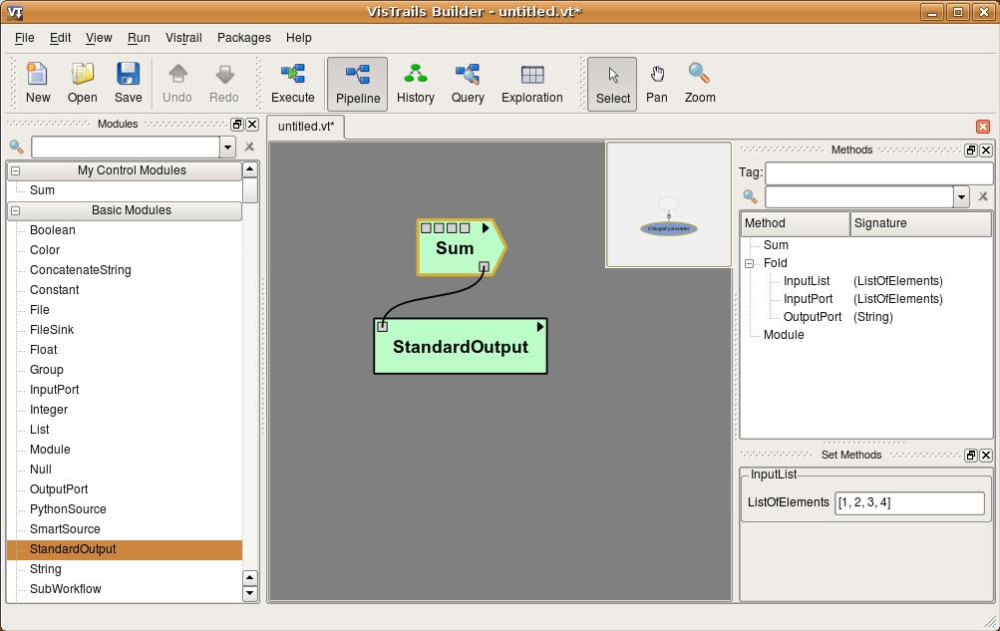
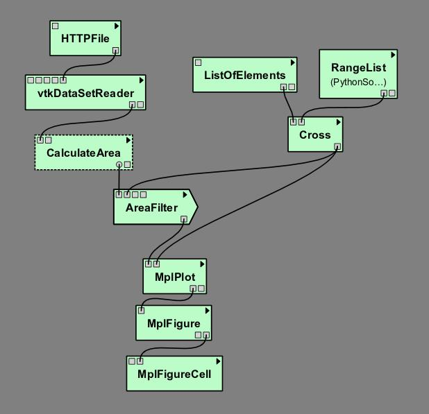

.. _chap-controlflowdev:

***********************************
Creating a Control Flow Loop Module
***********************************

This chapter explains how to extend the ``Control Flow`` package by creating additional loop modules. For more information on ``Control Flow`` or the ``Control Flow Assistant``, please refer to :ref:`chap-controlflow` or :ref:`chap-controlflow-assistant` in the User's Guide.

Building your own loop structure
================================

In functional programming, ``fold`` is a high-order function used to
encapsulate a pattern of recursion for processing lists. A simple example of a
``fold`` is summing the elements inside a list. If you ``fold`` the
list [1, 2, 3, 4] with the sum operator, the result will be (((1+2)+3)+4) = 10. It's
common to start with an initial value too. In the sum example, the initial value
would be 0, and the result would be ((((0+1)+2)+3)+4) = 10.

With this function, a programmer can do any type of recursion. In fact, the
``map`` and ``filter`` functions, shown previously, can be implemented
with ``fold``. The ``Control Flow`` package provides a ``Fold``
module to enable this functionality, and the ``Map`` and the ``Filter``
modules inherit from the ``Fold`` class.

In fact, any control module that has this kind of recursion uses the ``Fold``
class. To use this functionality for your own control modules, instead of defining
the ``compute()`` method, you need to define two other methods:

* ``setInitialValue()``: in this method, you will set the initial value of the fold operator through the ``self.initialValue`` attribute; 
* ``operation()``: in this method, you must implement the function to be applied recursively to the elements of the input list (|eg| the sum function). More specifically, you need to define the relationship between the previous iteration's result (``self.partialResult`` attribute) and the current element of the list (``self.element`` attribute); this method must be defined after the ``setInitialValue()`` one.

It's important to notice that all modules inheriting from ``Fold`` will have
the same ports, as ``Map`` and ``Filter``, but you can add any other
ports that will be necessary for your control structure. Also, you do not need to use
the input ports "FunctionPort", "InputPort" and
"OutputPort". You will only use them when you create an operator like
``Map`` and ``Filter``, which need a function to be applied for each
element of the input list.

As an example, we will create a simple ``Sum`` module to better understand the
idea. Create a new package, and the code inside it would be as follows:

.. role:: red

.. code-block:: python
   :linenos:
  
   from controlflow import Fold, registerControl

   version = "0.1"
   name = "My Control Modules"
   identifier = "edu.utah.sci.my_control_modules"

   def package_dependencies():
       return ["edu.utah.sci.vistrails.control_flow"]

   class Sum(Fold):
       def setInitialValue(self):
           self.initialValue = 0

       def operation(self):
           self.partialResult += self.element

   def initialize(*args,**keywords):
       registerControl(Sum)

.. highlight:: python
   :linenothreshold: 1

.. .. parsed-literal::

   :red:`from controlflow import Fold, registerControl`

   version = "0.1"
   name = "My Control Modules"
   identifier = "edu.utah.sci.my_control_modules"

   :red:`def package_dependencies():`
       :red:`return ["edu.utah.sci.vistrails.control_flow"]`

   class Sum(:red:`Fold`):
       :red:`def setInitialValue(self):`
           :red:`self.initialValue = 0`

       :red:`def operation(self):`
           :red:`self.partialResult += self.element`

   def initialize(\*args,**keywords):
       :red:`registerControl(Sum)`

We begin by importing the ``Fold`` class and the ``registerControl``
function from the ``Control Flow`` package (Line 1).
The ``registerControl`` function is used to register the control modules, so
the shape of them can be set automatically.

Also, define the variables ``version``, ``name`` and
``identifier``, as it's done for all
packages. The interpackage dependency (include reference of the package chapter) is
used too, as ``My Control Modules`` requires a module and a function from
``Control Flow`` (Lines 7 and 8); in
this way, |vistrails| can initialize the packages in the correct order. Then, create
the class ``Sum``, which inherits from ``Fold``. Inside it, set the
initial value to 0 inside the ``setInitialValue()`` method
(Lines 11 and 12), and define the sum operator
inside ``operation()``, as shown clearly by the relation between
``self.partialResult`` and ``self.element``
(Lines 14 and 15).

The last thing we must do is define the ``initialize()`` method, so the
package can be loaded in |vistrails|. However, instead of calling the registry, if you
do not need any other ports, you just have to call the ``registerControl()``
function (Line 18).

Save this package and enable it inside |vistrails|. Create a similar workflow as shown
in Figure :ref:`fig-controlflow-sum_workflow`.

.. _fig-controlflow-sum_workflow:

   A workflow using the ``Sum`` module

Upon executing this workflow, the sum ((((0+1)+2)+3)+4), should be printed on your
terminal as follows:

``10``

Note that the input ports "FunctionPort", "InputPort" and
"OutputPort" were not necessary for this module. Now, let's see another
example that does use them. Open the workflow we used to calculate the area of
isosurfaces (in "triangle_area.vt", "Surface Area with Map
and Filter" version), and delete the ``Map``, the ``Filter``, and the
``FilterCondition`` (``PythonSource``) modules.

Now, create a single module that maps the list and filters the results, named as
``AreaFilter``. Inside your package, add the following class:

.. code-block:: python
   :linenos:

   class AreaFilter(Fold):
       def setInitialValue(self):
           self.initialValue = []

       def operation(self):
           area = self.elementResult

           if area>200000:
               self.partialResult.append(area)

.. .. parsed-literal::

   class AreaFilter(:red:`Fold`):
       :red:`def setInitialValue(self):`
       .. _ref-areafilter-config1:

           :red:`self.initialValue = []`

       :red:`def operation(self):`
           :red:`area = self.elementResult`\label{ref:areafilter:config2}

           :red:`if area>200000:`\label{ref:areafilter:config3}
               :red:`self.partialResult.append(area)`\label{ref:areafilter:config4}

The initial value is an empty list, so the result of each element can be appended to
it (Line 3). In the ``operation()`` method, the
``self.elementResult`` attribute is used (Line 6);
it represents the result of the port chosen in "OutputPort"; so, it means
that "FunctionPort", "InputPort" and "OutputPort" will have
connections. In this workflow, ``self.elementResult`` is the area for each
contour value inside the input list, and, if the area is above 200,000, it will be
appended to the final result (Lines 8 and 9). We can easily see that this module does exactly
the same as ``Map`` and ``Filter`` combined.

Don't forget to register this module in the ``initialize()`` function. After
doing this, save the package and load it again inside |vistrails|. Then, just connect
``AreaFilter`` as in Figure :ref:`fig-controlflow-areafilter_workflow`.

.. _fig-controlflow-areafilter_workflow:

   The same workflow, but now with ``AreaFilter``

Now, you must set some values in the following parameters of ``AreaFilter``:

* "InputPort": *["SetValue"]*
* "OutputPort": *GetSurfaceArea*

When you execute this workflow, the result in the |vistrails| Spreadsheet will be the
same as shown previously (Figure :ref:`fig-controlflow-mapandfilter_spreadsheet`). It
shows the flexibility of doing a recursion function by inheriting from
``Fold``.
