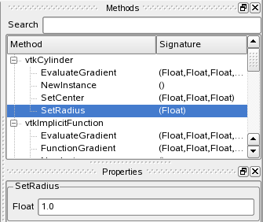
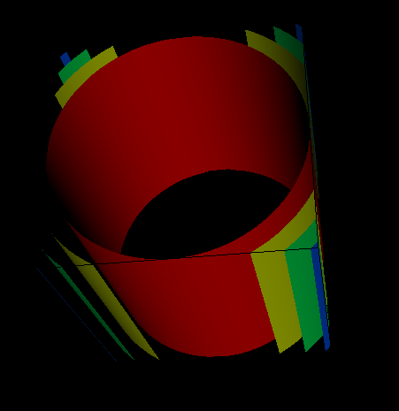
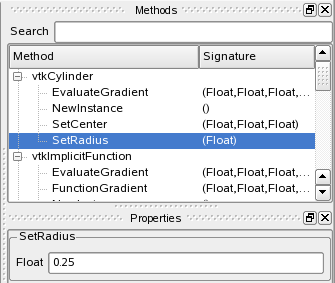
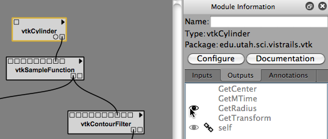
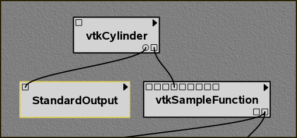
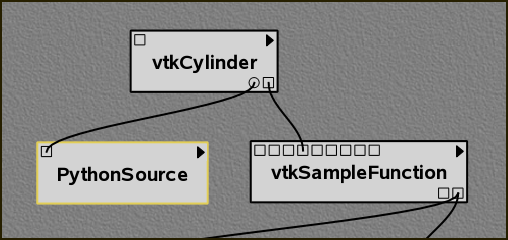
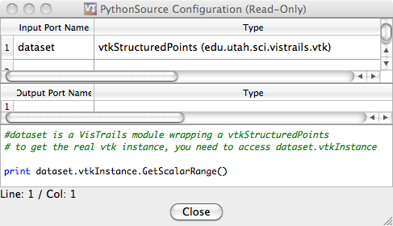

.. _part2:

.. _chap-creating:

********************************
Creating and Modifying Workflows
********************************

.. index:: builder

Working with Modules
====================

.. index:: modules

In VisTrails, modules are represented by a rectangle in the
``Pipeline`` view of the Builder.  The name of the module is
shown in bold letters in the middle of the rectangle.  The input and
output ports for the module are denoted by small squares on the top
and bottom of the module, respectively.  Modules are connected
together to define the dataflow using curved black lines that go from
output to input ports between modules.  Each module may have also have
adjustable parameters that can be viewed when a module is selected.
Modules can be connected, disconnected, added, and deleted from a
workflow.

As a running example in this chapter, we will make some changes to the
"vtk\_book\_3rd\_p189.vt" vistrail, included in the
"examples" folder of the |vistrails| installation.

.. topic:: Try it now!

   Open the "vtk\_book\_3rd\_p189.vt" vistrail, either by selecting ``File`` :math:`\rightarrow` ``Open`` from the menu, or by clicking the ``Open`` button on the toolbar. After opening this vistrail, select the version labeled ``final``, then click on the ``Pipeline`` toolbar button to enter workflow editing mode.

Adding and Deleting Modules
===========================

.. index:: 
   pair: modules; adding

A list of available modules is displayed
hierarchically in the ``Modules`` container on the left side
of the VisTrails Builder (Figure :ref:`The main VisTrails Pipeline... <fig-pipeline_screenshot>`). A core set of basic modules is always
distributed with the VisTrails system.  Other packages, such as VTK,
are also distributed, but are not necessary for VisTrails and thus can
be disabled on startup (see Chapter :ref:`chap-packages`). Note, however, that the VTK module *is* required for most of the examples in this book. Depending on
the number of packages imported on startup, the number of modules to
select from can be difficult to navigate.  Thus, a simple search box
is provided at the top of the container to narrow the displayed
results.  To add a module to the workflow, simply drag the text from
the ``Module`` container to the workflow canvas.

.. _fig-pipeline_screenshot:

.. figure:: /figures/creating/pipeline_screenshot_labeled.png
   :width: 5 in
   :align: center

   The main |vistrails| Pipeline user interface. The major components are labeled.

.. index::
   pair: modules; selecting
   pair: connections; selecting

Modules and
connections may be selected in multiple ways and are denoted by a
yellow highlight.
Besides directly left clicking on the object, a box selection is available by left clicking and dragging over the modules and connections in the canvas.  Multiple selection can be performed with the box selection as well as by right clicking on multiple objects with the 'Shift' key pressed.

.. index::
   pair: modules; deleting

There are several ways to manipulate selected
modules in the workflow canvas.  Moving them is performed by dragging
a selected module using the left mouse button.  Deleting selected
modules is performed by pressing the 'Delete' key.  The modules
and connections can also be copied and pasted using the
``Edit`` menu, or with 'Ctrl-C' and 'Ctrl-V', respectively.

.. topic:: Try it now!

   Let's replace the ``vtkQuadric`` module in our example with a ``vtkCylinder`` module instead. To do this, first type "vtkCylinder" into the search box of the ``Module`` container.  As the letters are typed, the list filters the available modules to match the query.  Select this module and drag the text onto an empty space in the canvas (see Figure :ref:`The vtkCylinder module is added to the canvas <fig-add_and_delete_modulea>`).  Then, select the ``vtkQuadric`` module in the canvas and press the 'Delete' key.  This removes the module along with any connections it has (see Figure :ref:`The vtkQuadric module is deleted <fig-add_and_delete_moduleb>`).

.. _fig-add_and_delete_modulea:

.. figure:: /figures/creating/add_cylinder.png
   :height: 1.25in
   :align: center

   The ``vtkCylinder`` module is added to the canvas.

.. _fig-add_and_delete_moduleb:

.. figure:: /figures/creating/cylinder_not_connected_but_quadric_deleted.png
   :height: 1.25in
   :align: center

   The ``vtkQuadric`` module is deleted.

Connecting Modules
==================

.. index::
   pair: modules; connecting
   pair: connections; adding
   single: ports

Modules are connected in VisTrails through the input and output ports
at the top and bottom of the module, respectively.  By hovering the
mouse over the box that defines a port, the name and data type are
shown in a small tooltip.  To connect two ports from different
modules, start by left clicking inside one port, then dragging the
mouse to the other.  The connection line will automatically snap to
the ports in a module that have a matching datatype.  Since multiple
ports may match, hovering the mouse over the port to confirm the
desired match may be necessary.  Once a suitable match is found,
releasing the left mouse button will create the connection.  Note, a
connection will only be made if the input and output port's data types
match.  To disconnect a connection between modules, the line between
the modules can be selected and deleted with the 'Delete' key.

.. topic:: Try it now!

   To connect the ``vtkCylinder`` module to the ``vtkSampleFunction`` module, place the cursor over the only output port on the ``vtkCylinder`` module, located on the bottom right. A tooltip should appear that reads "Output port self (vtkCylinder)."  Left click on the port and drag the mouse over the ``vtkSampleFunction`` module.  The connection should snap to the fourth input port from the left.  Hovering the mouse over this port shows a tooltip that reads "Input port SetImplicitFunction (vtkImplicitFunction)."  Release the mouse button to complete the connection between these two modules (see Figure :ref:`The connection replaced <fig-add_and_delete_modulec>`).  To check for a valid dataflow, execute the workflow by pressing the ``Execute`` button on the toolbar, and see if the results appear in the spreadsheet.

.. _fig-add_and_delete_modulec:

.. figure:: /figures/creating/delete_quadric.png
   :height: 1.25in
   :align: center

   The connection replaced.

Changing Module Parameters
==========================

.. index::
   pair: parameters; changing
   pair: modules; parameters
   single: methods

The parameters for a module can be accessed in the
``Module Information`` tab located on the right side of the
Builder window.  When a module on the canvas is selected, the corresponding
module information is displayed.  The ``Inputs``, ``Outputs``, and ``Annotations`` tabs can be selected to set parameters within the respective categories.  To set a parameter, simply click on its name to reveal its input box and enter the desired value.  Notice that a ``-`` and ``+`` button appears to the left of the input box.  The ``-`` button removes the corresponding input box and the ``+`` button adds one.  This allows you to experiment with different values, but only the values in the last box are used in the final result.  

.. topic:: Try it now!

   To perform a parameter change, select the ``vtkCylinder`` module in the canvas.  Select ``SetRadius``, enter 0.25 into the text box and press the 'Enter' key.  By executing the workflow, the modified visualization appears in the spreadsheet.  Figures :ref:`The module methods... and The results... <fig-parameter_changes>` show the interface and results of the parameter explorations.

.. _fig-parameter_changes:

   The module methods interface is shown with a change of the ``SetRadius`` parameter to 1.0.

   The results of the changes are displayed on execution.

   The module methods interface is shown with a change of the ``SetRadius`` parameter to 0.25.

.. figure:: figures/creating/cylinder2.png
   :height: 1.5in
   :align: center

   The results of the changes are displayed on execution.

Using Global Variables
======================

VisTrails supports the use of global variables, which allows the user to create a variable which can be used anywhere within the vistrail.  So, if you create a variable of type ``String``, you can assign that variable to any port of type ``String``.  This is done by opening the ``Vistrail Variables`` view, creating a variable, and then dragging it to the desired port.

.. topic:: Try it now!

   Open vtk_http.vt and go to the ``Pipeline`` view of the ``Fran Cut Smoothed`` version.  Select ``Views`` :math:`\rightarrow` ``Vistrail Variables``.  Select the ``String`` module from ``Basic Modules``, drag it over to the ``Vistrail Variables`` tab, and drop it (see Figure :ref:`Create a Variable... <fig-global-create>`).  Name it 'Filename1' and assign it the following value: 'http://www.sci.utah.edu/~cscheid/stuff/vtkdata-5.0.2.zip'.  Click on ``String``, which is just below ``Filename1`` in the ``Vistrail Variables`` tab.  Drag it over and drop it in the port of the ``HTTPFile`` (as shown in Figure :ref:`Assign a Variable... <fig-global-assign>`). The variable should be assigned and the port should be filled in with yellow.

To delete a global variable, simply click on the 'X' button that appears to the right of its name.  This will remove the variable, but if any ports are assigned to it, they need to be disconnected.  You can do this by right-clicking on the port and selecting ``Disconnect Vistrail Variables`` (see Figure :ref:`Disconnect a Variable... <fig-disconnect>`).

.. _fig-global-create:

.. figure:: /figures/creating/globalcreate.png
   :width: 2.5in

   Create a Variable - Drag the ``String`` module and drop it in the ``Vistrail Variables`` tab to create a global variable.

.. _fig-global-assign:

.. figure:: /figures/creating/globalassign.png
   :width: 2.5in

   Assign a Variable - Drag the type from just below the Global Variables name on the ``Vistrail Variables`` tab.  Drop it on a port to set the variable.

.. _fig-disconnect:

.. figure:: /figures/creating/disconnect.png
   :width: 2.5in

   Disconnect a Variable - To disconnect a global variable, right click on the assigned port and select ``Disconnect Vistrail Variables``.

Configuring Module Labels
=========================

.. index::
   pair: modules; labels

To give the module a custom name, enter it in the ``Module Information`` tab's ``Name`` box.  The modules name will be displayed with the original module name(type) displayed in parenthesis below it.

Configuring Module Ports
========================

.. index::
   pair: modules; ports
   pair: ports; adding
   pair: ports; deleting

For convenience, all the inputs and outputs of a module are not always
shown in the canvas as ports.  The ports that are shown by default are
defined with the method signatures of a package.  A full list of ports is available in the ``Module Configuraton`` window, which is accessed by clicking on the ``Configure`` button in the module information tab or pressing 'Ctrl-E' when a module is selected.  Alternatively, module ports can be enabled/disabled by clicking in the left margin next to the port name in the ``Inputs`` or ``Outputs`` tabs of the ``Module Information`` tab (see Figure :ref:`Enabling the GetRadius port from the Module Information tab <fig-enabling_ports>`).  When enabled, an eye icon will appear to the left of the port name.  New ports will appear on the module with a circle icon instead of a square to signify that they are not visible by default, but can be connected in the same way as the others.

.. %TODO module_configuration.png should be changed to reflect v2.0.  Caption: The module configuration window allows the hidden ports to be displayed.

.. topic:: Try it now!

   As an example of configuring a module port, select the ``vtkCylinder`` module in the canvas, select ``Outputs`` from the ``Module Information`` tab, and click in the left margin next to GetRadius (see Figure :ref:`Enabling the GetRadius port from the Module Information tab <fig-enabling_ports>`). A new circle port should appear on the module.  Next, add a new ``StandardOutput`` module from the basic modules and connect the output port for ``GetRadius`` to the input port of ``StandardOutput``.  Upon execution, the value 0.25 is now output to the console.  Figure :ref:`The vtkCylinder module... <fig-module_configuration>` shows the new workflow.

.. _fig-enabling_ports:

   Enabling the GetRadius port from the ``Module Information`` tab.

.. _fig-module_configuration:

   The ``vtkCylinder`` module is configured to show an additional ``GetRadius`` port, which is then connected to a ``StandardOutput`` module.

Basic Modules
=============

.. index::
   pair: modules; basic

In addition to the modules provided by external
libraries, VisTrails provides a few basic modules for convenience and
to facilitate the coupling of multiple packages in one workflow.
These modules mostly consist of basic data types in Python and some
manipulators for them.  In addition, file manipulation modules are
provided to read files from disk and write files to disk.  

.. _sec-pythonsource:

PythonSource
^^^^^^^^^^^^

.. index:: PythonSource

Because not every Python operation can be represented as a module, the
``PythonSource`` module is provided to
allow you to write Python statements to be executed as part of a
workflow.  By pressing 'Ctrl-E' when a ``PythonSource``
module is selected in the canvas, a configuration window is opened.
This window allows you to specify custom input and output ports
as well as directly enter Python source to be executed in the
workflow.

.. topic:: Note

   Sometimes is it useful to view the source code that is contained in the ``PythonSource`` module when working with other modules.  Since the PythonSource configuration window will disappear when you select a new module, a ``Show read-only window`` button can be used to open a read-only window of the ``PythonSource's`` configuration, which will remain open until it is closed.

.. topic:: Try it now!

   To demonstrate a ``PythonSource`` module, we will output the center of the cylinder using Python instead of the ``StandardOutput`` module.  First, add a ``PythonSource`` module to the canvas and remove the ``StandardOutput`` module.  Select the ``PythonSource`` module and press 'Ctrl-E' to edit the configuration.  In the newly opened configuration window, create a new input port named "radius" of type ``Float``.  Next, in the source window enter::

      print radius

   then select ``OK`` to close the window.  Finally, connect the ``GetRadius`` output of the ``vtkCylinder`` module to the new input port of ``PythonSource``.  Upon execution, the radius of the cylinder is printed to the console as before.  Figure :ref:`A PythonSource module can be used to directly insert scripts into the workflow <fig-python_source>` shows the new workflow together with the ``PythonSource`` configuration window.

.. _fig-python_source:

   A ``PythonSource`` module can be used to directly insert scripts into the workflow.

.. figure:: figures/creating/python_source_configuration.png
   :height: 2.5in
   :align: center

   The configuration window for ``PythonSource`` allows multiple input and output ports to be specified along with the Python code that is to be executed.

**Accessing vtkObjects in PythonSource** When using a ``PythonSource`` module, users will often rely on their knowledge of VTK to interact with VTK modules.  It is important to realize that a VTK module is really a wrapping of a vtkObject.  The real vtkObject is called vtkInstance, meaning the vtkObject of a module called 'dataset' is called 'dataset.vtkInstance' (see figure :ref:`Accessing vtkObjects... <fig-pythonsource-vtkinstance>`).

.. _fig-pythonsource-vtkinstance:

   Accessing vtkObjects - The vtkObject of a VTK module, 'dataset', is accessed with 'dataset.vtkInstance'. 

.. index:: builder
