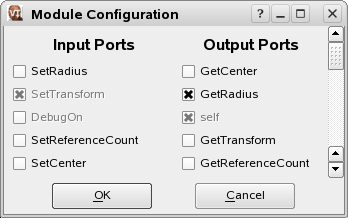
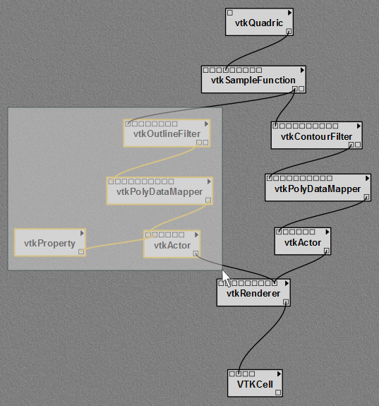
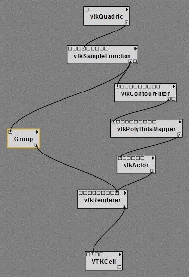
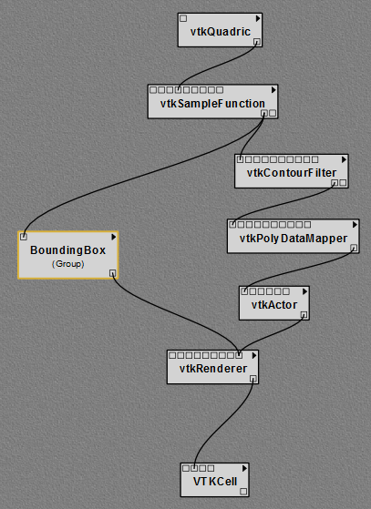

.. _part2:

.. _chap-creating:

********************************
Creating and Modifying Workflows
********************************

.. index:: builder

Working with Modules
====================

.. index:: modules

In VisTrails, modules are represented by a rectangle in the
``Pipeline`` view of the Builder.  The name of the module is
shown in bold letters in the middle of the rectangle.  The input and
output ports for the module are denoted by small squares on the top
and bottom of the module, respectively.  Modules are connected
together to define the dataflow using curved black lines that go from
output to input ports between modules.  Each module may have also have
adjustable parameters that can be viewed when a module is selected.
Modules can be connected, disconnected, added, and deleted from a
workflow.

As a running example in this chapter, we will make some changes to the
"vtk\_book\_3rd\_p189.vt" vistrail, included in the
"examples" folder of the |vistrails| installation.

.. topic:: Try it now!

   Open the "vtk\_book\_3rd\_p189.vt" vistrail, either by selecting ``File`` :math:`\rightarrow` ``Open`` from the menu, or by clicking the ``Open`` button on the toolbar. After opening this vistrail, click on the ``Pipeline`` toolbar button to enter workflow editing mode.

Adding and Deleting Modules
===========================

.. index:: 
   pair: modules; adding

A list of available modules is displayed
hierarchically in the ``Modules`` container on the left side
of the VisTrails Builder (Figure :ref:`fig-pipeline_screenshot`). A core set of basic modules is always
distributed with the VisTrails system.  Other packages, such as VTK,
are also distributed, but are not necessary for VisTrails and thus can
be disabled on startup (see Chapter :ref:`chap-packages`). Note, however, that the VTK module *is* required for most of the examples in this book. Depending on
the number of packages imported on startup, the number of modules to
select from can be difficult to navigate.  Thus, a simple search box
is provided at the top of the container to narrow the displayed
results.  To add a module to the workflow, simply drag the text from
the ``Module`` container to the workflow canvas.

.. _fig-pipeline_screenshot:

.. figure:: /figures/creating/pipeline_screenshot_labeled.png
   :width: 4 in
   :align: center

   The main |vistrails| Pipeline user interface. The major components are labeled.

.. index::
   pair: modules; selecting
   pair: connections; selecting

Modules and
connections may be selected in multiple ways and are denoted by a
yellow highlight.
Besides directly left clicking on the object, a box selection is available by left clicking and dragging over the modules and connections in the canvas.  Multiple selection can be performed with the box selection as well as by right clicking on multiple objects with the 'Shift' key pressed.

.. index::
   pair: modules; deleting

There are several ways to manipulate selected
modules in the workflow canvas.  Moving them is performed by dragging
a selected module using the left mouse button.  Deleting selected
modules is performed by pressing the 'Delete' key.  The modules
and connections can also be copied and pasted using the
``Edit`` menu, or with 'Ctrl-C' and 'Ctrl-V', respectively.

.. _fig-add_and_delete_modulea:

.. figure:: /figures/creating/add_cylinder.png
   :height: 1.25in
   :align: center

   The ``vtkCylinder`` module is added to the canvas.

.. _fig-add_and_delete_moduleb:

.. figure:: /figures/creating/cylinder_not_connected_but_quadric_deleted.png
   :height: 1.25in
   :align: center

   The ``vtkQuadric`` module is deleted.

.. _fig-add_and_delete_modulec:

.. figure:: /figures/creating/delete_quadric.png
   :height: 1.25in
   :align: center

   The connection replaced.

.. topic:: Try it now!

   Let's replace the ``vtkQuadric`` module in our example with a ``vtkCylinder`` module instead. To do this, first type "vtkCylinder" into the search box of the ``Module`` container.  As the letters are typed, the list filters the available modules to match the query.  Select this module and drag the text onto an empty space in the canvas.  (See Figure :ref:`fig-add_and_delete_modulea`.  Then, select the ``vtkQuadric`` module in the canvas and press the 'Delete' key.  This removes the module along with any connections it has (see Figure :ref:`fig-add_and_delete_moduleb`).

Connecting Modules
==================

.. index::
   pair: modules; connecting
   pair: connections; adding
   single: ports

Modules are connected in VisTrails through the input and output ports
at the top and bottom of the module, respectively.  By hovering the
mouse over the box that defines a port, the name and data type are
shown in a small tooltip.  To connect two ports from different
modules, start by left clicking inside one port, then dragging the
mouse to the other.  The connection line will automatically snap to
the ports in a module that have a matching datatype.  Since multiple
ports may match, hovering the mouse over the port to confirm the
desired match may be necessary.  Once a suitable match is found,
releasing the left mouse button will create the connection.  Note, a
connection will only be made if the input and output port's data types
match.  To disconnect a connection between modules, the line between
the modules can be selected and deleted with the 'Delete' key.

.. topic:: Try it now!

   To connect the ``vtkCylinder`` module to the ``vtkSampleFunction`` module, place the cursor over the only output port on the ``vtkCylinder`` module, located on the bottom right. A tooltip should appear that reads "Output port self (vtkCylinder)."  Left click on the port and drag the mouse over the ``vtkSampleFunction`` module.  The connection should snap to the fourth input port from the left.  Hovering the mouse over this port shows a tooltip that reads "Input port SetImplicitFunction (vtkImplicitFunction)."  Release the mouse button to complete the connection between these two modules (see Figure :ref:`fig-add_and_delete_modulec`.  To check for a valid dataflow, execute the workflow by pressing the ``Execute`` button on the toolbar, and see if the results appear in the spreadsheet.

Changing Module Parameters
==========================

.. index::
   pair: parameters; changing
   pair: modules; parameters
   single: methods

The parameters for a module can be accessed in the
``Methods`` container located on the right side of the
Builder window.  When a module is selected from the canvas, the corresponding
methods are displayed.  As with the ``Modules`` container, a
search box is provided to quickly find a desired method.  By default,
the Builder only manages methods with "set parameters."  To check the
set parameters, a ``Set Methods`` container is available
below the ``Methods`` container.  Changing a parameter can
be performed directly in the
``Set Methods`` container.  To set a parameter for the first
time, click on the corresponding method and drag it into the
``Set Methods`` container, then enter the parameters directly
into the text boxes.  To remove a method, simply select the
method in the ``Set Methods`` container and press
the 'Delete' key.

.. _fig-parameter_changes:

.. figure:: figures/creating/change_parameter_interface1.png
   :height: 1.5in
   :align: center

   The module methods interface is shown with a change of the ``SetRadius`` parameter to 1.0.

.. figure:: figures/creating/cylinder1.png
   :height: 1.5in
   :align: center

   The results of the changes are displayed on execution.

.. figure:: figures/creating/change_parameter_interface2.png
   :height: 1.5in
   :align: center

   The module methods interface is shown with a change of the ``SetRadius`` parameter to 0.25.

.. figure:: figures/creating/cylinder2.png
   :height: 1.5in
   :align: center

   The results of the changes are displayed on execution.

.. topic:: Try it now!

   To perform a parameter change, select the ``vtkCylinder`` module in the canvas.  The methods are shown hierarchically in the ``Methods`` container.  Find the ``SetRadius`` method and select it, then drag the highlighted text from the ``Methods`` container into the ``Set Methods`` container below.  The result is a ``SetRadius`` box with a ``Float`` text input.  Enter 0.25 into the text box and press the 'Enter' key.  By executing the workflow, the modified visualization appears in the spreadsheet.  Figure :ref:`fig-parameter_changes` shows the interface and results of the parameter explorations.

Configuring Module Ports
========================

.. index::
   pair: modules; ports
   pair: ports; adding
   pair: ports; deleting

For convenience, all the inputs and outputs of a module are not always
shown in the canvas as ports.  The ports that are shown by default are
defined using an option when defining the method signatures of a
package.  To access the full list of ports, the module configuration
window is used.  This is opened by selecting the triangle at the top
right of a module to open a popup menu and selecting
the ``Edit Configuration`` menu item,
or alternatively by
pressing 'Ctrl-E' when a module is selected. The window shows a
list of input and output ports and allows you to toggle any
additional ports to enable.  When the configuration is complete, the
new ports will appear on a module with a circle icon instead of the
normal square.  These new ports can then be used for connections in
the same way as the others.

.. %TODO screenshot!

.. _fig-module_configuration:

.. figure:: figures/creating/standard_output_module.png
   :height: 1.5in
   :align: center

   The ``vtkCylinder`` module is configured to show an additional ``GetRadius`` port, which is then connected to a ``StandardOutput`` module.

   The module configuration window allows the hidden ports to be displayed.

.. topic:: Try it now!

   As an example of configuring a module port, select the ``vtkCylinder`` module in the canvas and press 'Ctrl-E'.  In the newly opened configuration window, check the box for the ``GetRadius`` port, then click ``OK`` to close the window.  A new circle port should appear on the module.  Next, add a new ``StandardOutput`` module from the basic modules and connect the output port for ``GetRadius`` to the input port of ``StandardOutput``.  Upon execution, the value 0.25 is now output to the console.  Figure :ref:`fig-module_configuration` shows the new workflow together with the module configuration window.

.. _sec-creating-grouping:

Grouping Modules
================

.. index::
   pair: modules; grouping
   pair: modules; ungrouping

As the number of modules in a pipeline increases, the pipeline can grow quite large and cumbersome. This also makes the pipeline more difficult to understand and maintain.  With any large system, it can be helpful to cluster related pieces together and represent them as a single unit. This idea, called *encapsulation*, is commonly used in computer programming as a way of controlling complexity. |vistrails| likewise supports the grouping of multiple modules together so that they can be treated as a single module. This "group module" can be thought of as a monolithic entity that performs all the same functions as its individual parts, but shields its inner details from everyone else.  As such, a group module inherits all the input and output ports of the modules inside it, but only displays those ports that have connections to another module outside of the group. To borrow another term from programming languages, these visible ports might be considered the *public interface* of the group module.

Multiple modules are grouped together by first selecting them, and then choosing the ``Group`` option from the ``Edit`` menu. Alternatively, you can use the keyboard shortcut 'Ctrl-G'.

An example may clarify how this works.

.. topic:: Try it now!

   Select the ``vtkOutlineFilter``, ``vtkPolyDataMapper``, ``vtkProperty``, and ``vtkActor`` modules on the left side of the pipeline, as shown in Figure :ref:`fig-groupinga`. Type 'Ctrl-G' to group these modules. Notice how the pipeline changes, as shown in Figure :ref:`fig-groupingb`. Since the label "Group" isn't very descriptive, you can change this by clicking on the triangle in the top right of the module, and selecting the ``Set Module Label`` menu option. Type a more descriptive name, such as "BoundingBox," into the text field and click ``OK``. The new label is reflected in the pipeline (Figure :ref:`fig-groupingc`).

.. _fig-groupinga:

   Box selection of four modules.

.. _fig-groupingb:

   The modules represented as a single group module.

.. _fig-groupingc:

   Renaming the group.

Just as any number of modules may be clustered into a group, any number of groups may be combined with other groups or modules to form still larger groups. This is done in the same way as described above.

In addition, any group may be also un-grouped; that is, restored to its individual modules. This is done by selecting the group module in the pipeline, and then choosing the ``Edit`` :math:`\rightarrow` ``Ungroup`` menu option. Alternatively, you can use the keyboard shortcut 'Ctrl-Shift-G'.

Basic Modules
=============

.. index::
   pair: modules; basic

In addition to the modules provided by external
libraries, VisTrails provides a few basic modules for convenience and
to facilitate the coupling of multiple packages in one workflow.
These modules mostly consist of basic data types in Python and some
manipulators for them.  In addition, file manipulation modules are
provided to read files from disk and write files to disk.  

.. index:: PythonSource

Because not every Python operation can be represented as a module, the
``PythonSource`` module is provided to
allow you to write Python statements to be executed as part of a
workflow.  By pressing 'Ctrl-E' when a ``PythonSource``
module is selected in the canvas, a configuration window is opened.
This window allows you to specify custom input and output ports
as well as directly enter Python source to be executed in the
workflow.

.. topic:: Try it now!

   To demonstrate a ``PythonSource`` module, we will output the center of the cylinder using Python instead of the ``StandardOutput`` module.  First, add a ``PythonSource`` module to the canvas and remove the ``StandardOutput`` module.  Select the ``PythonSource`` module and press 'Ctrl-E' to edit the configuration.  In the newly opened configuration window, create a new input port named "radius" of type ``Float``.  Next, in the source window enter::

      print radius

   then select ``OK`` to close the window.  Finally, connect the ``GetRadius`` output of the ``vtkCylinder`` module to the new input port of ``PythonSource``.  Upon execution, the radius of the cylinder is printed to the console as before.  Figure :ref:`fig-python_source` shows the new workflow together with the ``PythonSource`` configuration window.

.. _fig-python_source:

.. figure:: figures/creating/python_source_module.png
   :height: 1.5in
   :align: center

   A ``PythonSource`` module can be used to directly insert scripts into the workflow.

.. figure:: figures/creating/python_source_configuration.png
   :height: 1.5in
   :align: center

   The configuration window for ``PythonSource`` allows multiple input and output ports to be specified along with the Python code that is to be executed.

.. index:: builder
