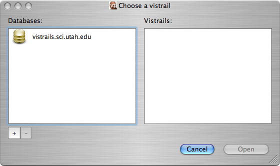
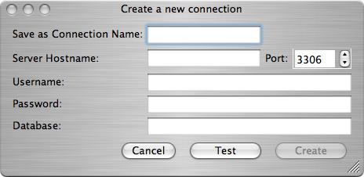

.. _chap-database:

************************
Connecting to a Database
************************

.. index:: database

.. \newcommand{\fixme}[1]{***#1}}}

As an environment for collaborative scientific exploration, |vistrails|
supports both stand-alone, file-based storage and relational storage
of vistrails.  With a relational database supporting |vistrails|, multiple users
can easily collaborate on projects without copying files back and
forth.  At the same time, if you choose to work without being
connected to a database, you can save your work locally to files.
Finally, |vistrails| can import and export to both types of storage so
you can import a vistrail from the database, save it locally as a
file on your computer, make and save changes, and export those changes
back to the database.  Remember that because the complete workflow
evolution is always saved, other users will not overwrite your changes, and vice versa. This prevents users from "stepping on each other's feet."

By default, |vistrails| works with local files stored in the
".vt" format (essentially compressed XML).  You can save a vistrail as
uncompressed XML by saving the file with a ".xml" extension.
When saving a vistrail, the system displays a standard save dialog.
These files have a version associated with them so when the schema for
these files may change, |vistrails| will be able to import older versions.
The current version of the XML schema can be found in the distribution
at:

``vistrails/db/versions/v1_0_2/schemas/xml/vistrail.xsd``

where ``v1_0_2`` is the current version.

Setup
=====

.. index::
   pair: database; setup

As described earlier, |vistrails| supports relational database storage as well as
file-based storage.  Currently, |vistrails| has been tested with 
MySQL, but in the future, we plan to support most standard relational database systems.

.. _sec-database-setup:

Setting up the database
^^^^^^^^^^^^^^^^^^^^^^^

Before using |vistrails| with a relational database, you must have a
database installed and have access to create, access, and
modify that database.  If you are planning to deploy for
institution-wide access, you should consult your system administrator
to determine the correct configuration.  The database schema for 
|vistrails| can be found in the distribution at:

``vistrails/db/versions/v1_0_2/schemas/sql/vistrails.sql``

where ``v1_0_2`` is the current version.  This schema contains a
sequence of SQL commands that define the tables needed for storing
vistrails.

After you or someone else has created the database for the vistrails,
you will need the following information:

#. *hostname*: the name or IP address of the machine that stores the database (``localhost`` if it is your own machine)
#. *port*: the port number that you connect to the database on
#. *user*: the username that should be used to access and modify the vistrails database
#. *password*: the password for the account corresponding to the given user
#. *database name*: the name of the database where the vistrails are to be stored.

.. _sec-database-config:

Setting up |vistrails|
^^^^^^^^^^^^^^^^^^^^^^

If you are planning to use the database for most of your work,
you can configure |vistrails| to open vistrails from the database by
default.  To do so, select the ``Preferences`` option from the ``Edit`` menu. (On Mac OS X, the ``Preferences`` option is found under the ``VisTrails`` menu.) When the ``Preferences`` window opens, select the appropriate option from the "Read/Write to database by default" box in the ``General Configuration`` tab.

.. _sec-database-open:

Opening from a database
=======================

.. index::
   pair: database; opening from

To open a vistrail from a relational database, choose the ``Import`` option from the ``File`` menu.
You should see a dialog like
the one pictured in Figure :ref:`fig-database-open`.  
(Alternatively, if
you have set |vistrails| to use a relational database by default
(see Section :ref:`sec-database-config`), then you should select ``File`` :math:`\rightarrow` ``Open`` from the menu or the ``Open`` button on the toolbar.)  

If you have previously connected to databases using |vistrails|, you
should see a list of these databases in the left column of the dialog.  If not,
you will need to add one.  To do so, click the ``+`` icon in the
lower-left corner.  This will bring up a dialog like that shown in
Figure :ref:`fig-database-create`. To set up a connection, you will
need the database connection information outlined in
Section :ref:`sec-database-setup`.  After filling in that information,
you can test the connection by clicking the ``Test`` button.
If the test succeeds, click the ``Create`` button to add the
database to the available sources for vistrails.

The database you wish to use should now be listed in the left column.
Clicking on that row will query the database for a list of vistrails
available from the database and display them in the right column.  To
open a vistrail, select the desired vistrail and click the
``Open`` button or simply double-click the vistrail.  When
the vistrail has loaded, you will be able to interact with it in
exactly the same way as a vistrail loaded from a file.

.. _fig-database-open:

   Opening a vistrail from the database

.. _fig-database-create:

   Creating a new database connection

Saving to a database
====================

.. index::
   pair: database; saving to

If you opened a vistrail from the database, the default save action
will be to save that vistrail back to the database.  There will be no
dialogs displayed---the database the vistrail was loaded from will be
automatically updated.

If you opened the vistrail from a file, you will need to select either
``Save As`` or ``Export`` from the
``File`` menu, depending on whether |vistrails| uses the
database by default (see Section :ref:`sec-database-config`).  You will
be shown a dialog similar to the one in
Figure :ref:`fig-database-save`.  As discussed in
Section :ref:`sec-database-open`, you can create a new connection to the
database or use an existing one.  Note that the name of the vistrail
must differ from those already stored on the database, and clicking the
``Save`` button will persist the changes to the database.

.. _fig-database-save:

.. figure:: figures/database/save_dialog.png
   :align: center
   :width: 3in

   Saving a vistrail to the database

Known Issues
============

.. index::
   pair: database; issues

Currently, saving a vistrail to the database will *overwrite* the
vistrail currently stored on the database.  However, we plan to add
synchronization soon so that all explorations are captured.  Thus, be
aware that if two users have the same vistrail loaded from the
database at the same time, and both users save their changes, only the
second user's changes will be captured.

.. index:: database
