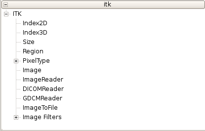
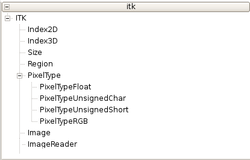
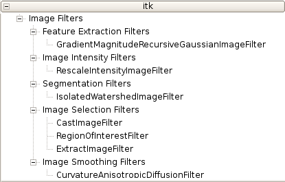
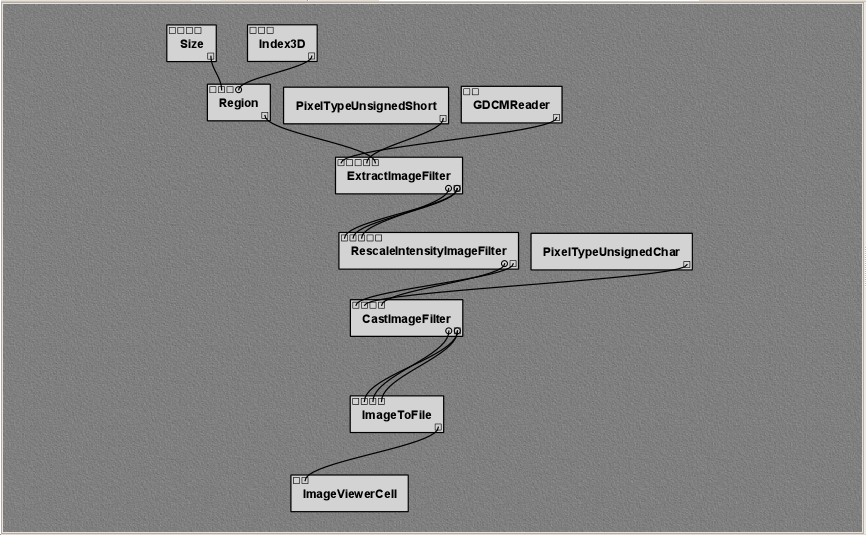

************
Example: ITK
************

Introduction to ITK
===================

The *Insight Toolkit*, [#]_ or ITK, is an open-source software system initially
designed to support the Visible Human Project [C1]_.
ITK is under continual development, being updated to employ
cutting-edge segmentation and registration algorithms for multiple
dimensions.  For more information about ITK, please refer to [C2]_ and [C3]_.

In order to facilitate the implementation of processing mechanisms
specific to the medical imaging community, ITK provides a robust set
of general purpose image processing tools.  These image processing
tools are available to users through the standard ITK Filter interface.  Although ITK is implemented in
C++, through the use of CMake [#]_ and CableSwig [#]_,
the functionality of ITK is made available to languages such as TCL,
Java, and Python. In addition, much of the functionality of ITK is also available in a |vistrails| package. The ITK package is not currently included in the binary distribution of |vistrails|, but it may be downloaded separately from the |vistrails| website.

**Note:** The WrapITK library, upon which the |vistrails| ITK package depends, is well-tested on Linux and Mac OS X platforms. It is, however, known to have issues under Windows.

Preparing ITK
=============

At the time of this writing, the latest stable release of ITK is 3.6.0.
In order to incorporate the functionality of ITK into the |vistrails|
system, it first must be built and installed.  In the following
sections, we will describe in detail the process of downloading,
building, and installing ITK and all the required components needed to
use it.

Downloading ITK
^^^^^^^^^^^^^^^

ITK can be downloaded in either source tarballs or via public CVS
access to the ITK source repository.  The following instructions take
advantage of the CVS source repository; however, source tarballs can
be downloaded from: http://www.itk.org/

These instructions can be found, in part, at the ITK
website.  To use CVS, you
must have a CVS client installed on your system.  To download the ITK
library, issue the following commands:

.. parsed-literal::
   
   cvs -d :pserver:anonymous@www.itk.org:/cvsroot/Insight login
   *password: insight*

   cvs -d :pserver:anonymous@www.itk.org:/cvsroot/Insight co Insight

Change directory into the newly created ``Insight/Utilities``
directory and issue the following command:

.. parsed-literal::

   cvs -d :pserver:anonymous@public.kitware.com:/cvsroot/CableSwig co CableSwig

This checkout includes CableSwig in the ITK system,
allowing it to be built automatically during compilation of ITK
itself.  

Building the ITK Libraries
^^^^^^^^^^^^^^^^^^^^^^^^^^

ITK requires CMake to be installed and available on your
system.
As of ITK version 3.2.0, CMake version 2.4.6 or greater must be used
to prevent compilation errors.  In order to simplify updating ITK to
later versions of the software, we perform an out-of-source build.  To
do this, we first create a directory outside the **Insight**
directory created for us during the CVS checkout process.

.. parsed-literal::

   mkdir itk
   cd itk

We now run CMake, or the GUI-based version ccmake, in this directory. If you're using Windows, you may wish to run the Windows-specific ``cmake-gui.exe`` instead.

.. parsed-literal::

   ccmake ../Insight

Note:  The above command assumes that the **Insight** directory exists
at the same level as the **itk** directory that we just created.

The following advanced CMake variables must be set to the appropriate values:

.. csv-table::
   :header: CMake Variable, Value

   BUILD\_SHARED\_LIBS, ON
   INSTALL\_WRAP\_ITK\_COMPATIBILITY, ON
   ITK\_CSWIG\_PYTHON, OFF
   ITK\_USE\_REVIEW, ON
   USE\_WRAP\_ITK, ON
   WRAP\_ITK\_PYTHON, ON
   WRAP\_ITK\_JAVA, OFF

Note:  Some CMake variables are only available based on the state of
others.  If a variable is missing from the list, set what is visible
and re-configure, this will often allow you to see and set additional
parameters.

After generating the appropriate files and exiting ccmake, the
standard build process can be completed.  To compile (on Linux or Mac OS X), run:

.. parsed-literal::

   make
   sudo make install

On Windows, the build process is governed by the type of project or Makefile generated by CMake.

.. topic:: Note:

   It is possible to use ITK without installing it.  To do this, the environment variables LD\_LIBRARY\_PATH and PYTHONPATH must be set to the appropriate build directories:

   |   ``LD_LIBRARY_PATH=/Path_To_itk/bin``
   |   ``PYTHONPATH=/Path_To_itk/Wrapping/WrapITK/Python``

At this point, ITK is build and installed.  To validate this, open a
Python shell and issue the following commands:

.. parsed-literal::

   >>> import itk
   >>> itk.Image[itk.US,2]

The above commands should both complete without error, and should produce the output:

.. parsed-literal::

   <class 'itkImage.itkImageUS2'>

The WrapITK
implementation used to wrap ITK for use in Python lazily instantiates
required classes.  This means that even if the import succeeds, the
instantiation of the above ``itk.Image`` class may fail.  This is
particularly common if the environment variable LD\_LIBRARY\_PATH is incorrectly set.

ITK and |vistrails|
===================

When built and installed with the appropriate Python bindings
included, ITK can be used from |vistrails| through the ITK package.
As mentioned previously, ITK is a third-party package and is not included in the general
|vistrails| distribution.  However, like many third-party packages, it
is available from the |vistrails| website. [#]_ 

The |vistrails| ITK package is under continual development with the
latest versions being announced on the |vistrails| website.  After
downloading the package and extracting it into the ``.vistrails/userpackages`` directory, you can enable it through the ``Module Packages`` tab in the ``Preferences`` dialog. Please refer to Chapter :ref:`chap-packages` for instructions on how to do this.

Upon starting |vistrails|, the ITK package modules will be made
available to the Builder Window.  

ITK Package Organization
^^^^^^^^^^^^^^^^^^^^^^^^

The ITK |vistrails| package loosely mimics the ITK functionality
hierarchy.  The package's top level consists of base classes,
containers, and file readers as shown in Figure :ref:`fig-structure`.
Also available at the top level is the ``PixelType`` module and the
specific types used to create and execute ITK-based pipelines.  

Currently, the ITK Image Filters are organized into functional groups.  The five filter types, as show in Figure :ref:`fig-structurec`, are:

* Feature Extraction Filters
* Image Intensity Filters
* Segmentation Filters
* Image Selection Filters
* Image Smoothing Filters

All filter types currently have at least one representative ITK filter
wrapped and usable from within the |vistrails| environment.

.. _fig-structure:

   \(a\) The |vistrails| ITK Package Structure Overview

   \(b\) The ITK Package Supported PixelTypes

.. _fig-structurec:

   \(c\) The ITK Package Filter Structure

Reading DICOM Volumes
^^^^^^^^^^^^^^^^^^^^^

DICOM is a standard format for exchanging medical images.
ITK includes DICOM support through the GDCM libraries. [#]_ It is worthwhile to note that at this time these 
libraries are currently not a complete implementation of the DICOM
standard.  

DICOM volumes can be integrated into |vistrails| through the use of
either the ``GDCMReader`` or ``DICOMReader`` modules in the ITK package.
For the rest of this example, we will use the ``GDCMReader`` module as
its performace is slightly higher than the ``DICOMReader``
implementation.

Figure :ref:`VisTrails workflow utilizing ITK to extract a single slice... <fig-slicer>` shows the use of the ``GDCMReader`` module.  In
order to properly read a DICOM volume, the ``GDCMReader`` must be supplied
with the dimension of the volume to be read and the directory
containing the series to read.  By default, WrapITK supports
two- and three-dimensional volumes.  In order to include support for
higher dimensions, the appropriate WrapITK variable must be set within
CMake, *before* compiling ITK.

Volume Processing With ITK and |vistrails|
^^^^^^^^^^^^^^^^^^^^^^^^^^^^^^^^^^^^^^^^^^

Typically, DICOM volumes are written with no 16-bit unsigned shorts.
Unfortunately, most systems allow the display of only 8-bit values.
Because of the higher precision inherent in DICOM data, it is often
preferable to perform any computation, segmentation, or processing on
the data prior to rescaling in order to utilize as much information as
possible.  

.. _fig-slicer:

   |vistrails| workflow utilizing ITK to extract a single slice from a DICOM volume.  The slice is chosen by first forming a Region to extract.  The result is viewed through the use of standard |vistrails| Spreadsheet modules.

Volume Processing With ITK and |vistrails|
^^^^^^^^^^^^^^^^^^^^^^^^^^^^^^^^^^^^^^^^^^

ITK image filters are
typically templated based on the dimensionality of the data being
processed, as well as the data type being processed.  In |vistrails|,
these parameters are handled through the use of ``PixelType`` modules.
Although any ITK Filter wrapped in \vistrails
can accept any of these ``PixelType``\ s, the underlying implementation may
not be compatible with the input ``PixelType``.  Using ``PixelType``\ s
incompatible with the underlying filter implementations is the most
frequent cause of error when executing otherwise functional pipelines
in |vistrails|. 

.. %%:ref:`fig-pixeltypes`

When processing volumes, it is often necessary to extract a single
slice from the volume at different stages of the processing pipeline.
This is possible in |vistrails| through the use of the
``ExtractImageFilter``.  Given a volume, a Region, and Dimensionality
information, the ``ExtractImageFilter`` can extract a single slice from
the data volume that can be used in further processing, previewing the
results, or writing to disk.  An example workflow that extracts a slice
from a DICOM volume can be seen in Figure :ref:`VisTrails workflow utilizing ITK to extract a single slice... <fig-slicer>`.  

Visualizing the results
^^^^^^^^^^^^^^^^^^^^^^^

Although ITK's processing filters and the DICOM standard both support
16-bit processing and storage, many image viewers are capable of
displaying in only 8-bit resolution using the unsigned char ``PixelType``.
Since the output of an ITK processing workflow is an image, it makes
sense to view it as such.  This means that we are required to both
remap the data values in the image to 8 bits as well as perform a
casting operation to change the data type from unsigned shorts to
unsigned chars.  These operations are performed through the use of the
``RescaleIntensityImageFilter`` and the ``CastImageFilter``.  Figure :ref:`VisTrails workflow utilizing ITK to extract a single slice... <fig-slicer>` demonstrates the use of the
``RescaleIntensityImageFilter`` and the ``CastImageFilter`` in conjunction
with the ``ImageToFile`` and ``ImageViewerCell`` modules to view the resulting slice in the |vistrails| Spreadsheet.

.. rubric:: Footnotes
.. [#] The Insight Toolkit is sometimes referred to by the longer name *Insight Segmentation and Registration Toolkit*. 
.. [#] CMake cross-platform make system.  http://www.cmake.org
.. [#] CableSwig Interface generator.  http://www.itk.org/HTML/CableSwig.html
.. [#] Please Note:  At the time of this writing, the |vistrails| ITK package is not a complete wrapping of all ITK functionality.  If you would like to contact the author regarding the wrapped functionality, please do so through the e-mail address on the |vistrails| website.
.. [#] Grass roots DiCoM Project.  http://www.creatis.insa-lyon.fr/Public/Gdcm/

.. rubric:: Citations
.. [C1] R. A. Banvard, "The visible human project image data set from inception to completion and beyond," Proceedings of CODATA, 2002.
.. [C2] L. Ibanez, W. Schroeder, L. Ng, and J. Cates, The ITK Software Guide, 2nd ed., Kitware, Inc. ISBN 1-930934-15-7, http://www.itk.org/ItkSoftwareGuide.pdf, 2005.
.. [C3] T. S. Yoo, M. J. Ackerman, W. E. Lorensen, W. Schroeder, V. Chalana, S. Aylward, D. Metaxes, and R. Whitaker, "Engineering and algorithm design for an image processing API: A technical report on ITK - The Insight Toolkit," Proceedings of Medicine Meets Virtual Reality, pp. 586-592, 2002.