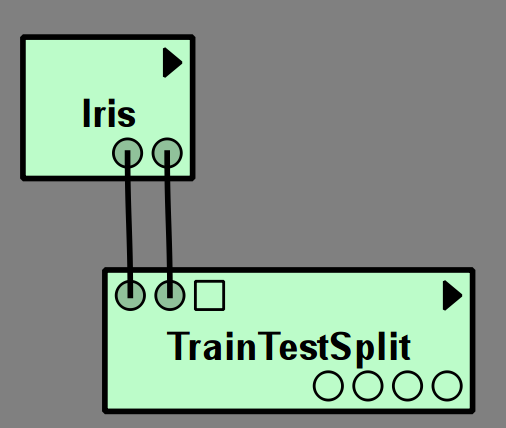
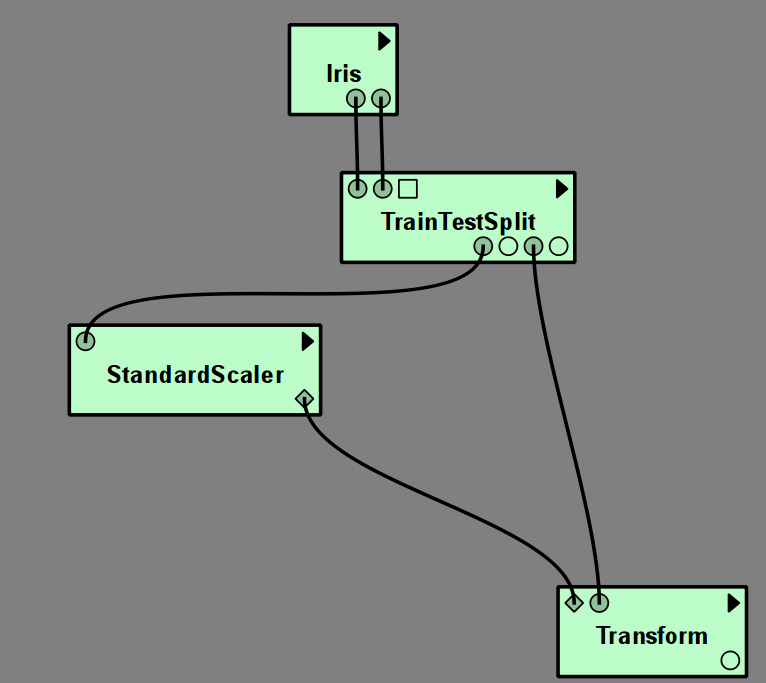
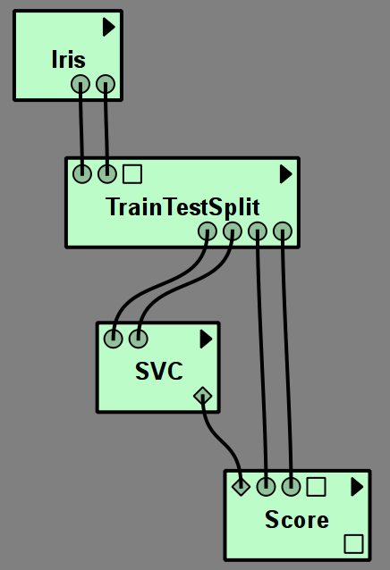
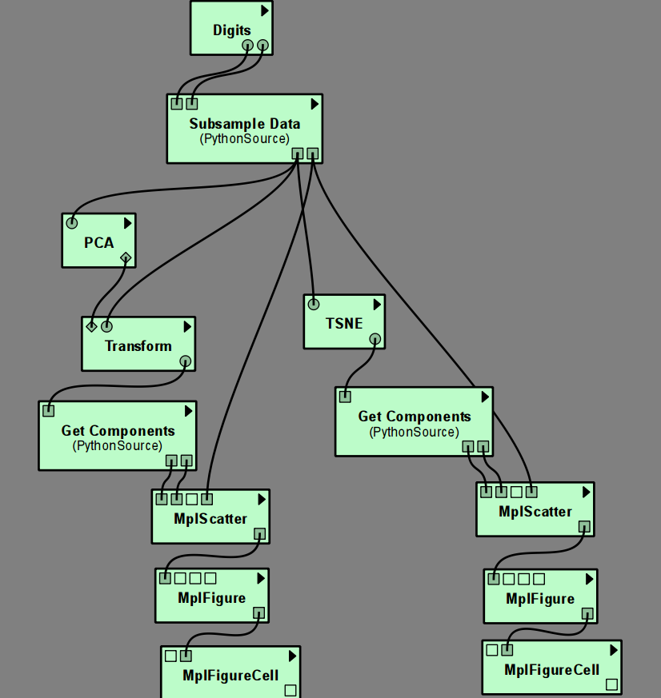
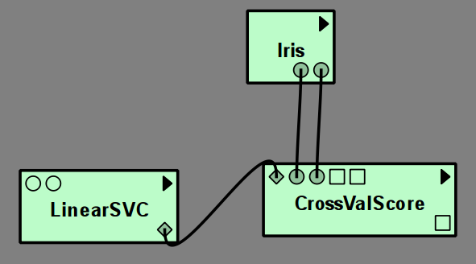
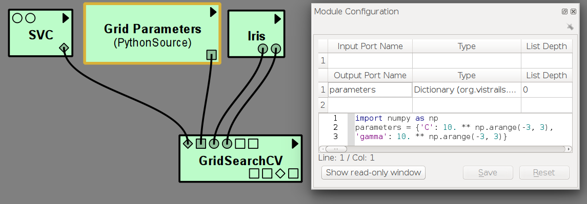
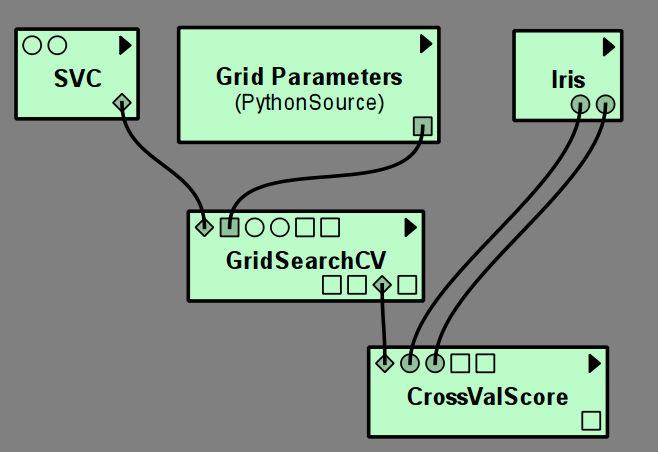
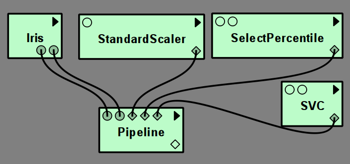
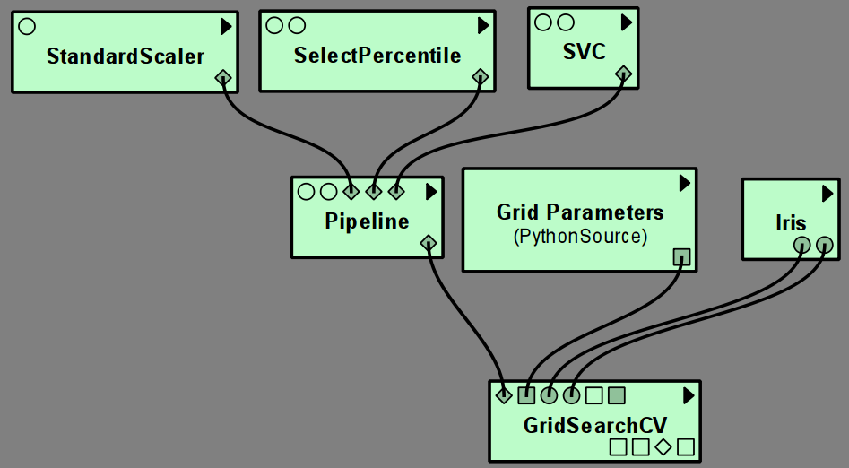

*********************
Example: scikit-learn
*********************

Introduction to scikit-Learn
============================
`scikit-learn <http://scikit-learn.org>`_ is a python based open-source machine learning library.
It provides implementations of popular machine learning algorithms together with
evaluation and preprocessing utilities.
For more information, refer to the `extensive documentation <http://scikit-learn.org/stable/documentation.html>`_.

Installing scikit-learn
=======================
|vistrails| should be able to automatically install scikit-learn via pip.
If this fails, try to install it manually::

    pip install --user scikit-learn

It this also fails, consult the `installation instructions <http://scikit-learn.org/stable/install.html>`_.

Using scikit-learn via |vistrails|
==================================

Datasets
^^^^^^^^
For testing purposes and the examples, there are two multi-class classification datasets made available as |vistrails| modules,
the Digits and the Iris datasets. These have as output ports training data and classification targets, to quickly test a pipeline.
Both datasets are very simple toy datasets and should not be used as benchmarks.

The Digits dataset consists of 1797 handwritten digits as represented as 8x8
grey scale images, resulting in 64 features. The digits belong to the classes 0
to 9.
The `Iris <https://en.wikipedia.org/wiki/Iris_flower_data_set>`_ dataset
consists of 150 data points with four features, belonging to one of three
classes.

Splitting data into training and test set
^^^^^^^^^^^^^^^^^^^^^^^^^^^^^^^^^^^^^^^^^
As machine learning is inherently about generalization from training to test data,
it is essential to separate a data set into training and test parts.
The ``TrainTestSplit`` module is a convenient way to do this:

   The round output ports of the Iris dataset correspond to training data and training targets,
   which are fed into ``TrainTestSplit``. The outputs of ``TrainTestSplit`` are data and labels
   for two subsets of the data, corresponding to the four round output ports.
   First are training data and training labels, then test data and test
   labels. The split is done randomly with 25% test data by default.

Basic usage
^^^^^^^^^^^
The |vistrails| sklearn package contains most algorithms provided in scikit-learn.
In machine learning, applying an algorithm to a dataset usually means
training it on one part of the data, the training set, and then applying it
to another part, the test set.

Each algorithm in scikit-learn has a corresponding |vistrails| module, which has
input ports for training data, and outputs the model that was learned (with the exception of the :ref:`manifold_module` module).
To apply the model to new data, connect it to a ``Predict`` module (for classification and regression) or to a ``Transform`` module
(for data transformations like feature selection and dimensionality reduction).

It is also possible to directly compute performance metrics like the accuracy or mean squared error using the
``Score`` module.

The resulting Scores can be output with a ``GenericOutput``, or more advanced string formatting.

To make connecting the ports easier, ports that represent models are diamond shaped,
while ports that represent data or label arrays are round. The remaining square ports
are either parameters of the models or additional information provided as output.

.. _manifold_module:

Manifold learning
^^^^^^^^^^^^^^^^^
Manifold learning algorithms are algorithms that embed high-dimensional data
into a lower-dimensional space, often for visualization purposes.
Most manifold learning algorithms in scikit-learn embed data, but cannot transform new data
using a previously learned model. Therefore, manifold learning modules will
directly output the transformed data.

   The left hand side of the pipeline uses ``PCA``, which can use ``Transform`` to be applied to new data.
   The right hand side uses the manifold learning method ``TSNE``, which cannot be applied to new data,
   and therefore directly produces the transformed input data (in contrast to ``PCA``, which produces a model).

Cross Validation and Grid Search
^^^^^^^^^^^^^^^^^^^^^^^^^^^^^^^^
To perform a cross validation or grid search with a model,
simply create a module for the model, without providing any training data.
The output will be an unfitted model that can be used as input for grid search or cross validation:

``GridSearch`` needs as additional input a dictionary of parameter values, that is best specified using a ``PythonSource`` module:

``GridSearch`` itself has a model output port, so that the grid search can be used, for example, in ``CrossValScore``
to perform a nested cross-validation.

Pipelines of scikit-learn models
^^^^^^^^^^^^^^^^^^^^^^^^^^^^^^^^
To perform cross validation or grid search over a chain of estimators, such
as preprocessing followed by classification, scikit-learn provides a ``Pipeline`` module.
Each step of a pipeline is defined by an input port specifying a model.
All but the last model in the pipeline must be transformers, the last can be arbitrary.
Currently the |vistrails| scikit-learn package only supports up to four steps in a pipeline.

As any other model, a pipeline can either be fit on data and then evaluated using ``Predict``, ``Transform`` or ``Score`` modules,
or can serve as the input model to ``CrossValScore`` or ``GridSearchCV``.

