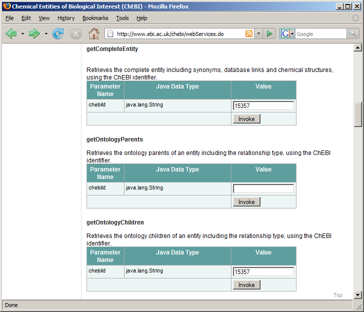
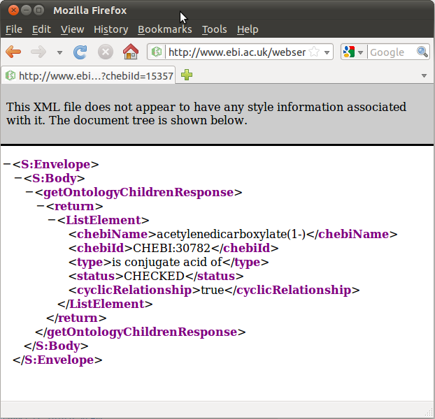
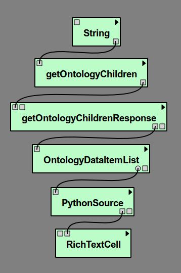
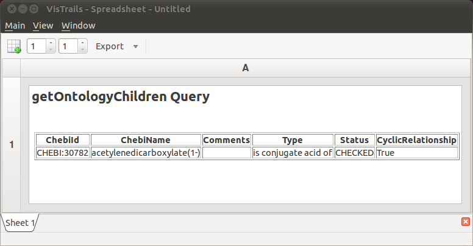

.. _chap-webservices:

************************
Example: Web Services
************************

A *web  service* grants you programmatic  access to an  online data source
via a straightforward  API.  In this chapter, you will learn  how to invoke web
services from within |vistrails| workflows. We will build a simple workflow that
invokes a web service and generates an HTML table with the results. Our current
example is  intentionally simple; for  more in-depth examples, please  refer to
the |vistrails| website.

**Where we're going in this chapter:**  The European Bioinformatics Institute maintains ChEBI, [#]_ a database of  over 15,000 chemical
compounds.   Each  entity   is  referenced  by  a  unique   ID  number,  called
its *chebiID*. To see  an example of the kind of queries  we will build in
this example, go to http://www.ebi.ac.uk/chebi/webServices.do and scroll
down   until   you   find   the   web   form   labeled   "getCompleteEntity."
(Figure :ref:`fig-webservices_webform1`).   If  you  type  15357 into  the  text
field,  it  will  return a  long  string  of  data  in  XML format  about  this
chemical.   We  learn,   among  other   things,  that   this   chemical's  name
is *acetylenedicarboxylate(-2)*.

To try another  query, scroll down to the  area labeled "getOntologyChildren"
and type 15357 into the text  field. This returns an XML representation of this
chemical's  ontology  children.    In  this  case,  the  result   is  a  single
chemical,    *acetylenedicarboxylate(-1)*,   whose   chebiID    is   30782
(Figure :ref:`fig-webservices_webform2`).

.. _fig-webservices_webform:

.. _fig-webservices_webform1:

   \(a\) Web browser interface for the ChEBI database 

.. _fig-webservices_webform2:

   \(b\) Results from a "getOntologyChildren" query

In  this example,  we will  build a  workflow that  accesses a  web  service to
perform the second of these two  queries. Because we're using a web service, we
don't  need  a  browser  ---   we  will  perform  this  query  programmatically
within |vistrails|.

Enabling the SUDSWebServices Package
====================================

In  order to  use  web services  in |vistrails|,  you  need to  ensure that  the ``SUDSWebServices`` package  is enabled in the ``Preferences``
dialog. (Please  refer to  Chapter :ref:`chap-packages` for more  information on enabling packages.)

Adding Web Service Packages
===========================

Within the  ``Module Packages`` tab  of the ``Preferences``
dialog,  click the  ``Configure``  button to  open the  configuration
dialog  for  this package(``SUDSWebServices``).   Select  the  ``wsdlList``  and click  on the ``Value`` field.  This is where you will enter  the URL(s) of the web service(s)  you wish  to access.  If there is  more than  one URL,  place a semicolon (;)  between each URL, but  *not* after the final  URL. In other words, the URLs must be semicolon-delimited, but not semicolon-terminated.

For our example, we need the following URL:

``http://www.ebi.ac.uk/webservices/chebi/2.0/webservice?wsdl``

After   closing   the   dialog,    you   need   to reload the ``SUDSWebServices`` package in order to load  the changes. Then, close the ``Preferences`` dialog.  A new package will be created for each URL provided.

Alternatively, you may add a web service package by clicking the secondary mouse button on the "SUDS Web Services" package in the module palette and entering the corresponding URL.  You may remove a web service by clicking the secondary mouse button on the corresponding package in the module palette and selecting ``Remove this Web Service``.

.. %.. figure::
.. %   :align: center
.. %   :height=3in,clip=false]{modules_list.png}
.. %}
.. %   The available modules in the ``webServices`` module are shown in the ``Modules`` panel.}
.. %.. _fig-webservices_preferences}
.. %  

Creating a new vistrail
=======================

After  configuring the  ``SUDSWebServices``  package properly,  there
will  be a  ``SUDSWebServices`` entry  in  your ``Modules``
panel.
The  ``SUDSWebServices``  package will  generate  a  module for  each
published method in a web service.

.. %Figure TODO. 

Start with  a new empty workflow  in the ``Pipeline``  view, and drag
the following modules to the canvas.

.. index::
   pair: modules; adding

* ``String`` (under "Basic Modules")
* ``getOntologyChildren`` (under "Methods" for the current web service)
* ``getOntologyChildrenResponse`` (under "Types" for the current web service)
* ``OntologyDataItemList`` (under "Types" for the current web service)
* ``PythonSource`` (under "Basic Modules")
* ``RichTextCell`` (under "Spreadsheet")

As discussed in  Chapter :ref:`chap-creating`, ``PythonSource`` has no
input  and  output  ports  by  default;  we  need  to  create  some.  Open  the
configuration dialog  for ``PythonSource``  by selecting this  module in
the  pipeline  canvas   and  typing  'Ctrl-E'.  Add  a   new  input  port
named  "ontologyDataItemList" of  type ``List``,  and  a new
output port named "outfile"  of type ``File``. (Please refer
to Chapter :ref:`chap-creating` for more information about configuring and using
the ``PythonSource`` module.)

We will now add  some Python code to this module. This  code generates a simple
HTML table based on the information retrieved from the web service query.  Type
or  paste  the  following   source  code  into  the  ``PythonSource``
configuration dialog:

.. code-block:: python

   dataitemlist = self.getInputFromPort("ontologyDataItemList")
   output1 = self.interpreter.filePool.create_file()
   f1 = open(str(output1.name), "w")
   text = "<HTML><TITLE>Chebi WebService</TITLE><BODY BGCOLOR=#FFFFFF>"
   f1.write(text)
   text = "<H2>getOntologyChildren Query</H2> "
   f1.write(text)
   text = "
<table border = 1><tr><TH>ChebiId</TH> <TH>ChebiName</TH>"
   text += "<TH>Comments</TH> <TH>Type</TH> <TH>Status</TH>"
   text += "<TH>CyclicRelationship</TH></tr>"
   f1.write(text)
   for element in dataitemlist:
       if not hasattr(element,'Comments') or str(element.Comments) == '[]':
           comment = ""
       else:
           comment = str(element.Comments)
       line = "<tr><td>" + str(element.chebiId) + "</td><td>" + str(element.chebiName)
       line += "</td><td>" + comment + "</td><td>" + str(element.type) + "</td><td>"
       line += str(element.status) + "</td><td>" + str(element.cyclicRelationship)
       line += "</td></tr>"
       f1.write(line)        
   text = "</table>
</BODY></HTML>"
   f1.write(text)
   self.setResult("outfile",output1)
   f1.close()

Close the dialog.  One of the ports we need to use is an optional port.  Select the ``OntologyDataItemList`` module and select the ``Outputs`` tab from the ``Module Information`` panel.  Click in the left column next to ``ListElement`` so the eye icon appears.  Now connect the modules together as shown in Figure :ref:`fig-chebi_pipeline_screenshot`.

.. _fig-chebi_pipeline_screenshot:

   Our example pipeline

Our workflow is now complete except for one crucial element: the starting point.  We need to pass a chebiID string to the workflow in order to look up information about a chemical.  We do this by assigning a chebiID string to the ``String`` module at the top of the pipeline.  Highlight the ``String`` module in the canvas, then in the ``Module Information`` panel on the right, make sure the ``Inputs`` tab is selected and click on ``value`` and type ``CHEBI:15357`` into the ``String`` input box that comes up.

Executing the workflow
======================

.. index::
   pair: spreadsheet; RichTextCell

The workflow  is now ready  to be visualized.  Click  the ``Execute``
button  to   send  the  current   pipeline  with  the  current   parameters  to
a ``RichTextCell`` within the |vistrails|
Spreadsheet.           Your           result          should           resemble
Figure :ref:`fig-webservices_spreadsheet`.       As      you       can      see,
the "ontology children" query  returns the same information as before,
but without  the use  of a  web browser. In  addition, we  used a  small Python
program (via the ``PythonSource`` module)  to transform the raw XML into
a readable HTML table.

.. _fig-webservices_spreadsheet:

   The HTML table generated by our workflow

.. rubric:: Footnotes
.. [#] ChEBI  is an acronym for Chemical Entities of Biological Interest.