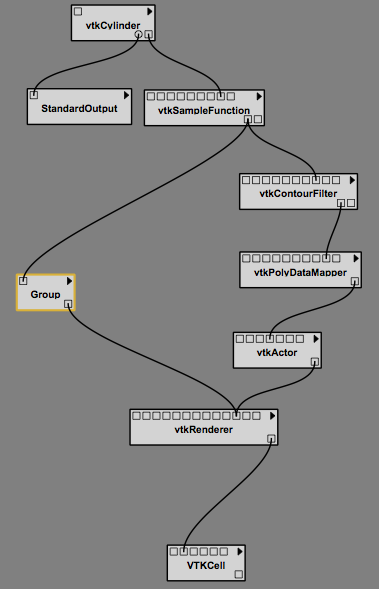
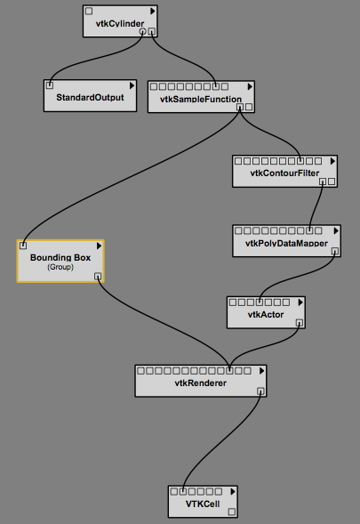
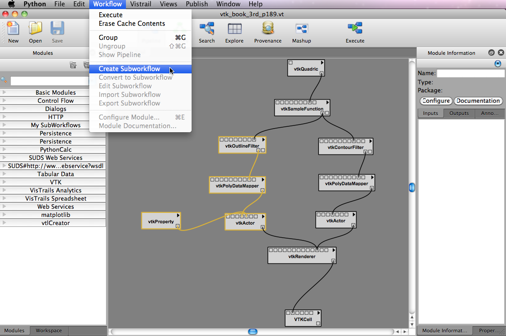

.. _chap-grouping:

********************************
Groups and Subworkflows
********************************

.. _sec-grouping:

Grouping Modules
================

.. index::
   pair: modules; grouping
   pair: modules; ungrouping
   single: grouping

As the number of modules in a pipeline increases, the pipeline can grow quite large and cumbersome. This also makes the pipeline more difficult to understand and maintain.  With any large system, it can be helpful to cluster related pieces together and represent them as a single unit. This idea, called *encapsulation*, is commonly used in computer programming as a way of controlling complexity. |vistrails| likewise supports the grouping of multiple modules together so that they can be treated as a single module. This "group" module can be thought of as a monolithic entity that performs all the same functions as its individual parts, but shields its inner details from everyone else.  As such, a group module inherits all the input and output ports of the modules inside it, but only displays those ports that have connections to another module outside of the group. To borrow another term from programming languages, these visible ports might be considered the *public interface* of the group module.

Multiple modules are grouped together by first selecting them, and then choosing the ``Group`` option from the ``Edit`` menu. Alternatively, you can use the keyboard shortcut 'Ctrl-G'.

An example may clarify how this works.

.. topic:: Try it now!

   Open "vtk_book_3rd_p189.vt".  Select the ``vtkOutlineFilter``, ``vtkPolyDataMapper``, ``vtkProperty``, and ``vtkActor`` modules on the left side of the pipeline, as shown in Figure :ref:`Box selection of four modules <fig-groupinga>`. Type 'Ctrl-G' to group these modules. Notice how the pipeline changes, as shown in Figure :ref:`The modules represented as a single group module <fig-groupingb>`. Since the label "Group" isn't very descriptive, you can change this by selecting the ``Group`` module, and entering a name in the ``Name`` box of the ``Module Information`` panel.  Type a more descriptive name, such as "BoundingBox," into the text field and click ``OK``. The new label is reflected in the pipeline (Figure :ref:`Renaming the group <fig-groupingc>`).

.. _fig-groupinga:

.. figure:: figures/grouping/grouping1.png
   :height: 2.6in
   :align: center

   Box selection of four modules.

.. _fig-groupingb:

   The modules represented as a single group module.

.. _fig-groupingc:

   Renaming the group.

Just as any number of modules may be clustered into a group, any number of groups may be combined with other groups or modules to form still larger groups. This is done in the same way as described above.  

Further, the contents of the groups or combinations of groups are revealed through the ``Show Pipeline`` option.  First select the ``group`` module in the pipeline and then select ``Show Pipeline`` from the ``Workflow`` menu.  The group's contents will be shown in a new tab.  If there is a group within a group, selecting the interior ``group`` module and then selecting ``Show Pipeline`` will show the interior group's pipeline in an additional tab. 
 
In addition to viewing the group's contents, any group may be also un-grouped; that is, restored to its individual modules. This is done by selecting the group module in the pipeline, and then choosing the ``Edit`` :math:`\rightarrow` ``Ungroup`` menu option or by pressing 'Ctrl-Shift-G'.  A group's pipeline may not be used to ungroup interior groups, however.  The tabs opened by the ``Show Pipeline`` command are read only.

.. Groups may only be ungrouped from the pipeline view, and not from the windows that are created when selecting ``Show Pipeline``.  Thus, an interior group may only be ungrouped after the group to which is belongs is ungrouped.

.. Combinations of groups may be ungrouped in any order.

.. _sec-grouping-subworkflows:

Subworkflows and Group Modules
===================================

.. index::
   pair: modules; subworkflows
   pair: subworkflows; groups
   pair: groups; subworkflows

A subworkflow is similar to a group, but has some differences.  Here, we will explain the differences to make it easier to understand which one to use when:

   * A subworklow is a VisTrail, and a history of changes to a subworkflow is kept, whereas a group is part of a vistrail.  So, if you copy and paste a group, the pasted group won't necessarily be linked to the group's history.
   * When a subworkflow is created, it is listed in the ``My Subworkflows`` portion of the ``Modules`` panel.  It is saved and will be accessible from any vistrail.  A group, on the other hand can be named and copied and pasted within a file, or even across files. However, it will not be placed in the modules panel.
   * Subworkflows can be edited and saved without needing to ungroup and regroup the modules.  To edit anything within a group, it first needs to be ungrouped, and then regrouped.

  
Subworkflows
============

.. index::
   pair: modules; subworkflows
   single: subworkflows

To create a subworkflow, select the modules to include and select ``Create Subworkflow`` from the ``Workflow`` menu.  See Figure :ref:`Creating a subworkflow <fig-subworkflow>`.  You will be prompted to name the subworkflow.  The subworkflow will appear in the modules list under ``My Subworkflows.``  Groups can be converted to subworkflows by selecting the ``Convert to Subworkflow`` option.  

To edit a subworkflow, select a module of the corresponding subworkflow and select ``Edit Subworkflow`` from the ``Workflow`` menu.  This will open the subworkflow's file.  If you make changes to the subworkflow and save them, the modules that correspond to the old subworkflow will be marked with a '!', meaning that it is not the latest version.  To upgrade to the latest version, either select the triangle in the module's upper right corner and choose ``Upgrade Module``, or delete the old module and replace it with a new one.  See Figure :ref:`Upgrading a subworkflow module that had been edited <fig-subworkflow_upgrade>`.

.. _fig-subworkflow:

   Creating a subworkflow.

.. _fig-subworkflow_upgrade:

.. figure:: figures/grouping/subworkflow_upgrade.png
   :align: center
   :width: 3in

   Upgrading a subworkflow module that has been edited.

Importing and Exporting Subworkflows
++++++++++++++++++++++++++++++++++++

Since subworkflows are saved locally, the ``Import Subworkflow`` and ``Export Subworkflow`` options can be used for sharing.  For example, to add a subworkflow from an open VisTrail to your local list of ``My Subworkflows`` modules, you would select the subworkflow and select ``Import Subworkflow`` from the ``Workflows`` menu.  Alternatively, you can save any number of subworkflows to a package by dragging the subworkflow modules to the canvas, selecting them, selecting ``Export Subworkflow``, and following the prompts to name/create the appropriate folders/files.  The subworkflows will be exported to a folder which can be added to the userpackages directory.  The package should contain a __init__.py, and an init.py file.  The importing of the individual subworkflows will be handled in the init.py file.  See the :ref:`Writing Vistrails Packages <chap-packages>` chapter of the Developer's Guide for more information on packages.