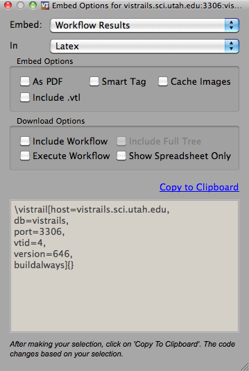

***********************************
Embedding VisTrails Files Via Latex
***********************************

.. index:
   pair: embed; latex

The VisTrails Latex extension allows you to embed a result from a VisTrails file in a Latex document.  Images to be included in the Latex document will be generated through VisTrails and can be linked to the VisTrails file and version from which it was generated.  In other words, Latex call VisTrails to generate an image for a resulting PDF document.  The resulting image can be set up so, when clicked, the generating VisTrails file will be opened in Vistrails.

Latex Setup and Commands
========================

To use the Latex extension, copy vistrails.sty and includevistrail.py from the extensions/latex directory to the same directory as your .tex files.  Then, add the following line to the beginning of the latex file:

``\usepackage{vistrails}``

By default, vistrails will be executed at www.vistrails.org and the images
downloaded to your hard drive.  If you want to run a local copy of VisTrails instead, add:

``\renewcommand{\vistrailspath}{/path/to/vistrails.py}``

There are a number of download options for those whose VisTrails are accessible through the Web.  Images can be set up to link to the corresponding VisTrail (see :ref:`sec-latex-setup-using-a-web-server`).  To setup the images without links (not clickable), add:

``\renewcommand{\vistrailsdownload}{}``

This extension uses python. If you don't have python on your path, use this 
to set the python interpreter:

``\renewcommand{\vistrailspythonpath}{python}``

**Note:** If you set the \vistrailspythonpath to an invalid path VisTrails will use 
cached files if they exist.

.. _sec-latex-setup-using-a-web-server:

Additional Setup For Use With Files on a Web Server
^^^^^^^^^^^^^^^^^^^^^^^^^^^^^^^^^^^^^^^^^^^^^^^^^^^

Many VisTrails files and/or data is stored in a database that readers of a pdf document might not have access to.  If the files are also accessible through the web, the following instructions explain setup that will allow readers to download the VisTrail or workflow through the web server.

To configure VisTrails to run on your web server rather than the VisTrails server, add the following to your tex file:

``\renewcommand{\vistrailspath}{http://yourwebserver.somethingelse/run_vistrails.php}``

To embed the links in the generated images, use 

``\renewcommand{\vistrailsdownload}{http://yourwebserver.somethingelse/download.php}``

.. todo: include instructions on using these php files.

.. Notes for Use with a Database
.. ^^^^^^^^^^^^^^^^^^^^^^^^^^^^^
.. todo: How do you make clickable images with database only use?

Including VisTrails Results in Latex
====================================

To include VisTrails Results in a Latex file:

  * Select the ``History`` view.  
  * Ensure that a version is selected.
  * Press the ``Embed`` button at the bottom of the Properties Panel.  This will launch a dialog with embedding options (see Figure :ref:`fig-configure-embedding`).  
  * Select the result that you would like to display.  The choices are: workflow results, workflow graph, and history tree graph.
  * Select ``Latex``.
  * You should then choose from a number of "Embed" and "Download" options which will be explained in the tables below.
  * Select "Copy to Clipboard"
  * Paste clipboard contents into you Latex document 
  * Run pdflatex with the -shell-escape option: pdflatex -shell-escape example.tex.

**Note:** When local VisTrails files are used, the text that VisTrails generates using ``Embed`` will list the name of the file you are trying to embed.  That file should be placed in the same directory as the tex file that references it.  Alternatively, you may include relative or absolute paths to the file.

.. tabularcolumns:: |p{2.8cm}|p{3.0cm}|p{7.5cm}|
   
.. _table-options:

.. only:: html

   **Configuration Options**

   +-----------------------+-----------------------+--------------------------------------------------------------------------+ 
   | Option                | Latex Flag            | Description                                                              |
   +=======================+=======================+==========================================================================+
   | | Workflow Results    | version=<...>         | Show the results of the specified version.                               |
   +-----------------------+-----------------------+--------------------------------------------------------------------------+
   | Workflow Graph        | | version=<...>       | Show the workflow instead of the results.                                |
   |                       | | showworkflow        |                                                                          |
   +-----------------------+-----------------------+--------------------------------------------------------------------------+
   | | History Tree Graph  | showtree              | Show the version tree instead of the results.                            |
   +-----------------------+-----------------------+--------------------------------------------------------------------------+

   **Embed Options**

   +-----------------------+-----------------------+--------------------------------------------------------------------------+ 
   | Option                | Latex Flag            | Description                                                              |
   +=======================+=======================+==========================================================================+
   | As PDF                | | pdf                 | Download images as pdf files.                                            |
   +-----------------------+-----------------------+--------------------------------------------------------------------------+
   | Smart Tag             | tag=<...>             | | Allows you to include a version's tag.  If a tag is provided, version  |
   |                       |                       |   can be omitted and buildalways is implicit.                            |
   +-----------------------+-----------------------+--------------------------------------------------------------------------+
   | Cache Images          | | buildalways         | | When caching desired, the buildalways flag should not be included.     |
   |                       | | (do not include     |   If it is included, VisTrails will be called regardless of whether or   |
   |                       |   for caching)        |   not it has been called for the same host, db, version, port and vt_id. |
   +-----------------------+-----------------------+--------------------------------------------------------------------------+
   | Include .vtl          | | getvtl              | Causes the .vtl file to be downloaded.                                   |
   +-----------------------+-----------------------+--------------------------------------------------------------------------+

   **Download Options**

   +-----------------------+-----------------------+--------------------------------------------------------------------------+ 
   | Option                | Latex Flag            | Description                                                              |
   +=======================+=======================+==========================================================================+
   | | Include Workflow    | embedworkflow         | Download the workflow only.                                              |
   +-----------------------+-----------------------+--------------------------------------------------------------------------+
   | | Execute Workflow    | execute               | Will cause the workflow to be executed when it is opened.                |
   +-----------------------+-----------------------+--------------------------------------------------------------------------+
   | | Include Full Tree   | includefulltree       | Download the complete VisTrail.                                          |
   +-----------------------+-----------------------+--------------------------------------------------------------------------+
   | | Show Spreadsheet    | showspreadsheetonly   | Will initially only show the spreadsheet.                                |
   |   Only                |                       |                                                                          |
   +-----------------------+-----------------------+--------------------------------------------------------------------------+

.. only:: latex

   .. tabularcolumns:: |p{2.8cm}|p{3.0cm}|p{7.5cm}|
   
   .. csv-table:: Configuration Options
      :header: **Option**, **Latex Flag**, **Description**

      Workflow Results, version=<...>, "Show the results of the specified version."
      , ,
      Workflow Graph, version=<...>, "Show the workflow instead of the results."
      ,showworkflow,
      , ,
      History Tree Graph, showtree, "Show the version tree instead of the results."

   .. tabularcolumns:: |p{2.8cm}|p{3.0cm}|p{7.5cm}|

   .. csv-table:: Embed Options
      :header: **Option**, **Latex Flag**, **Description**

      As PDF, pdf, "Download images as pdf files."
      , ,
      Smart Tag, tag=<...>, "Allows you to include a version's tag.  If a tag is provided, version can be omitted and buildalways is implicit."
      , ,
      Cache Images, buildalways (do not include for caching), "When caching desired, the buildalways flag should not be included.  If it is included, VisTrails will be called regardless of whether or not it has been called for the same host, db, version, port and vt_id."
      , ,
      Include .vtl, getvtl, "Causes the .vtl file to be downloaded."

   .. tabularcolumns:: |p{2.8cm}|p{3.0cm}|p{7.5cm}|

   .. csv-table:: Download Options
      :header: **Option**, **Latex Flag**, **Description**

      Include Workflow, embedworkflow, Download the workflow only.
      , ,
      Execute Workflow, execute, "Will cause the workflow to be executed when it is opened."
      , ,
      Include Full Tree, includefulltree, Download the complete VisTrail.
      , ,
      Show Spreadsheet Only, showspreadsheetonly, "Will initially only show the spreadsheet."

.. _fig-configure-embedding:

   Embedding Options

Example
^^^^^^^

The following is an example command for including a VisTrails image in Latex:

| ``\vistrails[host=vistrails.sci.utah.edu,``
| ``db=vistrails,``
| ``version=<version_number>,``
| ``vtid=<vistrails_id>,``
| ``tag=<tag>``
| ``port=3306,``  %The default value for port is 3306.
| ``buildalways,`` 
| ``execute,``
| ``showspreadsheetonly,`` 
| ``pdf,`` 
| ``showworkflow,`` 
| ``showtree,`` 
| ``getvtl,`` 
| ``]{width=0.45\linewidth}`` %Options you would give to the ``\includegraphics{}`` command.

See example.tex in the extensions/latex directory for a complete example of usage.

Additional Notes
^^^^^^^^^^^^^^^^

After running at least once, VisTrails will cache the images and latex 
instructions.  The latex code will be in the "cached" folder and the images in 
vistrails_images.

Vistrails will create in the current directory a directory called 
vistrails_images/host_db_vtid_version with the png files generated by 
the spreadsheet.

