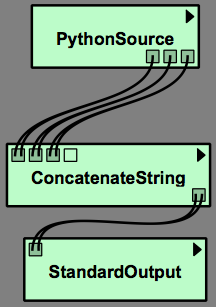
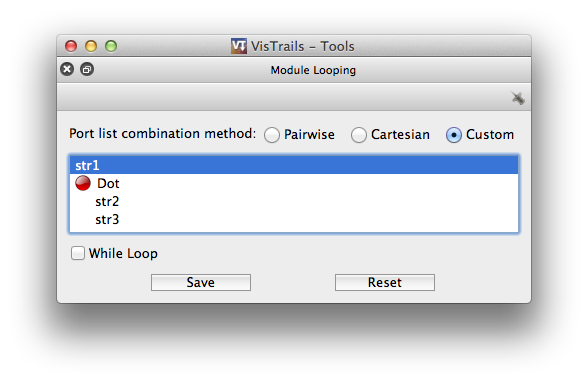

.. _chap-list_handling:

**************************
List Handling in VisTrails
**************************

In |vistrails| you can pass typed and :ref:`untyped <sec-list-type>` lists between modules. Ports on modules have a
depth parameter specifying the  list depth it supports. 0 means no  list, 1 is a
list, 2 is  a list of lists etc.  Port depth can be specified either by module
developers or by using a ``PythonSource`` or similar module.

It is important to know how connections of mismatching list depths are handled:

* List wrapping - If the destination port has a larger list depth, the source will be wrapped in lists until the list depth is matched.
* :ref:`sec-iterating-lists` - If the source port has a larger list depth, the destination module
  will  be executed  once  for each  element in  the  list.

.. _sec-list-type:

The List type
=============

The ``List`` type represents an untyped list and can contain a list of any type. The
vistrails ``Variant`` type matches any type and a ``List`` is equal to a
``Variant`` of list depth 1.
List depth specified on ``List`` types does not include the List itself: A ``List``
type with list depth 1 are considered a ``Variant`` with list depth 2.

There is one important exception: ``Variant`` connects directly to ``List``.
This is because ``Variant`` ports are allowed to contain lists.

.. _sec-iterating-lists:

Iterating over lists
====================

Passing a list to  a module that does not support lists  will cause that module
to  be executed  once  for each  element in  the  list. When  passing lists  on
multiple input ports, the inputs  will be combined.  The default combination is
cartesian product, where  each element in a list is  combined with each element
in another list. This combination can be changed by selecting "Looping Options"
in the  module menu.   The options are  ``Cartesian``, ``Pairwise``  (where the
elements are combined pairwise), and ``Custom``.  ``Custom`` gives you complete
control   over  how  inputs   are  combined   and  allows   you  to   use  both
pairwise/cartesian  combiners as  well as  reordering them.   The output  of an
iterated module  will be  an ordered  list with the  individual results  of the
module execution. This will cause  modules downstream to also be iterated over,
unless  they accept a  list as  input.  Iterated  modules will  have duplicated
connections to  show that they  are being iterated  over. A list of  lists will
have the connection triplicated etc.

.. topic:: Try it Now!

  Lets create a  simple example showing how to combine  strings.  First we will
  create a  module that generates lists  of strings. Create a  new workflow and
  add  a ``PythonSource``  module. Give  it  three output  ports named  ``s1``,
  ``s2``, ``s3`` of  type ``String`` and set their list depth  to 1. Enter this
  code:

.. code-block:: python

    s1 = ['A', 'B', 'C']
    s2 = ['+', '-', '*']
    s3 = ['1', '2', '3']

.. topic:: Next Step!

  Add  a  ``ConcatenateString``  module,  connect  ``s1->str1``,  ``s2->str2``,
  ``s3->str3``. Notice how the connections going into ``ConcatenateString`` are
  duplicated. This  indicates that ``ConcatenateString`` will  iterate over the
  list    inputs.     Add    a    ``StandardOutput``   module    and    connect
  ``ConcatenateString.value``  to  ``StandardOutput.value``.   This  connection
  will be duplicated in both ends,  indicating they will both be iterated over.
  Your       workflow       should       now       look       like       Figure
  :ref:`fig-list_handling-list-combine-workflow`.

.. _fig-list_handling-list-combine-workflow:

   The complete workflow

.. topic:: Next Step!

  By  default ``ConcatenateString``  will  combine the  inputs using  cartesian
  product  ``["A+1", "A+2",  "A+3", "A-1",  ...]``.  Lets  change this.   Go to
  Module ``Menu->Looping Options``  and click custom.  Right click  in the port
  list and  add a pairwise product. Rearrange  the ports so that  it looks like
  Figure :ref:`fig-list_handling-list-combine`.

.. _fig-list_handling-list-combine:

   A custom list combiner

.. topic:: Finally:

  ``str2`` and  ``str3`` will now be  combined pairwise and  then combined with
  ``str1`` using cartesian product. Open  the vistrails console and execute the
  workflow. You should see this output: :vtl:`(Open result) <list-handling.vt>`

.. code-block:: python

    A+1
    A-2
    A*3
    B+1
    B-2
    B*3
    C+1
    C-2
    C*3
