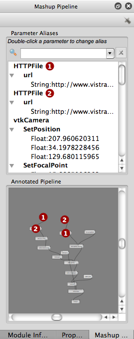
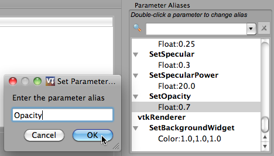
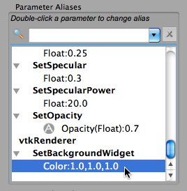
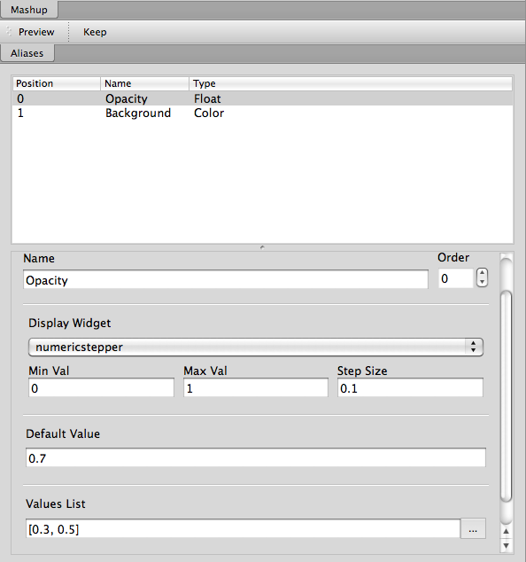
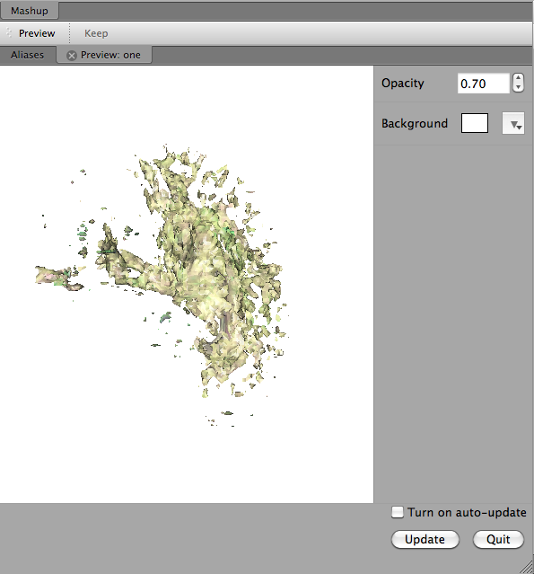

.. _chap-mashups:

*******
Mashups
*******

.. _sec-param-alias:

Creating Parameter Aliases
==========================

.. index:: 
   pair: mashups;aliases
   pair: mashups;setting parameters

If you would like to be able to explore different values for a specific parameter,  you will need to create an alias by double-clicking the parameter in the ``Parameter Aliases`` section.  After naming the alias, you can select the alias in the ``Mashup`` tab (center panel), and configure the alias by selecting the ``Display Widget`` type and setting Default values.  

Notice that a pipeline can have multiple modules of the same type or name, making it difficult to differentiate between them.  These modules are each assigned a number, with the numbers in the ``Annotated Pipeline`` section corresponding to the numbers in the ``Parameter Aliases`` section, making it possible set an alias for the desired module without much confusion. See figure :ref:`Numbered Modules... <fig-righttab>`.

.. _fig-righttab:

   Numbered Modules - The HTTPFile modules 1 and 2 appear in the annotated pipeline and in the parameter aliases.  The annotated pipeline also, numbers the vtkDataSetReader modules (which appear below the respective HTTPFile modules in the pipeline).  Their parameters have not been exposed to the mashup, so they do not appear in the Parameter Aliases section.

Finally, not all modules in the ``Annotated Pipeline`` will show up in the ``Parameter Aliases`` section.  Only modules whose parameters have been set in the pipeline will appear.

Configuring Parameter Aliases
=============================

.. index::
   pair: mashups; configuring aliases

As mentioned in section :ref:`sec-param-alias`, aliases are configured in the center panel (the ``Mashup`` tab).  This is pretty simple, so here are the steps:

#. Select the alias you wish to configure from the top box in the ``Aliases`` tab.  The name and position of the selected alias should be displayed below.  Both of these can be changed by editing the ``Name`` and/or ``Order`` values.  
#. Next select the type of widget to display.  The choices are combobox, slider, and numeric stepper.  The combobox will allow you to enter specific values, whereas the numeric stepper and slider will allow you to scroll through a range of values.
#. Set the Min Val, Max Val, and Step Size (for slider and numeric stepper only).
#. Set the Default Value.  The default value should already be set based on the value it was given in the pipeline, but you are allowed to change it here if desired.
#. Enter suggested values.  If you have a set of values to suggest to the user through the Mashups interface, you should add them to the values list.  You can do this by either clicking the ``...`` button and adding the appropriate values, or by entering the values in the ``Values List`` box in list format. 
#. Finally, you may delete an alias with the ``Delete Alias`` button.

After configuring the necessary aliases, press ``Preview`` to interact with your mashup and to ensure its proper functionality.

Saving a Mashup
===============

.. index::
   pair: mashups;saving

Mashups are added the the VisTrail when you press the keep button.  However, this changes the VisTrail, but does not save it.  To fully save your mashup, you should both press the ``Keep`` button and save the VisTrail.

Managing Multiple Mashups
=========================

.. index:: 
   pair: mashups;naming

The ``Mashups Inspector`` allows you to both rename a mashup, and easily switch between existing mashups.

A Simple Example
================
.. topic:: Try it now!

   * Open "brain_vistrail.vt"
   * Choose ``Save As`` and rename the file if you do not want to overwrite the original.
   * Select the "counter 4" version
   * Press execute to ensure any necessary upgrades are made
   * Select ``Mashup`` from the toolbar.
   * In the Mashup Pipeline tab, look under ``vtkProperty`` :math:`\rightarrow` ``SetOpacity`` and double-click on ``Float``.  
   * Enter "Opacity" in the ``Set Parameter`` box that pops up, then click ``OK``. See figure :ref:`Creating the Opacity Alias <fig-opacityalias>`.
   * Under ``vtkRenderer`` :math:`\rightarrow` ``SetBackgroundWidget``, double-click on ``Color`` and enter "Background" as the alias.  See figure :ref:`Creating the Background Alias <fig-background-create>`.
   * In the center panel, select the ``Opacity`` alias.
   * Change the display widget to ``numericstepper``.
   * Set the ``Min Val``, ``Max Val``, and ``Step Size`` to 0, 1, and 0.1 respectively.
   * Set the ``Values List`` to [0.3, 0.5].  See figure :ref:`Configuring the Opacity Alias <fig-opacity>`.
   * Select the ``Background`` alias and make sure the display widget is a ``combobox``.
   * Select ``Preview``.  See figure :ref:`The resulting mashup <fig-mashupcomp>`.
   * Select ``Keep``, ``No``, and then enter "one" as the new tag name.
   * Save the file.

.. _fig-opacityalias:

   Creating the Opacity Alias.

.. _fig-background-create:

   Creating the Background Alias.

.. _fig-opacity:

   Configuring the ``Opacity`` alias.

.. _fig-mashupcomp:

   The resulting mashup.

