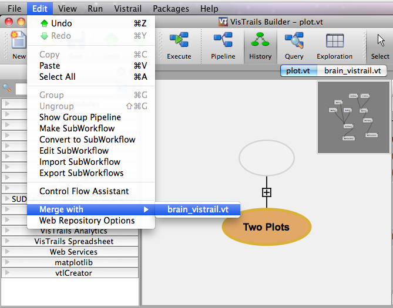
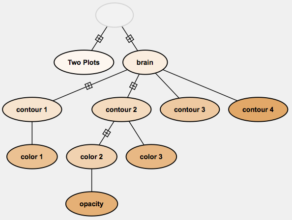

.. _chap-merging:

*************************
Merging Two Version Trees
*************************

.. index:: merging

One of the benefits of having a version tree is that branching allows users to work on multiple workflows within the same file.  This is especially useful when workflows are similar or when one workflow provides output for another.  However, if a user creates two different workflows in two different files and decides he/she wants them to be part of the same file/history, VisTrails allows file merging.

To merge two files:

   * Open both files
   * Select one of the files you would like to be merged.
   * Place you mouse over the ``Merge With`` arrow from the Edit menu.  A list of open files should appear.
   * Select the file that you would like to join with the current (previously selected) file.

The history trees of both files should now be joined and placed in a new file. 

Example
=======

.. _fig-premerge:

   Merging two vistrails.

.. _fig-postmerge:

   The resultant history tree.