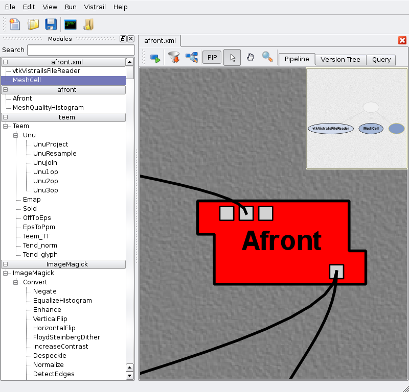
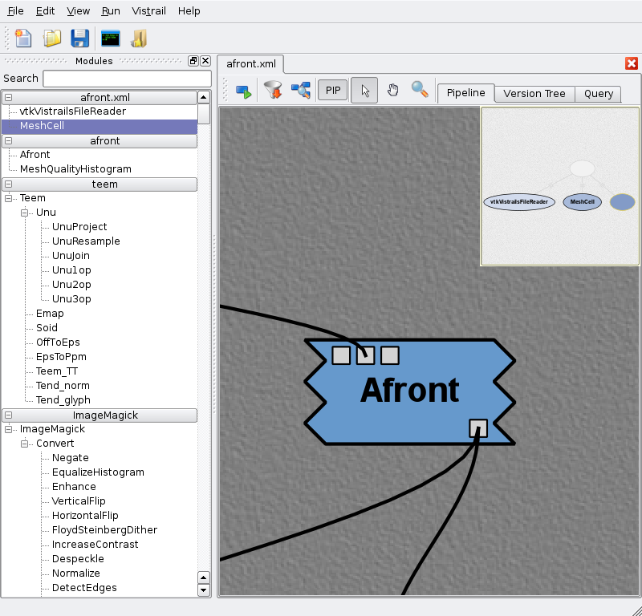
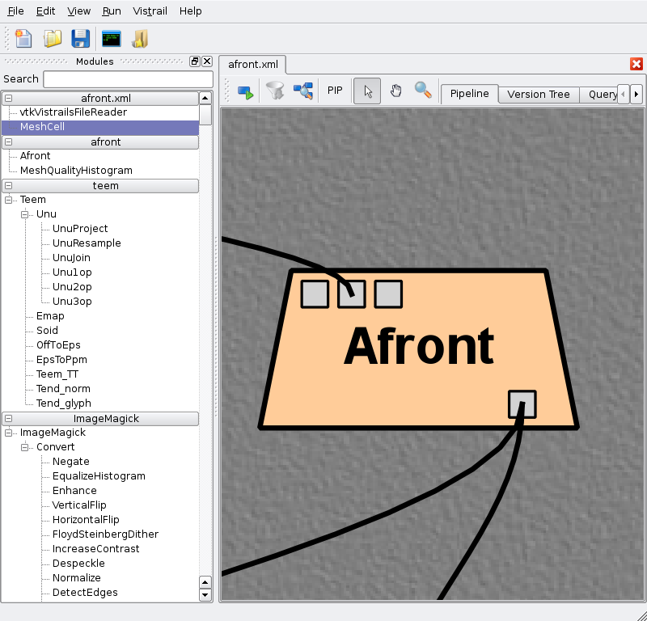

.. _chap-packages:

**************************
Writing VisTrails Packages
**************************

Introduction
============

.. highlight:: python
   :linenothreshold: 5

.. index::
   pair: modules; writing new
   single: packages

.. role:: red

|vistrails| provides a
plugin infrastructure to integrate user-defined functions and
libraries. Specifically, users can incorporate their own visualization
and simulation code into pipelines by defining custom modules (or wrappers). These
modules are bundled in what we call *packages*. A \vistrails
package is simply a collection of Python classes stored in one or more
files, respecting some conventions that will be described shortly.
Each of these classes will represent a new module. In this chapter, we
will build progressively more complicated modules.
Note that even though each section introduces a specific large
feature of the |vistrails| package mechanism, new small features are
highlighted and explained as we go along. Because of this, we
recommend at least skimming through the entire chapter at least once.

Who Should Read This Chapter?
=============================

This chapter is written for developers who wish to extend |vistrails| with customized modules, tailored for their specific needs. It is assumed that you have experience writing code in the Python programming language. Teaching the syntax of Python is beyond the scope of this manual; for experienced programmers who would like a compact introduction to Python, we recommend the book *Python in a Nutshell* by Alex Martelli (published by O'Reilly).

However, if you do not yet know Python but are familiar with another object-oriented language such as Java or C#, you should be able to get the gist of these examples from looking at the code and by reading our line-by-line commentaries.

.. _sec-packages-simple_example:

A Simple Example
================

Here is a simplified example of a very simple user-defined module:

.. code-block:: python
   :linenos:

   class Divide(Module):
       def compute(self):
           arg1 = self.getInputFromPort("arg1")
           arg2 = self.getInputFromPort("arg2")
           if arg2 == 0.0:
               raise ModuleError(self, "Division by zero")
           self.setResult("result", arg1 / arg2)

       _input_ports = [('arg1', '(edu.utah.sci.vistrails.basic:Float)',\
                        {"labels": str(["dividend"])}),\
                       ('arg2', '(edu.utah.sci.vistrails.basic:Float)',\
                        {"labels": str(["divisor"])})]
       _output_ports = [('result', '(edu.utah.sci.vistrails.basic:Float)',\
                        {"labels": str(["quotient"])})]

   _modules = [Divide]
   #old syntax
   #registry.addModule(Divide)
   #registry.addInputPort(Divide, "arg1", (basic.Float, 'dividend'))
   #registry.addInputPort(Divide, "arg2", (basic.Float, 'divisor'))
   #registry.addOutputPort(Divide, "result", (basic.Float, 'quotient'))

New VisTrails modules must subclass from Module, the base class that defines basic functionality. The only required override is the compute() method, which performs the actual module computation. Input and output is specified through ports, which currently have to be explicitly registered with VisTrails. However, this is straightforward, and done through method calls to the module registry. An example of a (slightly) more complicated module follows:

.. include:: pythoncalc.rst

To try this out in VisTrails, save the file above in the ``.vistrails/userpackages`` subdirectory of your home directory, with the filename ``pythoncalc.py``. Then, click on the ``Edit`` menu (or the ``VisTrails`` menu on Mac OS X), select the ``Preferences`` option and select the ``Module Packages`` tab.  A dialog similar to what is shown
in Figure :ref:`All available packages... <fig-packages-enablepackage>` should appear. Select the
``pythonCalc`` package, then click on
``Enable``. This should move the package to the
``Enabled packages`` list. Close the dialog. The package and
module should now be visible in the VisTrails builder.

.. _fig-packages-enablepackage:

.. figure:: figures/packages/enable_package.png
   :align: center
   :width: 100%

   All available packages can be enabled and disabled with the VisTrails preferences dialog.

Now create a workflow similar to what is shown in Figure
:ref:`A simple workflow that uses PythonCalc... <fig-packages-pythoncalcworkflow>`. When executed, this workflow
will print the following on your terminal:

``7.0``

.. _fig-packages-pythoncalcworkflow:

.. figure:: figures/packages/pythoncalc_workflow.png
   :align: center
   :width: 100%

   A simple workflow that uses ``PythonCalc``, a user-defined module.

Let's now examine how this works. The first
two lines simply import required components. The next three lines
give |vistrails| meta-information about the
package. ``Version`` is simply information about the package
version. This might be tied to the underlying library or not. The only
recommended guideline is that compatibility is not broken across minor
releases, but this is not enforced in any way. ``Name`` is a
human-readable name for the package. 

.. %\paragraph*{Choosing a good identifier}

The most important piece of metadata,
however, is the package *identifier*, stored in the variable called
``identifier``. This is a string that must be globally unique
across all packages, not only in your system, but in any possible
system. We recommend using an identifier similar to Java's package
identifiers. These look essentially like regular DNS names, but the
word order is reversed. This makes sorting on the strings a lot more
meaningful. You should generally go for
``institution.project.packagename`` for a package related to a
certain project from some institution, and
``institution.creatorname`` for a personally developed
package. If you are wrapping third-party functionality, *do not*
use their institution's DNS, use your own. The rationale for this is
that the third party itself might decide to create their own |vistrails|
package, and you do not want to introduce conflicts.

Line 8 is where we actually start defining a new module.
Every |vistrails| module corresponds
to a Python class that ultimately derives from the ``Module`` class, which is defined in ``core.modules.vistrails_module``. Each module must implement a ``compute`` method that takes no extra parameters, such as on Line 11. This method
represents the actual computation that happens in a module.
This computation typically involves getting the necessary input and
generating the output. We will now see how that works.

Line 12 shows how to extract input from a
port. Specifically, we're getting the values passed to input ports
``value1`` and ``value2``. We then perform some
operation with these values, and need to report the output on an
output port, so that it is available for downstream modules. This is
done on Line 15, where the result is set to port
``value``.

.. index:: 
   pair: modules; ``ModuleError``

Let us now look more carefully at the remainder of the class definition. Notice
that developers are allowed to define extra helper methods, for example the ``op`` method on Line
17. These helper methods can naturally use the ports
API. The other important feature of the ``op`` method is
*error checking*. ``PythonCalc`` requires a string that
represents the operation to be performed with the two numbers. If the
string is invalid, it signals an error by simply raising a Python
exception, ``ModuleError``, that is provided in
``core.modules.vistrails_module``. This exception expects two
parameters: the module that generated the exception (typically
``self``) and a string describing the error. In the Pipeline view, this error message is displayed in the tooltip that appears when the user "mouses over" the ``PythonCalc`` module icon.

.. index::
   pair: packages; ``initialize``
   pair: Module registry; ``add_Module``
   pair: Module registry; ``add_input_port``
   pair: Module registry; ``add_output_port``

That is all that it takes in terms of module behavior. The rest of the
code is meant to interact with |vistrails|, and let the system know
about the modules and ports being exposed. To do that, you must
provide a function called ``initialize`` in the main body of the
package file (the function starting on Line
27). The first thing is usually to register the
module itself, such as on Line 33. Then, we need
to tell |vistrails| about the input and output ports we want to
expose.  Input ports are set with the ``add_input_port`` method
in the registry, and output ports with ``add_output_port``. These calls take three parameters. The
first parameter is the module you're adding a new port to. The second
one is simply the name of the port, and the third one is a description
of the parameter. In most cases, this is just a pair, where the
first element is a |vistrails| module representing the module type
being passed, and the second element is a string describing it.
Notice that the
types being used are |vistrails| modules (Line 35),
and not Python types.

.. %Later, we will see how to pass more complicated data types.

That is it --- you have successfully created a new package and
module. From now on, we will look at more complicated examples, and
more advanced features of the package mechanism.

Creating Reloadable Packages
============================

When creating or making changes to packages, it is often desirable to reload the package without having to restart |vistrails|.  To create a package that is reloadable, users should create a new directory for the package in ``userpackages`` directory.  This new directory should have the same name as the package and should contain an ``__init__.py`` file and an ``init.py`` file.  The identified, name, version, configuration, and package_dependencies fields/methods should be in ``__init__.py``.  An example of ``__init__.py`` from Vistrails' pylab package follows.

.. code-block:: python
   :linenos:

   identifier = 'edu.utah.sci.vistrails.matplotlib'
   name = 'matplotlib'
   version = '0.9.0'

   def package_dependencies():
       import core.packagemanager
       manager = core.packagemanager.get_package_manager()
       if manager.has_package('edu.utah.sci.vistrails.spreadsheet'):
           return ['edu.utah.sci.vistrails.spreadsheet']
       else:
           return []

   def package_requirements():
       import core.requirements
       if not core.requirements.python_module_exists('matplotlib'):
           raise core.requirements.MissingRequirement('matplotlib')
       if not core.requirements.python_module_exists('pylab'):
           raise core.requirements.MissingRequirement('pylab')

Imports (excluding core.configuration), other class definitions, and the initialize method should be in the ``init.py`` file.  Finally, to reload a package, select the ``reload`` button from the ``Preferences`` dialog's ``Module Packages`` tab.

.. topic:: Note

   To make the previous example :ref:`sec-packages-simple_example` reloadable, rather than having just one file ``pythoncalc.py``, one would have a ``pythoncalc`` directory with the "version", "name", and "identifier" lines in ``__init__.py`` and all other lines in ``init.py``.

.. _sec-wrapping_cmdline_tools:

Wrapping Command-line tools
===========================

.. index::
   pair: packages; wrapping command-line tools

Many existing programs are readily available through a command-line
interface. Also, many existing workflows are first implemented
through scripts, which work primarily with command-line
tools. This section describes how to wrap command-line applications so
they can be used with VisTrails. We will use as a running example the
``afront`` package, which wraps ``afront``, a command-line program
for generating 3D triangle meshes.  [#]_ We will wrap the basic
functionality in three different modules: ``Afront``, ``AfrontIso``, and ``MeshQualityHistogram``.

Each of these modules will be implemented by a Python
class, and they will all invoke the ``afront`` binary.
``Afront`` is the base execution module, and
``AfrontIso`` requires extra parameters on top of the original
ones. Because of this, we will implement ``AfrontIso`` as a
subclass of ``Afront``. ``MeshQualityHistogram``,
however, requires entirely different parameters, and so will not be
a subclass of ``Afront``. A first attempt at writing this package might look something like this:

.. code-block:: python
   :linenos:

   from core.modules.vistrails_module import Module
   ... # other import statements

   name = "Afront"
   version = "0.1.0"
   identifier = "edu.utah.sci.vistrails.afront"

   class Afront(Module):
       def compute(self):
           ... # invokes afront

   class AfrontIso(Afront):
       def compute(self):
           ... # invokes afront with additional parameters

   class MeshQualityHistogram(Module):
       def compute(self):
           ... # invokes afront with completely different parameters

   def initialize():
       ...

Class Mixins
^^^^^^^^^^^^

While this approach is a good start, it does require significant duplication of effort. Each module must contain code to invoke the ``afront`` binary and pass it some parameters. Since this functionality is required by all three modules, we would like to put this code in a separate class called, say, ``AfrontRun``, and let each of our modules inherit from it. ``AfrontRun`` itself is not a module, and thus does not extend the ``Module`` class. So our three modules will inherit from *both* ``AfrontRun`` *and* ``Module``. Helper classes such as this are often referred to as *mixin classes*. [#]_

.. %It should be clear that all three modules share some functionality (invoking ``afront``), but not all. We would like to avoid duplicate code, but there is not a single class where we can implement the base code. The solution is to create a *mixin class*, where we implement the necessary functionality, and then inherit from both classes. In the following snippets, we will highlight the changes in the code.

.. raw:: latex

   \definecolor{CodeEmph}{rgb}{0.8,0.1,0.1}
   \newcommand{\important}[1]{\textsl{{\color{CodeEmph}#1}}}
   \important{hi} hello

.. code-block:: python
   :linenos:

   from core.modules.vistrails_module import Module, ModuleError
   from core.system import list2cmdline
   import os
   
   class AfrontRun(object):
       _debug = False
       def run(self, args):
           cmd = ['afront', '-nogui'] + args
           cmdline = list2cmdline(cmd)
           if self._debug:
               print cmdline
           result = os.system(cmdline)
           if result != 0:
               raise ModuleError(self, "Execution failed")

   class Afront(Module, AfrontRun):
       ...

   class MeshQualityHistogram(Module, AfrontRun):
       ...

.. .. parsed-literal::

   from core.modules.vistrails_module import Module, ModuleError
   :red:`from core.system import list2cmdline`
   :red:`import os`
   
   :red:`class AfrontRun(object):`
       :red:`_debug = False`
       :red:`def run(self, args):`
           :red:`cmd = ['afront', '-nogui'] + args`
           :red:`cmdline = list2cmdline(cmd)`
           :red:`if self._debug:`
               :red:`print cmdline`
           :red:`result = os.system(cmdline)`
           :red:`if result != 0:`
               :red:`raise ModuleError(self, "Execution failed")`

   class Afront(Module, :red:`AfrontRun`):
       ...

   class MeshQualityHistogram(Module, :red:`AfrontRun`):
       ...

Now every module in the ``afront`` package has access to
``run()``.  The other new feature in this snippet is
``list2cmdline``, which turns a list of strings into a command
line. It does this in a careful way (protecting arguments with spaces,
for example). Notice that we use a call to a shell
(``os.system()``) to invoke ``afront``. This is
frequently the easiest way to get third-party functionality into |vistrails|.

.. _sec-pkg_config:

Package Configuration
^^^^^^^^^^^^^^^^^^^^^

.. index::
   pair: packages; configuration

There are two obvious shortcomings in the way ``run()`` is
implemented. First, the code assumes ``afront`` is available
in the system path, which might not be true in practice. Second, the
debugging variable is inaccessible from the GUI, where it could be
very useful. |vistrails| provides a way to configure a package
through the |vistrails| ``Preferences`` dialog. It is very simple to provide your own configuration;
just add a ``configuration`` attribute to your package, as follows:

.. code-block:: python
   :linenos:

   from core.configuration import ConfigurationObject
   from core.modules.vistrails_module import Module, ModuleError
   from core.system import list2cmdline
   import os

   configuration = ConfigurationObject(path=(None, str),
                                       debug=False)

   class AfrontRun(object):

       def run(self, args):
           if configuration.check('path'): # there's a set directory
               afront_cmd = configuration.path + '/afront'
           else: # Assume afront is on path
               afront_cmd = 'afront'
           cmd = [afront_cmd, '-nogui'] + args
           cmdline = list2cmdline(cmd)
           if configuration.debug:
               print cmdline
           ...
   ...

.. .. parsed-literal::

   :red:`from core.configuration import ConfigurationObject`
   from core.modules.vistrails_module import Module, ModuleError
   from core.system import list2cmdline
   import os

   .. _ref-packages=configconstructor1:
   :red:`configuration = ConfigurationObject(path=(None, str),`
   .. _ref-packages-configconstructor2:
                                       :red:`debug=False)`

   class AfrontRun(object):

       def run(self, args):
   .. _ref-packages-configurationcheck:
           :red:`if configuration.check('path'): # there's a set directory`
               :red:`afront_cmd = configuration.path + '/afront'`
           :red:`else: # Assume afront is on path`
               :red:`afront_cmd = 'afront'`
           cmd = [:red:`afront_cmd`, '-nogui'] + args
           cmdline = list2cmdline(cmd)
   .. _ref-packages-configurationdebug:
           :red:`if configuration.debug:` 
               print cmdline
           ...
   ...

.. index:: ``ConfigurationObject``

Let us first look at how to specify configuration options. Named
arguments passed to the ``ConfigurationObject`` constructor (Lines 6 and 7) become attributes in the object. If the attribute has a default value, simply pass it to the constructor. If the attribute should be unset by default, pass the constructor a pair whose first element is ``None`` and second element is the *type* of the expected
parameter. Currently, the valid types are ``bool``,
``int``, ``float`` and ``str``.

To use the configuration object in your code, you can simply access
the attributes (as on line 18). This is fine when there is a
default value set for the attribute. In the case of ``path``,
however, the absence of a value is encoded by a tuple
``(None, str)``, so using it directly is inconvenient. That is
where the ``check()`` method comes in (line 12). It returns ``False``
if there is no set value, and returns the value otherwise.

Perhaps the biggest advantage of using a configuration object is that the values can
be changed through a GUI, and they are persistent across VisTrails
sessions. To configure a package, open the ``Preferences``
menu (|vistrails|:math:`\rightarrow`
``Preferences`` on Mac OS X, or ``Edit`` :math:`\rightarrow`
``Preferences`` on other platforms). Then, select the package you want to
configure by clicking on it (a package must be enabled to be
configurable). If the ``Configure`` button is disabled, it
means the package does not have a configuration object. When you do
click ``Configure``, a dialog like the one in Figure :ref:`Configuration window for a package... <fig-packages-afrontconfigurationwindow>` will appear.

.. _fig-packages-afrontconfigurationwindow:

.. figure:: figures/packages/afront_configuration_window.png
   :align: center
   :width: 40%

   Configuration window for a package that provides a configuration object.

To edit the value for a particular field, double-click on it, and change the
value. The values set in this dialog are persistent across VisTrails
sessions, being saved on a per-user basis.

Temporary File Management
^^^^^^^^^^^^^^^^^^^^^^^^^

.. index::
   pair: packages; temporary files
   pair: packages; ``filePool``

Command-line programs typically generate files as outputs. On
complicated pipelines, many files get created and passed to other
modules. To facilitate the use of files as communication
objects, VisTrails provides basic infrastructure for temporary file
management. This way, package developers do not have to worry about
file ownership and lifetimes.

To use this infrastructure, it must be possible to tell the program
being called which filename to use as output. VisTrails can accommodate
some filename requirements (in particular, specific
filename extensions might be important in Windows environments, and
these can be set), but it must be possible to direct the output to a
certain filename.

We will use ``Afront's compute()`` method to
illustrate the feature.

.. code-block:: python
   :linenos:

   ...
   class Afront(Module, AfrontRun):
           
       def compute(self):
           o = self.interpreter.filePool.create_file(suffix='.m')
           args = []
           if not self.hasInputFromPort("file"):
               raise ModuleError(self, "Needs input file")
           args.append(self.getInputFromPort("file").name)
           if self.hasInputFromPort("rho"):
               args.append("-rho")
               args.append(str(self.getInputFromPort("rho")))
           if self.hasInputFromPort("eta"):
               args.append("-reduction")
               args.append(str(self.getInputFromPort("eta")))
           args.append("-outname")
           args.append(o.name)
           args.append("-tri")
           self.run(args)
           self.setResult("output", o)
   ...

Line 5 shows how to create a temporary file
during the execution of a pipeline. There are a few new things
happening, so let us look at them one at a time. Every module holds a
reference to the current *interpreter*, the object responsible
for orchestrating the execution of a pipeline. This object has a
``filePool``, which is what we will use to create a pipeline,
through the ``create_file`` method. This method takes
optionally a named parameter ``suffix``, which forces the
temporary file that will be created to have the right extension.

The file pool returns an instance of ``basic_modules.File``,
a module that is provided by the basic VisTrails packages. There are
two important things you should know about ``File``. First, it
has a ``name`` attribute that stores the name of the file it
represents. In this case, it is the name of the
recently-created temporary file. This allows you to safely use this
file when calling a shell, as seen on Line 17.
The other important feature is that it can be passed directly to an
output port, so that this file can be used by subsequent modules. This
is shown on Line 20.

The above code also introduces the boolean function ``hasInputFromPort`` (see Lines 7, 10, and 13). This is a simple error-checking function that verifies that the port has incoming data before the program attempts to read from it. It is considered good practice to call this function before invoking ``getInputFromPort`` for any input port.

**Accommodating badly-designed programs** Even though it is
considered bad design for a command-line program not to allow the specification of an output
filename, there do exist programs that lack this functionality. In this case, a possible
workaround is to execute the command-line tool, and move the generated
file to the name given by VisTrails.

Interfacing with the |vistrails| Menu
=====================================

As we saw in Section :ref:`sec-pkg_config`, using the ``ConfigurationObject`` class is one way to "hook" your custom package into the |vistrails| GUI.  However, this is not the only way to integrate your package with the user interface. |vistrails| also supports a mechanism whereby your package can add new options underneath the ``Packages`` menu (Figure :ref:`Packages can integrate their own commands... <fig-packages-package_menu>`).

.. _fig-packages-package_menu:

.. figure:: figures/packages/package_menu.png
   :align: center
   :width: 5in

   Packages can integrate their own commands into the main |vistrails| menu.

This is done by adding a function named ``menu_items`` to your main package file. This function takes no parameters, and should return a tuple of pairs for each new menu item to be added. The first element of each pair is the label of the menu item as it should appear in the GUI. The second element of the pair is the name of the callback function to be invoked when the user selects that menu item. 

As an example, we include below the implementation of ``menu_items`` from the |vistrails| Spreadsheet package:

.. code-block:: python
   :linenos:

   def menu_items():
       """menu_items() -> tuple of (str,function)
       It returns a list of pairs containing text for the menu and a
       callback function that will be executed when that menu item is selected.    
       """

       def show_spreadsheet():
           spreadsheetWindow.show()
       lst = []
       lst.append(("Show Spreadsheet", show_spreadsheet))
       return tuple(lst)

.. .. parsed-literal::

   def menu_items():
       """menu_items() -> tuple of (str,function)
       It returns a list of pairs containing text for the menu and a
       callback function that will be executed when that menu item is selected.    
       """

       def show_spreadsheet():
           spreadsheetWindow.show()
       lst = []
       :red:`lst.append(("Show Spreadsheet", show_spreadsheet))` 
       return tuple(lst)

Writing your own ``menu_items`` function is straightforward; simply use the provided example as a basis, and substitute labels and callback functions as appropriate for your specific module. Although the Spreadsheet package currently only implements one new menu option, you are free to add as many as you see fit; just append additional pairs to the list (see Line 10 of the example code) before the function returns.

The ``Packages`` menu is organized hierarchically, as illustrated in Figure :ref:`Packages can integrate their own commands... <fig-packages-package_menu>`. Each package that contributes a ``menu_items`` function will receive an entry in the ``Packages`` menu. The actual menu items for each package will appear in a submenu.

.. _sec-interpackage_dependencies:

Interpackage Dependencies
=========================

.. index::
   pair: packages; dependencies

When creating more sophisticated VisTrails packages, you might want to
create a new module that requires a module *from another package*. For example, using modules from different packages as
input ports, or even subclassing modules from other packages, require
management of interpackage dependencies. VisTrails needs to know about
these so that packages can be initialized in the correct order. To specify these dependencies, you should add a function named
``package_dependencies`` to your package. This function should return a list containing the identifier strings of the required packages.

As an example of this function's usage, let's take a look at a (simplified) code segment from the VTK package, which is included in the standard |vistrails| distribution:

.. code-block:: python
   :linenos:

   def package_dependencies():
       return ['edu.utah.sci.vistrails.spreadsheet']

As you can see, the ``package_dependencies`` function is quite straightforward; it simply returns a list of the identifiers for the packages required by the VTK package. In this case, the list contains just a single string, as the |vistrails| Spreadsheet is the only package dependency for the VTK package.

The simple approach taken by the above code works well for the majority of cases, but in practice you may want to add some error-checking to your ``package_dependencies`` function. This allows |vistrails| to recover gracefully in the unlikely event that the Spreadsheet package is missing. Below is the complete ``package_dependencies`` function for the VTK package:

.. code-block:: python
   :linenos:

   def package_dependencies():
       import core.packagemanager
       manager = core.packagemanager.get_package_manager()
       if manager.has_package('edu.utah.sci.vistrails.spreadsheet'):
           return ['edu.utah.sci.vistrails.spreadsheet']
       else:
           return []

The above code segment also demonstrates the |vistrails| API function ``has_package`` which simply verifies that a given package exists in the system.

Package Requirements
====================

In Section :ref:`sec-interpackage_dependencies`\ , we saw how packages can depend on other packages. However, some packages may also depend on the presence of external libraries (in the form of Python modules) or executable files in order to run correctly.

Required Python Modules
^^^^^^^^^^^^^^^^^^^^^^^

To check for the presence of a required Python module, you should add a function named ``package_requirements`` to your package. This function need not return any value; however it may raise exceptions or output error messages as necessary.
Here is an example of the syntax of the ``package_requirements`` function, taken from the |vistrails| VTK package:

.. code-block:: python
   :linenos:

   def package_requirements():
       import core.requirements
       if not core.requirements.python_module_exists('vtk'):
           raise core.requirements.MissingRequirement('vtk')
       if not core.requirements.python_module_exists('PyQt4'):
           print 'PyQt4 is not available. There will be no interaction',
           print 'between VTK and the spreadsheet.'
       import vtk

A key element of ``package_requirements`` is the use of the function ``python_module_exists``  (see Lines 3 and 5), which checks whether a given module has been installed in your local Python system.

Required Executables
^^^^^^^^^^^^^^^^^^^^

As explained in Section :ref:`sec-wrapping_cmdline_tools`, a common motivation for writing new |vistrails| modules is to wrap existing command-line tools. To this end, the |vistrails| API provides a function called ``executable_file_exists`` which checks for the presence of specific executables on the path.

Here is an example of its usage, taken from the ``initialize`` function of the ``ImageMagick`` package. This package is included in the standard |vistrails| distribution. The following code snippet checks to see if ``convert``, a command-line program associated with the *ImageMagick* suite of graphics utilities, is on the path.

.. code-block:: python
   :linenos:

   import core.requirements

   ...

       if (not core.requirements.executable_file_exists('convert')):
           raise core.requirements.MissingRequirement("ImageMagick suite")

Note that this function is not strictly required in order to wrap third party executables into a module. Using a ``Configuration`` object (see Section :ref:`sec-pkg_config`) that lets the user specify the path to an executable may be a cleaner solution.

For additional information or examples of any of the functions described above, please refer to the |vistrails| source code or contact the |vistrails| development team.

Interaction with Caching
========================

.. index::
   pair: modules; caching

VisTrails provides a caching mechanism, in which portions of pipelines that are common across different executions are automatically shared. However, some modules should not be shared. Caching control is therefore up to the package developer. By default, caching is enabled. So a developer that doesn't want caching to apply must make small changes to the module.  For example, look at the StandardOutput module:

.. code-block:: python

   from core.modules.vistrails_module import Module, newModule, \
       NotCacheable, ModuleError
   (...)
   class StandardOutput(NotCacheable, Module):
       """StandardOutput is a VisTrails Module that simply prints the
       value connected on its port to standard output. It is intended
       mostly as a debugging device."""
    
       def compute(self):
           v = self.getInputFromPort("value")
           print v

By subclassing from ``NotCacheable`` and ``Module`` (or one of its subclasses), we are telling VisTrails not to cache this module, or anything downstream from it.

VisTrails also allows a more sophisticated decision on whether or not to use caching. To do that, a user simply overrides the method ``is_cacheable`` to return the appropriate value (the default implementation returns ``True``).  For example, in the `teem <http://teem.sourceforge.net/>` package, there's a module that generates a scalar field with random numbers. This is non-deterministic, so shouldn't be cached. However, this module only generates non-deterministic values in special occasions, depending on its input port values. To keep efficiency when caching is possible, while still maintaining correctness, that module implements the following override:

.. code-block:: python

   class Unu1op(Unu):
   (...)
       def is_cacheable(self):
           return not self.getInputFromPort('op') in ['rand', 'nrand']
   (...)

Notice that the module explicitly uses inputs to decide whether it should be cached. This allows reasonably fine-grained control over the process.

Customizing Modules and Ports
=============================

.. index:: 
   pair: Module registry; ``-output_ports``
   pair: Module registry; ``_input_ports``
   pair: Module registry; ``_modules``

Here we will explore the options for registry initialization of modules and ports which was introduced in Section :ref:`sec-packages-simple_example`.  There is a new syntax for specifying modules in packages:

.. code-block:: python
   :linenos:

   _modules = [MyModule1, (MyModule2, {'option_name' : 'value'})]

Observe that ``_modules`` is assigned a list of modules to be registered, and module options can be provided as keyword arguments by specifying a tuple (class, kwargs).  Similarly, ports are defined by providing a list of tuples of the form (portName, portSignature, optional=False, sort_key=-1).  For example:

.. code-block:: python
   :linenos:

   class MyModule(Module):
       def compute(self):
          pass

       _input_ports = [('firstInput', String), ('secondInput', Integer, True)]
       _output_ports = [('firstOutput', String), ('secondOutput', String)]

.. index::
   pair: port; shortcut

Notice that "String" and "Integer" were used for the portSignature instead of ``edu.utah.sci.vistrails.basic:String`` and ``edu.utah.sci.vistrails.basic:Integer``.  That is because the current package, ``edu.utah.sci.vistrails.basic`` is used by default.

.. topic:: Note

   The old syntax (reg.add_module(...), reg.add_input_port(...), and reg.add_output_port(...)) is still supported.

Configuring Modules
^^^^^^^^^^^^^^^^^^^

.. index::
   pair: packages; modules
   pair: modules; visibility
   pair: modules; namespaces

**Hierarchy and Visibility** There are a few options that assist in the organization and display of modules: ``namespace``,  ``abstract``, and ``hide_descriptor``.  The ``namespace`` option can be used to define a hierarchy in the module palette, which hierarchies can be nested through the use of the '|' character.  For example:

.. code-block:: python
   :linenos:

   _modules = [MyModule1, (MyModule2, {'namespace': 'MyNamespace'})]
    or
   _modules = [MyModule1, (MyModule2, {'namespace': 'ParentNamespace|\
               ChildNamespace'})]

The other options, ``abstract`` and ``hide_descriptor`` can be used to prevent modules from appearing in the module palette.  ``Abstract`` is for use with modules that should never be instantiated in the workflow and will not add the item to the module palette.  On the other hand, ``hide-descriptor`` will add the item to the palette, but hides it.  This will prevent users from adding the module to a pipeline, but allow code to add it programmatically.  To use either of these options, ``abstract`` or ``hide_descriptor``, set it to ``True``:

.. code-block:: python
   :linenos:

   _modules = [AnotherModule, (InvisibleModule, {'abstract': True})]
    or
   _modules = [AnotherModule, (InvisibleModule, {'hide-descriptor': True})]

.. index::
   pair: modules; shape
   pair: modules; color

**Defining Module Shapes and Colors**  VisTrails allows users to define custom colors and shapes to modules. This must be done at module registration time, by using the ``moduleColor`` and ``moduleFringe`` options. For example:

.. code-block:: python

   _modules = [(Afront, {'moduleColor' : (1.0, 0.0, 0.0), 
                         'moduleFringe' : [(0.0, 0.0),
                                           (0.2, 0.0),
                                           (0.2, 0.4),
                                           (0.0, 0.4),
                                           (0.0, 1.0)]})]
  
.. reg.addModule(Afront,
                 moduleColor=(1.0,0.0,0.0),
                 moduleFringe=[(0.0, 0.0),
                               (0.2, 0.0),
                               (0.2, 0.4),
                               (0.0, 0.4),
                               (0.0, 1.0)])

gives:

and

.. code-block:: python

   _modules = [(Afront, {'moduleColor': (0.4,0.6,0.8),
                         'moduleFringe' : [(0.0, 0.0),
                                           (0.2, 0.0),
                                           (0.0, 0.2),
                                           (0.2, 0.4),
                                           (0.0, 0.6),
                                           (0.2, 0.8),
                                           (0.0, 1.0)]})]

..   reg = core.modules.module_registry
..   reg.addModule(Afront,
                 moduleColor=(0.4,0.6,0.8),
                 moduleFringe=[(0.0, 0.0),
                               (0.2, 0.0),
                               (0.0, 0.2),
                               (0.2, 0.4),
                               (0.0, 0.6),
                               (0.2, 0.8),
                               (0.0, 1.0)])

gives:

The moduleColor parameter must be a tuple of three floats between 0 and 1 that specify RGB colors for the module background, while moduleFringe is a list of pairs of floats that specify points as they go around a side of the module (the same one is used to go from the top-right corner to bottom-right corner, and from the bottom-left corner to the top-left one. If this is not enough, let the developers know!)

Alternatively, you can use different fringes for the left and right borders:

.. code-block:: python

   _modules = [(Afront, {'moduleColor': (1.0,0.8,0.6),
                         'moduleLeftFringe' : [(0.0, 0.0),
                                               (-0.2, 0.0),
                                               (0.0, 1.0)],
                         'moduleRightFringe' : [(0.0, 0.0),
                                                (0.2, 1.0),
                                                (0.0, 1.0)]})]

..   reg.addModule(Afront,
                 moduleColor=(1.0,0.8,0.6),
                 moduleLeftFringe=[(0.0, 0.0),
                                   (-0.2, 0.0),
                                   (0.0, 1.0)],
                 moduleRightFringe=[(0.0, 0.0),
                                    (0.2, 1.0),
                                    (0.0, 1.0)])

Configuring Ports
^^^^^^^^^^^^^^^^^

.. index::
   pair: packages; ports
   pair: ports; default values
   pair: ports; labels

**Default Values and Labels** In versions 1.4 and greater, package developers can add labels and default values for parameters. To add this functionality, you need to use the defaults and labels keyword arguments and pass the values as strings. For example,

.. code-block:: python
   :linenos:

   class TestDefaults(Module):
      _input_ports = [('f1', '(edu.utah.sci.vistrails.basic:Float, \
                               edu.utah.sci.vistrails.basic:String)',
                       {"defaults": str([1.23, "abc"]), 
                        "labels": str(["temp", "name"])})]
   _modules = [TestDefaults]

or in the older syntax,

.. code-block:: python
   :linenos:

   def initialize():
     reg = core.modules.module_registry.get_module_registry()
     reg.add_module(TestDefaults)
     reg.add_input_port(TestDefaults, "f1", [Float, String], 
                        defaults=str([1.23, "abc"]), 
                        labels=str(["temp", "name"]))

.. index::
   pair: ports; optional

**Making a Port Optional**  To add a port that is optional, simply set optional to true:

.. code-block:: python
   :linenos:

   _input_ports = [('MyPort', '(edu.utah.sci.vistrails.basic:String)',
                       {"optional": True})]

   reg.add_input_port(MyModule, "MyPort", 
                      (edu.utah.sci.vistrails.basic:String, 'MyPort Name'), 
                      optional=True)

.. index::
   pair: ports; multiple inputs

**Multiple Inputs** For compatibility reasons, we do need to allow multiple connections to an input port. However, most package developers should never have to use this, and so we do our best to hide it. the default behavior for getting inputs from a port, then, is to always return a single input.

If on your module you need multiple inputs connected to a single port, use the 'forceGetInputListFromPort' method. It will return a list of all the data items coming through the port. The spreadsheet package uses this feature, so look there for usage examples (vistrails/packages/spreadsheet/basic_widgets.py)

.. index::
   pair: ports; port types

**Port Types** To define ports to be of types that are not imported into the package, pass and identifier string as the portSignature:

.. code-block:: python
   :linenos:

   <module_string> := <package_identifier>:[<namespace>|]<module_name>,
   <port_signature> := (<module_string>*)

For example,

.. code-block:: python

   registry.add_input_port(MyModule, 'myInputPort', \
                           '(edu.utah.sci.vistrails.basic:String)')

or

.. code-block:: python

   _input_ports = [('myInputPort', '(edu.utah.sci.vistrails.basic:String)')]

.. index::
   pair: ports; input dependency

**Varying Output According to the Input** There are a few ways to tackle this - each has it's own benefits and pitfalls. Firstly, module connections do respect class hierarchies as we're familiar with in object oriented languages. For instance, A module can output a Constant of which String, Float, Integer, etc are specifications. In this way, you can have a subclass of something like MyData be passed out of the module and the connections will be established regardless of the sub-type. This is a bit dangerous though. Modules downstream of such a class may not really know how to operate on certain types derived from the super-class. Extreme care must be taken both when creating the modules as well as connecting them to prevent things like this from happening.

A second method that is employed in several different packages is the idea of a container class. For instance, the NumSciPy package uses a relatively generic container "Numpy Array" to encapsulate the data. Of course, these encapsulating objects can store dictionaries that other modules can easily access and understand how to operate on. Although this method is slightly more work, the benefits of a stricter typing of ports is beneficial - particularly upon interfacing with other packages that may depend on strongly typed constants (for example).

.. index::
   pair: ports; module connectivity

**Determining Whether or Not a Module is Attached to an Output Port** The outputPorts dictionary of the base Module stores connection information. Thus, you should be able to check

``("myPortName" in self.outputPorts)``

on the parent module to check if there are any downstream connections from the port "myPortName". This might be used, for example, to only set results for output ports that will be used. **Note**, however, that the caching algorithm assumes that all outputs are set so adding a new connection to a previously unconnected output port will not work as desired if that module is cached. For this reason, I would currently recommend making such a module not cacheable. Another possibility is overriding the update() method to check the outputPorts and set the upToDate flag if they are not equal. In a single, limited test, this seemed to work, but be warned that it is not fully tested. Here is an example:

.. code-block:: python
   :linenos:

   class TestModule(Module):
       _output_ports = [('a1', '(edu.utah.sci.vistrails.basic:String)'),
                        ('a2', '(edu.utah.sci.vistrails.basic:String)')]
       def __init__(self):
           Module.__init__(self)
           self._cached_output_ports = set()
    
       def update(self):
           if len(set(self.outputPorts) - self._cached_output_ports) > 0:
               self.upToDate = False
           Module.update(self)
    
       def compute(self):
           if "a1" in self.outputPorts:
               self.setResult("a1", "test")
           if "a2" in self.outputPorts:
               self.setResult("a2", "test2")
           self._cached_output_ports = set(self.outputPorts)

Generating Modules Dynamically
==============================

.. index::
  pair: modules; dynamic

When wrapping existing libraries or trying to generate modules in a more procedural manner, it is useful to dynamically generate modules. In our work, we have created some shortcuts to make this easier. In addition, the list of modules can also be based on the package configuration. Here is some example code:

**__init__.py**

.. code-block:: python
   :linenos:

   from core.configuration import ConfigurationObject
 
   identifier = "edu.utah.sci.dakoop.auto_example"
   version = "0.0.1"
   name = "AutoExample"
 
   configuration = ConfigurationObject(use_b=True)

**init.py**

The expand_ports and build_modules methods are functions to help the construction of the modules easier. The key parts are the new_module call and setting the _modules variable.

.. code-block:: python
   :linenos:

   from core.modules.vistrails_module import new_module, Module
 
   identifier = "edu.utah.sci.dakoop.auto_example"
 
   def expand_ports(port_list):
       new_port_list = []
       for port in port_list:
           port_spec = port[1]
           if type(port_spec) == str: # or unicode...
               if port_spec.startswith('('):
                   port_spec = port_spec[1:]
               if port_spec.endswith(')'):
                   port_spec = port_spec[:-1]
               new_spec_list = []
               for spec in port_spec.split(','):
                   spec = spec.strip()
                   parts = spec.split(':', 1)
                   print 'parts:', parts
                   namespace = None
                   if len(parts) > 1:
                       mod_parts = parts[1].rsplit('|', 1)
                       if len(mod_parts) > 1:
                           namespace, module_name = mod_parts
                       else:
                           module_name = parts[1]
                       if len(parts[0].split('.')) == 1:
                           id_str = 'edu.utah.sci.vistrails.' + parts[0]
                       else:
                           id_str = parts[0]
                   else:
                       mod_parts = spec.rsplit('|', 1)
                       if len(mod_parts) > 1:
                           namespace, module_name = mod_parts
                       else:
                           module_name = spec
                       id_str = identifier
                   if namespace:
                       new_spec_list.append(id_str + ':' + module_name + \
                                            ':' + namespace)
                   else:
                       new_spec_list.append(id_str + ':' + module_name)
               port_spec = '(' + ','.join(new_spec_list) + ')'
           new_port_list.append((port[0], port_spec) + port[2:])
       print new_port_list
       return new_port_list
 
   def build_modules(module_descs):
       new_classes = {}
       for m_name, m_dict in module_descs:
           m_doc = m_dict.get("_doc", None)
           m_inputs = m_dict.get("_inputs", [])
           m_outputs = m_dict.get("_outputs", [])
           if "_inputs" in m_dict:
               del m_dict["_inputs"]
           if "_outputs" in m_dict:
               del m_dict["_outputs"]
           if "_doc" in m_dict:
               del m_dict["_doc"]
           klass_dict = {}
           if "_compute" in m_dict:
               klass_dict["compute"] = m_dict["_compute"]
               del m_dict["_compute"]
           m_class = new_module(Module, m_name, klass_dict, m_doc)
           m_class._input_ports = expand_ports(m_inputs)
           m_class._output_ports = expand_ports(m_outputs)
           new_classes[m_name] = (m_class, m_dict)
       return new_classes.values()
 
   def initialize():
       global _modules
       def a_compute(self):
           a = self.getInputFromPort("a")
           i = 0
           if self.hasInputFromPort("i"):
               i = self.getInputFromPort("i")
           if a == "abc":
               i += 100
           self.setResult("b", i)
 
       module_descs = [("ModuleA", {"_inputs": [("a", "basic:String")],
                                    "_outputs": [("b", "basic:Integer")],
                                    "_doc": "ModuleA documentation",
                                    "_compute": a_compute,
                                    "namespace": "Test"}),
                       ("ModuleB", {"_inputs": [("a", "Test|ModuleA")],
                                    "_outputs": [("b", "Test|ModuleA")],
                                    "_doc": "ModuleB documentation"})
                     ]
 
       if configuration.use_b:
           _modules = build_modules(module_descs)
       else:
           _modules = build_modules(module_descs[:1])
 
   _modules = []

For System Administrators
=========================
Most users will want to put their custom packages in their

 :math:`\sim`\ ``/.vistrails/userpackages``

directory, as described in Section :ref:`sec-packages-simple_example`. This makes the package available to the current user only. However, if you are a power user or a system administrator, you may wish to make certain packages available to all users of a |vistrails| installation. To do this, copy the appropriate package files and/or directories to the

 ``vistrails/packages``

directory of the |vistrails| distribution.
The packages will be made visible to users the next time they launch |vistrails|.

.. %Advanced: Wrapping a big API
.. ============================
.. %In the future, there will be a walkthrough of the VTK package wrapping mechanism. 

.. rubric:: Footnotes
.. [#] This package is not included in binary distributions of |vistrails|, but is available in the source code distribution. The stand-alone ``Afront`` utility is available at http://afront.sourceforge.net.
.. [#] Programmers who are more comfortable with single-inheritance languages like Java and C# may be unfamiliar with mixins. A mixin class is similar to an *interface* in Java or C#, except that a mixin provides an implementation as well. Python's support for multiple inheritance allows subclasses to "import" functionality as needed from a mixin class, without artificially cluttering the base class's interface.