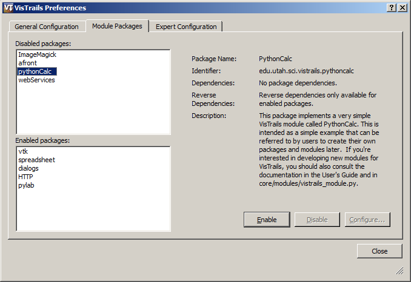
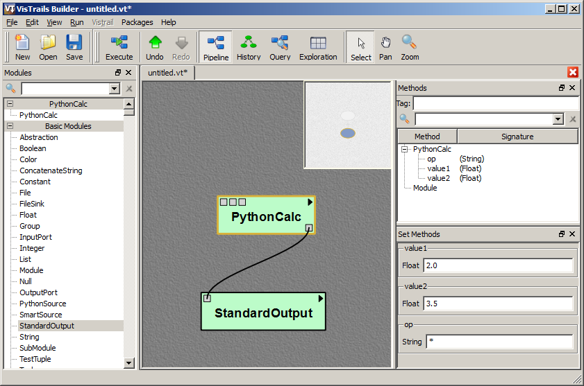
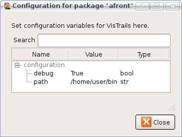
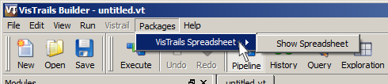
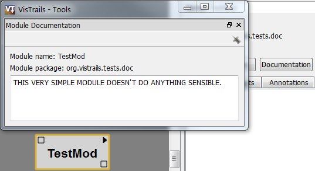

.. _chap-packages:

**************************
Writing VisTrails Packages
**************************

Introduction
============

.. highlight:: python
   :linenothreshold: 5

.. index::
   pair: modules; writing new
   single: packages

.. role:: red

|vistrails| provides a
plugin infrastructure to integrate user-defined functions and
libraries. Specifically, users can incorporate their own visualization
and simulation code into pipelines by defining custom modules (or wrappers). These
modules are bundled in what we call *packages*. A |vistrails|
package is simply a collection of Python classes stored in one or more
files, respecting some conventions that will be described shortly.
Each of these classes will represent a new module. In this chapter, we
will build progressively more complicated modules.
Note that even though each section introduces a specific large
feature of the |vistrails| package mechanism, new small features are
highlighted and explained as we go along. Because of this, we
recommend at least skimming through the entire chapter at least once.

Who Should Read This Chapter?
=============================

This chapter is written for developers who wish to extend |vistrails| with customized modules, tailored for their specific needs. It is assumed that you have experience writing code in the Python programming language. Teaching the syntax of Python is beyond the scope of this manual; for experienced programmers who would like a compact introduction to Python, we recommend the book *Python in a Nutshell* by Alex Martelli (published by O'Reilly).

However, if you do not yet know Python but are familiar with another object-oriented language such as Java or C#, you should be able to get the gist of these examples from looking at the code and by reading our line-by-line commentaries.

.. _sec-packages-example-module:

An Example Module
=================

Here is the definition of a very simple module:

.. code-block:: python
   :linenos:

   class Divide(Module):
       _input_ports = [IPort(name='arg1',\
                             signature='basic:Float',\
                             label="dividend"),
                       IPort(name='arg2',\
		             signature='basic:Float',\
			     label='divisor')]
       _output_ports = [OPort(name='result',\
                              signature='basic:Float',\
                              label='quotient')]

       def compute(self):
           arg1 = self.get_input("arg1")
           arg2 = self.get_input("arg2")
           if arg2 == 0.0:
               raise ModuleError(self, "Division by zero")
           self.set_output("result", arg1 / arg2)

New VisTrails modules must subclass from :py:class:`~vistrails.core.modules.vistrails_module.Module`, the base class that defines basic functionality. The only required override is the :py:meth:`~vistrails.core.modules.vistrails_module.Module.compute` method, which performs the actual module computation. Input and output is specified through ports, which must be explicitly registered with |vistrails| using the :py:attr:`~.vistrails_module.Module._input_ports` and :py:attr:`~.vistrails_module.Module._output_ports` lists.  Simple ports are specified using :py:class:`~.config.InputPort` (:py:class:`~.config.IPort`) and :py:class:`~.config.OutputPort` (:py:class:`~.config.OPort`) objects.

.. _sec-packages-simple-example:

An Example Package
==================

The previous section only shows the definition of a single module.  To create a full package that loads and runs in |vistrails|, a few more items are required.  In this example, we define a basic calculator package named PythonCalc.  Note that this package includes *two* files, ``__init__.py`` and ``init.py`` that live in a directory named ``pythonCalc``; each file is an important piece of a VisTrails package.

**__init__.py**

.. include:: pythoncalc_file1.rst

**init.py**

.. include:: pythoncalc.rst

To create and install this package in VisTrails, first create a new directory named ``pythonCalc`` in the ``.vistrails/userpackages`` subdirectory of your home directory. Then, save the two code blocks above to the corresponding ``__init__.py`` and ``init.py`` files in the newly created ``pythonCalc`` directory.  Now, click on the ``Edit`` menu (or the ``VisTrails`` menu on Mac OS X), select the ``Preferences`` option and select the ``Module Packages`` tab.  A dialog similar to what is shown
in Figure :ref:`All available packages... <fig-packages-enablepackage>` should appear. Select the
``pythonCalc`` package, then click on
``Enable``. This should move the package to the
``Enabled packages`` list. Close the dialog. The package and
module should now be visible in the VisTrails builder.

.. _fig-packages-enablepackage:

   All available packages can be enabled and disabled with the VisTrails preferences dialog.

Now create a workflow similar to what is shown in Figure
:ref:`A simple workflow that uses PythonCalc... <fig-packages-pythoncalcworkflow>`. When executed, this workflow
will print the following on your terminal:

``7.0``

.. _fig-packages-pythoncalcworkflow:

   A simple workflow that uses ``PythonCalc``, a user-defined module.

Let's now examine how this works. The ``__init__.py`` file provides metadata about the package.  ``Version`` is simply information about the package version. This might be tied to the underlying library or not. The only recommended guideline is that compatibility is not broken across minor releases, but this is not enforced in any way. ``Name`` is a human-readable name for the package. 

.. %\paragraph*{Choosing a good identifier}

The most important piece of metadata,
however, is the package *identifier*, stored in the variable called
``identifier``. This is a string that must be globally unique
across all packages, not only in your system, but in any possible
system. We recommend using an identifier similar to Java's package
identifiers. These look essentially like regular DNS names, but the
word order is reversed. This makes sorting on the strings a lot more
meaningful. You should generally go for
``institution.project.packagename`` for a package related to a
certain project from some institution, and
``institution.creatorname`` for a personally developed
package. If you are wrapping third-party functionality, *do not*
use their institution's DNS, use your own. The rationale for this is
that the third party itself might decide to create their own |vistrails|
package, and you do not want to introduce conflicts.

The ``init.py`` file contains the actual definitions of the modules. Every |vistrails| module corresponds to a Python class that ultimately derives from the :py:class:`.Module` class, which is defined in :py:mod:`vistrails.core.modules.vistrails_module`. Each module must define input ports and output ports as well as implement a :py:meth:`~.vistrails_module.Module.compute` method that takes no extra parameters.

.. index:: ports
   pair: modules; ``_input_ports``
   pair: modules; ``_output_ports``

We need to tell |vistrails| about the input and output ports we want to expose in a module.  Input ports are set in the :py:attr:`~.vistrails_module.Module._input_ports` list and output ports in the :py:attr:`~.vistrails_module.Module._output_ports` list. Each object in these lists is defined from a type from :py:mod:`vistrails.core.modules.config`.  The most basic port types are :py:class:`~.modules.config.InputPort` (aka :py:class:`~.modules.config.IPort`) and :py:class:`~.modules.config.OutputPort` (aka :py:class:`~.modules.config.OPort`).  Each requires two arguments, the *name* of the port and the *signature* of the port.  A name may be any string, but must be unique across all inputs or outputs.  The same name may be used both for an input and an output. The signature defines the type of the port; |vistrails| allows any module to also be a type. A signature is a string composed of the module's package identifier followed by a colon and the module's name.  Many basic module types including ``String``, ``Float``, and ``Integer`` are defined by |vistrails| in the Basic Modules package.  Thus, the ``Float`` module's signature is ``org.vistrails.vistrails.basic:Float``.  Any core package that is distributed with |vistrails| has an identifier that begins ``org.vistrails.vistrails`` and thus you may omit that prefix for brevity; ``basic:Float`` defines the same signature.  There are a number of other options for ports, but we will cover these later.

.. index::
   pair: modules; ``compute``

The compute method on Line 49 defines the actual computation that happens in a module. This computation typically involves getting the necessary input and generating the output.  Lines 53-54 shows how to extract input from a port. Specifically, we're getting the values passed to input ports ``value1`` and ``value2``. We then perform some
operation with these values, and need to report the output on an output port, so that it is available for downstream modules. This is done on Line 62, where the result is set to port ``value``.

.. index:: 
   pair: modules; ``ModuleError``

Let us now look more carefully at the remainder of the class definition. Notice
that developers are allowed to define extra helper methods, for example the ``op`` method on Line
64. These helper methods can naturally use the ports
API. The other important feature of the ``op`` method is
*error checking*. ``PythonCalc`` requires a string that
represents the operation to be performed with the two numbers. If the
string is invalid, it signals an error by simply raising a Python
exception, :py:class:`~.modules.vistrails_module.ModuleError`, that is provided in
:py:mod:`vistrails.core.modules.vistrails_module`. This exception expects two
parameters: the module that generated the exception (typically
``self``) and a string describing the error. In the Pipeline view, this error message is displayed in the tooltip that appears when the user moves the cursor over the ``PythonCalc`` module icon.

The final step is to specify the list of modules your package defines.  This is done via the ``_modules`` list which is simply a list of all the modules the package wishes to define.  Leaving a class out of that list will mean it will *not appear* as an available module for use in VisTrails.  That is it --- you have successfully created a new package and module. From now on, we will look at more complicated examples, and more advanced features of the package mechanism.

.. topic:: Note

   Older versions of VisTrails used explicit calls to the ModuleRegistry in an ``initialize()`` method.  These calls like ``ModuleRegistry.add_module()``, ``ModuleRegistry.add_input_port()``, and ``ModuleRegistry.add_output_port()`` are still supported though their use is discouraged as the new syntax places all attributes and configuration options in the module definition, making code more readable and localized.  The arguments available in the registry functions are mirrored in the new configuration objects used for ``_settings``, ``_input_ports``, and ``_output_ports``.

Package Specification
=====================

Structure
^^^^^^^^^

A package should contain the following files inside a directory named for the package:

* ``__init__.py`` -- identifiers and configuration
* ``init.py`` -- modules, other imports

Optionally, it might also contain:

* ``identifiers.py`` -- the identifers might be specified here and imported in ``__init__.py``
* ``widgets.py`` -- any GUI widgets the package's modules use
* any other files and/or python submodules that the package depends on in

The reason for the separation between ``__init__.py`` and ``init.py`` is that |vistrails| inspects packages for identification, configurations, and information to populate the list of available packages, and for large packages with dependent libraries, including everything (including the subpackage imports) in ``__init__.py`` would take significant time.  Thus, we encourage package developers to define modules and include sub-imports only from ``init.py`` to speed up loading times.  The optional ``identifiers.py`` allows developers to import configuration information, like the identifier and version, into both ``__init__.py`` and ``init.py``.  Then, ``__init__.py`` may consist of the line ``from identifiers import *``.  ``widgets.py`` is a suggested separation between GUI configuration widgets and the module definitions because |vistrails| can run in batch mode or as a python package without Qt/PyQt, and if the widgets are imported into or defined from ``init.py``, |vistrails| will unnecessarily try to import the Qt/PyQt libraries.  Instead, modules can define their configuration widgets as *path strings* (see :ref:`sec-configuration-widgets` ), and the widgets will only be imported when the GUI is running.

Most third-party packages should be installed into a user's :math:`\sim`\ ``/.vistrails/userpackages`` directory.  The package's ``codepath`` is the name of the directory in that userpackages directory.  A few third-party packages install into the ``packages`` directory of the |vistrails| codebase due to specific dependencies or to install for all users of the application.  If you are interested in such installation features, please contact us.

The identifier, name, version, configuration, and package_dependencies fields/methods should be specified or imported into ``__init__.py``.  An example of ``__init__.py`` from |vistrails|' matplotlib package follows.

.. code-block:: python
   :linenos:

   identifier = 'org.vistrails.vistrails.matplotlib'
   name = 'matplotlib'
   version = '1.0.1'
   old_identifiers = ['edu.utah.sci.vistrails.matplotlib']

   def package_dependencies():
       import vistrails.core.packagemanager
       manager = vistrails.core.packagemanager.get_package_manager()
       if manager.has_package('org.vistrals.vistrails.spreadsheet'):
           return ['org.vistrails.vistrails.spreadsheet']
       else:
           return []

   def package_requirements():
       import vistrails.core.requirements
       if not vistrails.core.requirements.python_module_exists('matplotlib'):
           raise vistrails.core.requirements.MissingRequirement('matplotlib')
       if not vistrails.core.requirements.python_module_exists('pylab'):
           raise vistrails.core.requirements.MissingRequirement('pylab')

The ``old_identifiers`` field is used to identify packages whose identifiers have changed.  This allows |vistrails| to migrate old vistrails to the new packages.  Other imports (excluding vistrails.core.configuration), other class definitions, and the initialize method should be in the ``init.py`` file.

.. _sec-pkg_config:

Configuration
^^^^^^^^^^^^^

.. index::
   pair: packages; configuration

In addition to "pure-python" packages, |vistrails| packages can also be
designed to wrap existing libraries and command-line tools (see
:ref:`sec-wrapping_cmdline_tools` for more information).  For
command-line tools, there are often some configuration options that
may change from machine to machine.  In addition, there may also be
flags (e.g. for debugging) that a user may wish to toggle on or off
depending on the situation.  |vistrails| provides the
``configuration`` package attribute for such situations; the
``ConfigurationObject`` stored here is accessible both during module
computations and from the GUI in the ``Preferences`` dialog.

In the following example, we have some code from a package designed to
control runs of ``afront``, a command-line program for generating 3D
triangle meshes. [#]_ It uses a general ``run()`` method to run each
command, and we use the configuration object to determine where the
executable lives and whether we should print debugging information.

.. code-block:: python
   :linenos:

   import os

   from vistrails.core.configuration import ConfigurationObject
   from vistrails.core.modules.vistrails_module import Module, ModuleError
   from vistrails.core.system import list2cmdline

   configuration = ConfigurationObject(path=(None, str),
                                       debug=False)

   class AfrontRun(object):

       def run(self, args):
           if configuration.check('path'): # there's a set directory
               afront_cmd = os.path.join(configuration.path, 'afront')
           else: # Assume afront is on path
               afront_cmd = 'afront'
           cmd = [afront_cmd, '-nogui'] + args
           cmdline = list2cmdline(cmd)
           if configuration.debug:
               print cmdline
           ...
   ...

.. index:: ``ConfigurationObject``

Let us first look at how to specify configuration options. Named
arguments passed to the ``ConfigurationObject`` constructor (Lines 6 and 7) become attributes in the object. If the attribute has a default value, simply pass it to the constructor. If the attribute should be unset by default, pass the constructor a pair whose first element is ``None`` and second element is the *type* of the expected
parameter. Currently, the valid types are ``bool``,
``int``, ``float`` and ``str``.

To use the configuration object in your code, you can simply access
the attributes (as on line 18). This is fine when there is a
default value set for the attribute. In the case of ``path``,
however, the absence of a value is encoded by a tuple
``(None, str)``, so using it directly is inconvenient. That is
where the ``check()`` method comes in (line 12). It returns ``False``
if there is no set value, and returns the value otherwise.

Perhaps the biggest advantage of using a configuration object is that the values can
be changed through a GUI, and they are persistent across VisTrails
sessions. To configure a package, open the ``Preferences``
menu (|vistrails|:math:`\rightarrow`
``Preferences`` on Mac OS X, or ``Edit`` :math:`\rightarrow`
``Preferences`` on other platforms). Then, select the package you want to
configure by clicking on it (a package must be enabled to be
configurable). If the ``Configure`` button is disabled, it
means the package does not have a configuration object. When you do
click ``Configure``, a dialog like the one in Figure :ref:`Configuration window for a package... <fig-packages-afrontconfigurationwindow>` will appear.

.. _fig-packages-afrontconfigurationwindow:

   Configuration window for a package that provides a configuration object.

To edit the value for a particular field, double-click on it, and change the
value. The values set in this dialog are persistent across VisTrails
sessions, being saved on a per-user basis.

Menu Items
^^^^^^^^^^

As we saw in Section :ref:`sec-pkg_config`, using the ``ConfigurationObject`` class is one way to "hook" your custom package into the |vistrails| GUI.  However, this is not the only way to integrate your package with the user interface. |vistrails| also supports a mechanism whereby your package can add new options underneath the ``Packages`` menu (Figure :ref:`Packages can integrate their own commands... <fig-packages-package_menu>`).

.. _fig-packages-package_menu:

   Packages can integrate their own commands into the main |vistrails| menu.

This is done by adding a function named ``menu_items`` to your main package file. This function takes no parameters, and should return a tuple of pairs for each new menu item to be added. The first element of each pair is the label of the menu item as it should appear in the GUI. The second element of the pair is the name of the callback function to be invoked when the user selects that menu item. 

As an example, we include below the implementation of ``menu_items`` from the |vistrails| Spreadsheet package:

.. code-block:: python
   :linenos:

   def menu_items():
       """menu_items() -> tuple of (str,function)
       It returns a list of pairs containing text for the menu and a
       callback function that will be executed when that menu item is selected.    
       """

       def show_spreadsheet():
           spreadsheetWindow.show()
       lst = []
       lst.append(("Show Spreadsheet", show_spreadsheet))
       return tuple(lst)

.. .. parsed-literal::

   def menu_items():
       """menu_items() -> tuple of (str,function)
       It returns a list of pairs containing text for the menu and a
       callback function that will be executed when that menu item is selected.    
       """

       def show_spreadsheet():
           spreadsheetWindow.show()
       lst = []
       :red:`lst.append(("Show Spreadsheet", show_spreadsheet))` 
       return tuple(lst)

Writing your own ``menu_items`` function is straightforward; simply use the provided example as a basis, and substitute labels and callback functions as appropriate for your specific module. Although the Spreadsheet package currently only implements one new menu option, you are free to add as many as you see fit; just append additional pairs to the list (see Line 10 of the example code) before the function returns.

The ``Packages`` menu is organized hierarchically, as illustrated in Figure :ref:`Packages can integrate their own commands... <fig-packages-package_menu>`. Each package that contributes a ``menu_items`` function will receive an entry in the ``Packages`` menu. The actual menu items for each package will appear in a submenu.

.. _sec-interpackage_dependencies:

Dependencies
^^^^^^^^^^^^

.. index::
   pair: packages; dependencies

When creating more sophisticated VisTrails packages, you might want to
create a new module that requires a module *from another package*. For example, using modules from different packages as
input ports, or even subclassing modules from other packages, require
management of interpackage dependencies. VisTrails needs to know about
these so that packages can be initialized in the correct order. To specify these dependencies, you should add a function named
``package_dependencies`` to your package. This function should return a list containing the identifier strings of the required packages.

As an example of this function's usage, let's take a look at a (simplified) code segment from the VTK package, which is included in the standard |vistrails| distribution:

.. code-block:: python
   :linenos:

   def package_dependencies():
       return ['org.vistrails.vistrails.spreadsheet']

As you can see, the ``package_dependencies`` function is quite straightforward; it simply returns a list of the identifiers for the packages required by the VTK package. In this case, the list contains just a single string, as the |vistrails| Spreadsheet is the only package dependency for the VTK package.

The simple approach taken by the above code works well for the majority of cases, but in practice you may want to add some error-checking to your ``package_dependencies`` function. This allows |vistrails| to recover gracefully in the unlikely event that the Spreadsheet package is missing. Below is the complete ``package_dependencies`` function for the VTK package:

.. code-block:: python
   :linenos:

   def package_dependencies():
       import vistrails.core.packagemanager
       manager = vistrails.core.packagemanager.get_package_manager()
       if manager.has_package('org.vistrails.vistrails.spreadsheet'):
           return ['org.vistrails.vistrails.spreadsheet']
       else:
           return []

The above code segment also demonstrates the |vistrails| API function ``has_package`` which simply verifies that a given package exists in the system.

Requirements
^^^^^^^^^^^^

In Section :ref:`sec-interpackage_dependencies`\ , we saw how packages can depend on other packages. However, some packages may also depend on the presence of external libraries (in the form of Python modules) or executable files in order to run correctly.

Python Modules
--------------

To check for the presence of a required Python module, you should add a function named ``package_requirements`` to your package. This function need not return any value; however it may raise exceptions or output error messages as necessary.
Here is an example of the syntax of the ``package_requirements`` function, taken from the |vistrails| VTK package:

.. code-block:: python
   :linenos:

   def package_requirements():
       import vistrails.core.requirements
       if not vistrails.core.requirements.python_module_exists('vtk'):
           raise vistrails.core.requirements.MissingRequirement('vtk')
       if not vistrails.core.requirements.python_module_exists('PyQt4'):
           print 'PyQt4 is not available. There will be no interaction',
           print 'between VTK and the spreadsheet.'
       import vtk

A key element of ``package_requirements`` is the use of the function ``python_module_exists``  (see Lines 3 and 5), which checks whether a given module has been installed in your local Python system.

Automatically Installation
--------------------------

A more advanced method is to attempt to install a python module
automatically using a system package manager. This method currently
works for apt- and rpm-based systems.  By using
``core.bundles.py_import``, you can attempt to automatically install a
system dependency, all you need to specify is the python module name
and the name of the package that contains it.  The following example
can be put in your ``init.py`` file, with the desired module and
package names changed:

.. code-block:: python
   :linenos:

    from vistrails.core.bundles import py_import
    from vistrails.core import debug
    try:
        pkg_dict = {'linux-ubuntu': 'your-apt-package',
                    'linux-fedora': 'your-deb-package'}
        your-py-module = py_import('your-py-module', pkg_dict)
    except Exception, e:
        debug.critical("Exception: %s" % e)

Note that, if you use this method, you should not specify it in the
``package_requirements``, because that would block the install attempt.

Executables
-----------

As explained in Section :ref:`sec-wrapping_cmdline_tools`, a common motivation for writing new |vistrails| modules is to wrap existing command-line tools. To this end, the |vistrails| API provides a function called ``executable_file_exists`` which checks for the presence of specific executables on the path.

Here is an example of its usage, taken from the ``initialize`` function of the ``ImageMagick`` package. This package is included in the standard |vistrails| distribution. The following code snippet checks to see if ``convert``, a command-line program associated with the *ImageMagick* suite of graphics utilities, is on the path.

.. code-block:: python
   :linenos:

   import vistrails.core.requirements

   ...

       if (not vistrails.core.requirements.executable_file_exists('convert')):
           raise vistrails.core.requirements.MissingRequirement("ImageMagick suite")

Note that this function is not strictly required in order to wrap third party executables into a module. Using a ``Configuration`` object (see Section :ref:`sec-pkg_config`) that lets the user specify the path to an executable may be a cleaner solution.

For additional information or examples of any of the functions described above, please refer to the |vistrails| source code or contact the |vistrails| development team.

Upgrades
^^^^^^^^

.. index::
   pair: package; upgrades
   single: upgrades

When revising a package, it is important that workflows containing old
modules can be translated to their corresponding new versions.  If no
upgrade is explicitly specified, |vistrails| attempts to automatically
upgrade the old module to the new version.  However, if a module's
interface has changed (e.g. a port was added or removed or the name
was changed), the automated upgrade will fail.  For such cases,
|vistrails| provides hooks for developers to specify the upgrade
paths.  The recommended method is to use the ``_upgrades`` attribute
in the package to specify a dictionary where each key is a module name
and the corresponding value is a list of potential upgrade paths for
those modules.  The upgrade path is specified by an
:py:class:`.UpgradeModuleRemap` instance which specifies the versions
for which the upgrade is valid, the output version, the new module,
and a set of remaps for module entities.  For example,

.. code-block:: python
   :linenos:

   _upgrades = {"TestUpgradeA": 
                [UpgradeModuleRemap('0.8', '0.9', '0.9', None,
                                    function_remap={'a': 'aa'},
                                    src_port_remap={'z': 'zz'}),
                 UpgradeModuleRemap('0.9', '1.0', '1.0', None,
                                    function_remap={'aa': 'aaa'},
                                    src_port_remap={'zz': 'zzz'})]}

Here, we have two upgrade paths for the module ``TestUpgradeA``.  The
first works for version ``0.8`` through--but not including--``0.9``,
and the second for ``0.9`` to ``1.0``.  The output versions are
``0.9`` and ``1.0``, respectively, and both specify ``None`` as the
new module type which means that the new module has the same name as
the old one.  The new module type could also be a string representing
a different module name.  There are four remap types:
``function_remap``, ``src_port_remap``, ``dst_port_remap``, and
``annotation_remap``.  Each one is a dictionary where the name of
affected function, port, or annotation is the key and the value
specifies either the output name (if this is just a name change) or a
function to be used to perform the remap.  For example, one might
write a method that transforms the value of a temperature parameter
from Fahrenheit to Celsius.  Such a method should return a list of
actions that accomplish this change.  Note that because the
``dst_port_remap`` and ``function_remap`` both affect input ports, any
remaps for ``dst_port_remap`` are also used for functions unless
explicitly overridden.

If you require more control over the upgrade process, you may also
define a ``handle_module_upgrade_request`` method in the |vistrails|
package.  It will be passed the controller, id of the module needing
an upgrade, and the current pipeline as inputs, and should return a
set of actions that will upgrade that single module to the latest
version.

Module Specification
====================

.. index:: 
   pair: modules; customization

In this section, we will explore different options for specifying modules and associated attributes, including those which affect their appearance and organization in the GUI.  Details about all of the options available for modules can be found in the :ref:`chap-api-documentation`. VisTrails provides the :py:class:`.ModuleSettings` class to offer a number of configuration options for modules.  A module should define the ``_settings`` attribute in the class to use these settings.

Caching
^^^^^^^

.. index::
   pair: modules; caching

VisTrails provides a caching mechanism, in which portions of pipelines that are common across different executions are automatically shared. However, some modules should not be shared. Caching control is therefore up to the package developer. By default, caching is enabled. So a developer that doesn't want caching to apply must make small changes to the module.  For example, look at the ``StandardOutput`` module:

.. code-block:: python

   from vistrails.core.modules.vistrails_module import Module, newModule, NotCacheable, ModuleError
   from vistrails.core.modules.config import IPort

   ...

   class StandardOutput(NotCacheable, Module):
       """StandardOutput is a VisTrails Module that simply prints the
       value connected on its port to standard output. It is intended
       mostly as a debugging device."""
    
       _input_ports = [IPort(name="value", signature="basic:Module")]

       def compute(self):
           v = self.get_input("value")
           print v

By subclassing from ``NotCacheable`` and ``Module`` (or one of its subclasses), we are telling VisTrails not to cache this module, or anything downstream from it.

VisTrails also allows a more sophisticated decision on whether or not to use caching. To do that, a user simply overrides the method ``is_cacheable`` to return the appropriate value (the default implementation returns ``True``).  For example, in the `teem <http://teem.sourceforge.net/>` package, there's a module that generates a scalar field with random numbers. This is non-deterministic, so shouldn't be cached. However, this module only generates non-deterministic values in special occasions, depending on its input port values. To keep efficiency when caching is possible, while still maintaining correctness, that module implements the following override:

.. code-block:: python

   class Unu1op(Unu):
   (...)
       def is_cacheable(self):
           return not self.get_input('op') in ['rand', 'nrand']
   (...)

Notice that the module explicitly uses inputs to decide whether it should be cached. This allows reasonably fine-grained control over the process.

Namespaces
^^^^^^^^^^

.. index::
   pair: modules; namespaces

:py:attr:`ModuleSettings.namespace` can be used to define a hierarchy for modules in a package that is used to organize the module palette. Hierarchies can be nested through the use of the '|' character.  For example,

.. code-block:: python
   :linenos:

   class MyModule1(Module):
       _settings = ModuleSettings(namespace="MyNamespace")
       ...

   class MyModule2(Module):
       _settings = ModuleSettings(namespace="ParentNamespace|\
                                  ChildNamespace")
       ...   

Documentation
^^^^^^^^^^^^^

The docstring you set on your Module subclass will be displayed to the user
when he clicks on the 'Documentation' button in the 'Module Information' panel.
Be sure to put a readable description and your usage information there.

If you want to customize that documentation, you can provide a staticmethod or
classmethod 'get_documentation' on your Module. The string it returns will be
used as the documentation.

.. code-block:: python
   :linenos:

   class TestMod(Module):
       """This very simple module doesn't do anything sensible.
       """

       @classmethod
       def get_documentation(cls, docstring, module=None):
           return docstring.upper()

The function receives two arguments: the string that was about to be used (the
module's docstring or an empty string), and the module object from the
pipeline if the documentation was requested for a specific instance of that
module (else, None is passed).

.. _fig-packages-custom_documentation:

.. index::
   pair: modules; visibility
   pair: modules; abstract

Visibility
^^^^^^^^^^

:py:attr:`.ModuleSettings.abstract` and :py:attr:`.ModuleSettings.hide_descriptor` can be used to prevent modules from appearing in the module palette.  :py:attr:`~.ModuleSettings.abstract` is for use with modules that should never be instantiated in the workflow and will not add the item to the module palette.  On the other hand, :py:attr:`~.ModuleSettings.hide_descriptor` will add the item to the palette, but hides it.  This will prevent users from adding the module to a pipeline, but allow code to add it programmatically.  To use either of these options, :py:attr:`~.ModuleSettings.abstract` or :py:attr:`~.ModuleSettings.hide_descriptor`, set it to ``True``:

.. code-block:: python
   :linenos:

   class AbstractModule(Module):
       _settings = ModuleSettings(abstract=True)
       ...

   class InvisibleModule(Module):
       _settings = ModuleSettings(hide_descriptor=True)
       ...

.. index::
   pair: modules; shape
   pair: modules; color

Shape and Color
^^^^^^^^^^^^^^^

VisTrails allows users to assign custom colors and shapes to modules by using the :py:attr:`.ModuleSettings.color` and :py:attr:`.ModuleSettings.fringe` options. For example,

.. code-block:: python

   class FancyModule(Module):
       _settings = ModuleSettings(color=(1.0, 0.0, 0.0),
                                  fringe=[(0.0, 0.0),
                                          (0.2, 0.0),
                                          (0.2, 0.4),
                                          (0.0, 0.4),
                                          (0.0, 1.0)])
  

produces

and

.. code-block:: python

   class FancyModule2(Module):
       _settings = ModuleSettings(color=(0.4,0.6,0.8),
                                  fringe=[(0.0, 0.0),
                                          (0.2, 0.0),
                                          (0.0, 0.2),
                                          (0.2, 0.4),
                                          (0.0, 0.6),
                                          (0.2, 0.8),
                                          (0.0, 1.0)])

produces

The :py:attr:`.ModuleSettings.color` parameter must be a tuple of three floats between 0 and 1 that specify RGB colors for the module background, while :py:attr:`.ModuleSettings.fringe` is a list of pairs of floats that specify points as they go around a side of the module (the same one is used to go from the top-right corner to bottom-right corner, and from the bottom-left corner to the top-left one. If this is not enough, let the developers know!)

Alternatively, you may use different fringes for the left and right borders:

.. code-block:: python

   class FancyModule3(Module):
       _settings = ModuleSettings(color=(1.0,0.8,0.6),
                                  left_fringe=[(0.0, 0.0),
                                               (-0.2, 0.0),
                                               (0.0, 1.0)],
                                  right_fringe=[(0.0, 0.0),
                                                (0.2, 1.0),
                                                (0.0, 1.0)])

.. figure:: figures/packages/fancy_module3.png
   :align: center
   :width: 2in

.. _sec-configuration-widgets:

Configuration Widgets
^^^^^^^^^^^^^^^^^^^^^

.. index::
   pair: modules; widgets
   pair: modules; configuration

There are two types of widgets that are associated with modules.  The first, the *module configuration widget*, is available to all modules regardless of inheritance.  This type of widget allows users to configure modules in ways other than with the ports list in the Module Information panel.  For example, the ``PythonSource`` module uses a special widget that allows users to add ports as well as write code in a editor with line numbers and highlighting features.  Developers wishing to create similar widgets should subclass from ``vistrails.gui.modules.module_configure.StandardModuleConfigurationWidget`` and implement the ``saveTriggered`` and ``resetTriggered`` methods.  Note that both the *module* and *controller* are passed into the constructor and are available as ``self.module`` and ``self.controller``.

The second type of widget is the *constant configuration widget* which can only be defined for constant modules, that is those which subclass from ``vistrails.core.modules.basic_modules.Constant``.  When such a module is used as the type of an input port, the user is allowed to edit the value in the ports list of the Module Information panel.  The constant configuration widget is used to display and allow the user to edit the value of a parameter.  The default widget is a simple line edit widget, but certain basic types in VisTrails like ``Color`` and ``File`` have specialized widgets that make specification easier. 

Creation
--------

Developers may build new constant configuration widgets using the ``vistrails.gui.modules.constant_configuration.ConstantWidgetBase`` or ``vistrails.gui.modules.constant_configuration.ConstantEnumWidgetBase`` base classes.  **Note** that these base classes should be the *second* base class listed; the first should be a *QWidget* subclass.  ``ConstantWidgetBase`` is intended for use with "normal"  while ``ConstantEnumWidgetBase`` is intended for use with ports where the possible values are enumerated.  For ``ConstantWidgetBase`` subclasses, developers should implement the ``setContents`` and ``contents`` methods and optionally the ``setDefault`` method.  For ``ConstantEnumWidgetBase`` subclasses, developers should implement the ``setValues`` method and optionally the ``setFree`` and ``setNonEmpty`` methods.

As an example, consider the following widget:

.. code-block:: python
    :linenos:

    from PyQt4 import QtCore, QtGui
    from vistrails.gui.modules.constant_configuration import ConstantEnumWidgetBase

    class NumericSliderWidget(QtGui.QSlider, ConstantEnumWidgetBase):
        def __init__(self, param, parent=None):
            QtGui.QSlider.__init__(self, parent)
            self.setOrientation(QtCore.Qt.Horizontal)
            self.setTracking(False)
            self.setTickPosition(QtGui.QSlider.TicksBelow)
            ConstantEnumWidgetBase.__init__(self, param)
            self.connect(self, QtCore.SIGNAL("valueChanged(int)"),
                         self.update_parent)

        def setValues(self, values):
            self.setMinimum(int(values[0]))
            self.setMaximum(int(values[1]))

        def contents(self):
            return unicode(self.value())

        def setContents(self, contents, silent=True):
            if contents:
                self.setValue(int(contents))
                if not silent:
                    self.update_parent()

Registration
------------

To make |vistrails| aware of these new widgets, developers should specifying them in the :py:class:`.ModuleSettings` options.  For example,

.. code-block:: python
    :linenos:
    
    class TestWidgets(Constant):
        _settings = ModuleSettings(configure_widget="widgets:MyWidget",
	                           constant_widget="widgets:ConstWgt")

Note that the ``PathString`` is best specified relative to the base path of the package.  **Important:** If ``MyWidget`` is defined in the ``widgets`` module of the ``test_widgets`` package in ``userpackages``, its full path might be ``userpackages.test_widgets.widgets:MyWidget``, but we only include the inner path (``widgets:MyWidget``).  (The full path is used for internal packages, but this should be avoided for third-party packages.)

For constant widgets, |vistrails| allows users to associate different widgets with different *uses*.  A widget used for query may differ from the default display & edit widget, and developers may specify different widgets for these uses.  Current uses include "query" and "paramexp" (parameter exploration). In addition, individual ports may specify different constant widgets using the :py:attr:`.InputPort.entry_type` setting.  These specifications are tied to the widget's *type*.  To specify these associations, developers should use the :py:class:`.ConstantWidgetConfig` settings. Also, :py:class:`.QueryWidgetConfig` and :py:class:`.ParamExpWidgetConfig` provide shortcuts for configurations for query and parameter exploration uses, respectively. Multiple widgets can be specified via the :py:attr:`ModuleSettings.constant_widgets` setting.  For example,

.. code-block:: python
    :linenos:

    class TestWidgets(Constant):
        _settings = ModuleSettings(constant_widgets=[
            ConstantWidgetConfig(widget="widgets:MyEnumWidget",
                                 widget_type="enum"),
            QueryWidgetConfig(widget="widgets:MyQueryWidget")])

Note that if a query or parameter exploration widget is not specified, |vistrails| will generically adapt the default widget for those uses so you do not need to create a widget for each use.  

Port Specification
==================

.. index::
   pair: packages; ports
   pair: ports; default values
   pair: ports; labels

Defaults and Labels
^^^^^^^^^^^^^^^^^^^

In versions 2.0 and greater, package developers can add labels and default values for parameters. To add this functionality, you need to use the default(s) and label(s) keyword arguments. For example,

.. code-block:: python
   :linenos:

   class TestDefaults(Module):
      _input_ports = [IPort('word', 'basic:String',
                            default="Hello",
                            label="greeting"),
                      CIPort('center', 'basic:Float, basic:Float',
                             defaults=[10.0, 10.0], labels=["x", "y"])]

Note that simple ports use the singular :py:attr:`.InputPort.default` and :py:attr:`.InputPort.label` kwargs while compound input ports use *plural* forms, :py:attr:`.CompoundInputPort.defaults` and :py:attr:`.CompoundInputPort.labels`.

.. index::
   pair: ports; optional

Optional Ports
^^^^^^^^^^^^^^

An optional port is one that will not be visible by default in the module shape.  For modules with many ports, developers might less-used ports optional to reduce clutter.  To make a port optional, set the :py:attr:`~.config.InputPort.optional` flag to true:

.. code-block:: python
   :linenos:
   
   class ModuleWithManyPorts(Module):
        _input_ports = [IPort('Port14', 'basic:String',
                              optional=True)]

.. index::
   pair: ports; cardinality

Cardinality
^^^^^^^^^^^

By default, ports will accept any number of connections or parameters.  However, the :py:meth:`.Module.get_input` method will only access *one* of the inputs, and which one is not well-defined.  To access *all* of the inputs, developers should use the :py:meth:`.Module.get_input_list` method.  The spreadsheet package uses this feature, so look there for usage examples (vistrails/packages/spreadsheet/basic_widgets.py)

In addition, VisTrails 2.1 introduced new port configuration arguments :py:attr:`~.config.InputPort.min_conns` and :py:attr:`~.config.InputPort.max_conns` that allow developers to enforce specific cardinalities on their ports.  For example, a port that required at least two inputs could set ``min_conns=2``, and a port that does not accept more than a single input could set ``max_conns=1``.  Currently, the values for :py:attr:`~.config.InputPort.min_conns` and :py:attr:`~.config.InputPort.max_conns` default to 0 and -1, respectively, which means that no connections are required and any number of connections are allowed.  These will eventually be enforced by the GUI to help users building workflows.

.. index::
   pair: ports; shape

Shape
^^^^^

As with modules, port shape can also be customized.  There are three basic types besides the default square, "triangle", "circle", and "diamond".  Such types are specified as string values to the :py:attr:`~.config.InputPort.shape` setting.  In addition, the triangle may be rotated by appending the degree of rotation (90, 180, or 270 only!) in the string.  Finally, custom shapes are supported in a similar fashion to the module fringe.  The shape should be defined in the [0,1] x [0,1] domain with 0 representing the top/left) and 1 being the bottom/right.

.. code-block:: python
    :linenos:

    class FancyPorts(Module):
        _input_ports = [IPort("normal", "basic:Float"),
                        IPort("triangle", "basic:Float",
                              shape="triangle"),
                        IPort("triangle90", "basic:Float",
                              shape="triangle90"),
                        IPort("circle", "basic:Float",
                              shape="circle"),
                        IPort("diamond", "basic:Float",
                              shape="diamond"),
                        IPort("pentagon", "basic:Float",
                              shape=[(0.0, 0.0), (0.0, 0.66), 
			             (0.5, 1.0), (1.0, 0.66), 
				     (1.0, 0.0)])]

This produces a module with ports that look like the following figure:

.. index::
   pair: ports; signatures

Signatures
^^^^^^^^^^

We recommend using strings to define ports, but we still allow the actual classes to be used instead for backward compatibility.  For example,

.. code-block:: python
   :linenos:

   from vistrails.core.modules.basic_modules import String

   class MyModule(Module):
       _input_ports = [IPort("a", String)]

This is **not recommended** for non-basic types due to the required import of the dependent package modules.  If a package develoepr wants to use a module from another package, they must determine where in that package the module is defined, import that specific module, and then hope that future versions of that package do not change the location of that module.  String-based signatures do not face the same issues as code reorganization is independent of the package definition.  The grammar for a simple port signature is 

.. code-block:: python
   :linenos:

   <module_string> := <package_identifier>:[<namespace>|]<module_name>
   <port_signature> := "<module_string>"

and for a compound port:

.. code-block:: python
   :linenos:

   <compound_string> := ,<module_string>
   <port_signature> := "<module_string><compound_string>*"

For example,

.. code-block:: python

   class MyModule(Module):
       _input_ports = ("myInputPort", "org.suborg.pkg_name:Namespace|ModuleB")

.. index::
   pair: ports; variant

Variable Output
^^^^^^^^^^^^^^^

There may be cases where a port may output values of different types. There are a few ways to tackle this--each has its own benefits and pitfalls. Because |vistrails| modules obey inheritance principles, a port of a given type may produce/accept subclasses of itself.  For example, an output port of type ``Constant`` may output ``String``, ``Float``, or ``Integer`` values since all are subclasses of ``Constant``.  For input ports, ``Module`` (the base class for all modules) is the most general input type and will accept any input. For example, the ``StandardOutput`` module's input port ``value`` is of type ``Module`` and it prints the string representation of the input value to stdout.  However, for output ports, note that having an output of type ``Module`` is less useful because there may be cases where a user wishes to use a general output as an input to a port that accepts a specific type.  For example, consider a ``GetItem`` module that takes a ``List`` module and a ``Integer`` parameter and outputs the element at the specified index.  Its output port must be the most general type (e.g. ``Module``), but that means that a user who knows the list only contains floats cannot pass the output to a calculator that only takes floats as inputs.  To address this issue, |vistrails| provides the ``Variant`` type which allows connections to any input port.  |vistrails| attempts to do run-time type-checking to ensure that the type passed in to the module is as advertised but allows general computations to remain general.  For example, the ``GetItem`` module might be constructed as:

.. code-block:: python
    :linenos:

    class GetItem(Module):
        _input_ports = [IPort("list", "basic:List"),
	                IPort("index", "basic:Integer")]
        _output_ports = [OPort("value", "basic:Variant")]

.. index::
   pair: ports; connectivity

Connectivity
^^^^^^^^^^^^

In some cases, it may be desirable to know which outputs are used before running a computation.  The ``outputPorts`` dictionary of the module stores connection information. Thus, you should be able to check

``("myPortName" in self.outputPorts)``

on the parent module to check if there are any downstream connections from the port "myPortName". **Note**, however, that the caching algorithm assumes that all outputs are computed so adding a new connection to a previously unconnected output port will not work as desired if that module is cached. For this reason, we would currently recommend making such a module not cacheable. Another possibility is overriding the ``update()`` method to check the output ports and set the ``upToDate`` flag if they are not equal. Here is an example:

.. code-block:: python
   :linenos:

   class TestModule(Module):
       _output_ports = [('a1', 'basic:String'),
                        ('a2', 'basic:String')]
       def __init__(self):
           Module.__init__(self)
           self._cached_output_ports = set()
    
       def update(self):
           if len(set(self.outputPorts) - self._cached_output_ports) > 0:
               self.upToDate = False
           Module.update(self)
    
       def compute(self):
           if "a1" in self.outputPorts:
               self.set_output("a1", "test")
           if "a2" in self.outputPorts:
               self.set_output("a2", "test2")
           self._cached_output_ports = set(self.outputPorts)

Generating Modules Dynamically
==============================

.. index::
  pair: modules; dynamic

When wrapping existing libraries or trying to generate modules in a more procedural manner, it is useful to dynamically generate modules. In our work, we have created some shortcuts to make this easier. In addition, the list of modules can also be based on the package configuration. Here is some example code:

**__init__.py**

.. code-block:: python
   :linenos:

   from vistrails.core.configuration import ConfigurationObject
 
   identifier = "org.vistrails.examples.auto_example"
   version = "0.0.1"
   name = "AutoExample"
 
   configuration = ConfigurationObject(use_b=True)

**init.py**

The expand_ports and build_modules methods are functions to help the construction of the modules easier. The key parts are the new_module call and setting the _modules variable.

.. code-block:: python
   :linenos:

   from vistrails.core.modules.vistrails_module import new_module, Module
 
   identifier = "org.vistrails.examples.auto_example"
 
   def expand_ports(port_list):
       new_port_list = []
       for port in port_list:
           port_spec = port[1]
           if type(port_spec) == str: # or unicode...
               if port_spec.startswith('('):
                   port_spec = port_spec[1:]
               if port_spec.endswith(')'):
                   port_spec = port_spec[:-1]
               new_spec_list = []
               for spec in port_spec.split(','):
                   spec = spec.strip()
                   parts = spec.split(':', 1)
                   print 'parts:', parts
                   namespace = None
                   if len(parts) > 1:
                       mod_parts = parts[1].rsplit('|', 1)
                       if len(mod_parts) > 1:
                           namespace, module_name = mod_parts
                       else:
                           module_name = parts[1]
                       if len(parts[0].split('.')) == 1:
                           id_str = 'org.vistrails.vistrails.' + parts[0]
                       else:
                           id_str = parts[0]
                   else:
                       mod_parts = spec.rsplit('|', 1)
                       if len(mod_parts) > 1:
                           namespace, module_name = mod_parts
                       else:
                           module_name = spec
                       id_str = identifier
                   if namespace:
                       new_spec_list.append(id_str + ':' + module_name + \
                                            ':' + namespace)
                   else:
                       new_spec_list.append(id_str + ':' + module_name)
               port_spec = '(' + ','.join(new_spec_list) + ')'
           new_port_list.append((port[0], port_spec) + port[2:])
       print new_port_list
       return new_port_list
 
   def build_modules(module_descs):
       new_classes = {}
       for m_name, m_dict in module_descs:
           m_doc = m_dict.get("_doc", None)
           m_inputs = m_dict.get("_inputs", [])
           m_outputs = m_dict.get("_outputs", [])
           if "_inputs" in m_dict:
               del m_dict["_inputs"]
           if "_outputs" in m_dict:
               del m_dict["_outputs"]
           if "_doc" in m_dict:
               del m_dict["_doc"]
           klass_dict = {}
           if "_compute" in m_dict:
               klass_dict["compute"] = m_dict["_compute"]
               del m_dict["_compute"]
           m_class = new_module(Module, m_name, klass_dict, m_doc)
           m_class._input_ports = expand_ports(m_inputs)
           m_class._output_ports = expand_ports(m_outputs)
           new_classes[m_name] = (m_class, m_dict)
       return new_classes.values()
 
   def initialize():
       global _modules
       def a_compute(self):
           a = self.get_input("a")
           i = 0
           if self.has_input("i"):
               i = self.get_input("i")
           if a == "abc":
               i += 100
           self.set_output("b", i)
 
       module_descs = [("ModuleA", {"_inputs": [("a", "basic:String")],
                                    "_outputs": [("b", "basic:Integer")],
                                    "_doc": "ModuleA documentation",
                                    "_compute": a_compute,
                                    "namespace": "Test"}),
                       ("ModuleB", {"_inputs": [("a", "Test|ModuleA")],
                                    "_outputs": [("b", "Test|ModuleA")],
                                    "_doc": "ModuleB documentation"})
                     ]
 
       if configuration.use_b:
           _modules = build_modules(module_descs)
       else:
           _modules = build_modules(module_descs[:1])
 
   _modules = []

.. _sec-wrapping_cmdline_tools:

Wrapping Command-line tools
===========================

.. index::
   pair: packages; wrapping command-line tools

Many existing programs are readily available through a command-line
interface. Also, many existing workflows are first implemented
through scripts, which work primarily with command-line
tools. This section describes how to wrap command-line applications so
they can be used with VisTrails. We will use as a running example the
``afront`` package, which wraps ``afront``, a command-line program
for generating 3D triangle meshes.  We will wrap the basic
functionality in three different modules: ``Afront``, ``AfrontIso``, and ``MeshQualityHistogram``.

Each of these modules will be implemented by a Python
class, and they will all invoke the ``afront`` binary.
``Afront`` is the base execution module, and
``AfrontIso`` requires extra parameters on top of the original
ones. Because of this, we will implement ``AfrontIso`` as a
subclass of ``Afront``. ``MeshQualityHistogram``,
however, requires entirely different parameters, and so will not be
a subclass of ``Afront``. A first attempt at writing this package might look something like this:

**__init__.py**

.. code-block:: python
   :linenos:

   name = "Afront"
   version = "0.1.0"
   identifier = "edu.utah.sci.vistrails.afront"

**init.py**

.. code-block:: python
   :linenos:

   from vistrails.core.modules.vistrails_module import Module
   ... # other import statements

   class Afront(Module):
       def compute(self):
           ... # invokes afront

   class AfrontIso(Afront):
       def compute(self):
           ... # invokes afront with additional parameters

   class MeshQualityHistogram(Module):
       def compute(self):
           ... # invokes afront with completely different parameters

   _modules = [Afront, AfrontIso, MeshQualityHistogram, ...]

Class Mixins
^^^^^^^^^^^^

While this approach is a good start, it does require significant duplication of effort. Each module must contain code to invoke the ``afront`` binary and pass it some parameters. Since this functionality is required by all three modules, we would like to put this code in a separate class called, say, ``AfrontRun``, and let each of our modules inherit from it. ``AfrontRun`` itself is not a module, and thus does not extend the ``Module`` class. So our three modules will inherit from *both* ``AfrontRun`` *and* ``Module``. Helper classes such as this are often referred to as *mixin classes*. [#]_

.. %It should be clear that all three modules share some functionality (invoking ``afront``), but not all. We would like to avoid duplicate code, but there is not a single class where we can implement the base code. The solution is to create a *mixin class*, where we implement the necessary functionality, and then inherit from both classes. In the following snippets, we will highlight the changes in the code.

.. raw:: latex

   \definecolor{CodeEmph}{rgb}{0.8,0.1,0.1}
   \newcommand{\important}[1]{\textsl{{\color{CodeEmph}#1}}}
   \important{hi} hello

.. code-block:: python
   :linenos:

   from vistrails.core.modules.vistrails_module import Module, ModuleError
   from vistrails.core.system import list2cmdline
   import os
   
   class AfrontRun(object):
       _debug = False
       def run(self, args):
           cmd = ['afront', '-nogui'] + args
           cmdline = list2cmdline(cmd)
           if self._debug:
               print cmdline
           result = os.system(cmdline)
           if result != 0:
               raise ModuleError(self, "Execution failed")

   class Afront(Module, AfrontRun):
       ...

   class MeshQualityHistogram(Module, AfrontRun):
       ...

.. .. parsed-literal::

   from vistrails.core.modules.vistrails_module import Module, ModuleError
   :red:`from vistrails.core.system import list2cmdline`
   :red:`import os`
   
   :red:`class AfrontRun(object):`
       :red:`_debug = False`
       :red:`def run(self, args):`
           :red:`cmd = ['afront', '-nogui'] + args`
           :red:`cmdline = list2cmdline(cmd)`
           :red:`if self._debug:`
               :red:`print cmdline`
           :red:`result = os.system(cmdline)`
           :red:`if result != 0:`
               :red:`raise ModuleError(self, "Execution failed")`

   class Afront(Module, :red:`AfrontRun`):
       ...

   class MeshQualityHistogram(Module, :red:`AfrontRun`):
       ...

Now every module in the ``afront`` package has access to
``run()``.  The other new feature in this snippet is
``list2cmdline``, which turns a list of strings into a command
line. It does this in a careful way (protecting arguments with spaces,
for example). Notice that we use a call to a shell
(``os.system()``) to invoke ``afront``. This is
frequently the easiest way to get third-party functionality into |vistrails|.

Temporary File Management
^^^^^^^^^^^^^^^^^^^^^^^^^

.. index::
   pair: packages; temporary files
   pair: packages; ``filePool``

Command-line programs typically generate files as outputs. On
complicated pipelines, many files get created and passed to other
modules. To facilitate the use of files as communication
objects, VisTrails provides basic infrastructure for temporary file
management. This way, package developers do not have to worry about
file ownership and lifetimes.

To use this infrastructure, it must be possible to tell the program
being called which filename to use as output. VisTrails can accommodate
some filename requirements (in particular, specific
filename extensions might be important in Windows environments, and
these can be set), but it must be possible to direct the output to a
certain filename.

We will use ``Afront's compute()`` method to
illustrate the feature.

.. code-block:: python
   :linenos:

   ...
   class Afront(Module, AfrontRun):
           
       def compute(self):
           o = self.interpreter.filePool.create_file(suffix='.m')
           args = []
           if not self.has_input("file"):
               raise ModuleError(self, "Needs input file")
           args.append(self.get_input("file").name)
           if self.has_input("rho"):
               args.append("-rho")
               args.append(str(self.get_input("rho")))
           if self.has_input("eta"):
               args.append("-reduction")
               args.append(str(self.get_input("eta")))
           args.append("-outname")
           args.append(o.name)
           args.append("-tri")
           self.run(args)
           self.set_output("output", o)
   ...

Line 5 shows how to create a temporary file
during the execution of a pipeline. There are a few new things
happening, so let us look at them one at a time. Every module holds a
reference to the current *interpreter*, the object responsible
for orchestrating the execution of a pipeline. This object has a
``filePool``, which is what we will use to create a pipeline,
through the ``create_file`` method. This method takes
optionally a named parameter ``suffix``, which forces the
temporary file that will be created to have the right extension.

The file pool returns an instance of ``basic_modules.File``,
a module that is provided by the basic VisTrails packages. There are
two important things you should know about ``File``. First, it
has a ``name`` attribute that stores the name of the file it
represents. In this case, it is the name of the
recently-created temporary file. This allows you to safely use this
file when calling a shell, as seen on Line 17.
The other important feature is that it can be passed directly to an
output port, so that this file can be used by subsequent modules. This
is shown on Line 20.

The above code also introduces the boolean function ``has_input`` (see Lines 7, 10, and 13). This is a simple error-checking function that verifies that the port has incoming data before the program attempts to read from it. It is considered good practice to call this function before invoking ``get_input`` for any input port.

**Accommodating badly-designed programs** Even though it is
considered bad design for a command-line program not to allow the specification of an output
filename, there do exist programs that lack this functionality. In this case, a possible
workaround is to execute the command-line tool, and move the generated
file to the name given by VisTrails.

For System Administrators
=========================
Most users will want to put their custom packages in their

 :math:`\sim`\ ``/.vistrails/userpackages``

directory, as described in Section :ref:`sec-packages-simple-example`. This makes the package available to the current user only. However, if you are a power user or a system administrator, you may wish to make certain packages available to all users of a |vistrails| installation. To do this, copy the appropriate package files and/or directories to the

 ``vistrails/packages``

directory of the |vistrails| distribution.
The packages will be made visible to users the next time they launch |vistrails|.

.. %Advanced: Wrapping a big API
.. ============================
.. %In the future, there will be a walkthrough of the VTK package wrapping mechanism. 

.. rubric:: Footnotes
.. [#] This package is not included in binary distributions of |vistrails|, but is available in the source code distribution. The stand-alone ``Afront`` utility is available at http://afront.sourceforge.net.
.. [#] Programmers who are more comfortable with single-inheritance languages like Java and C# may be unfamiliar with mixins. A mixin class is similar to an *interface* in Java or C#, except that a mixin provides an implementation as well. Python's support for multiple inheritance allows subclasses to "import" functionality as needed from a mixin class, without artificially cluttering the base class's interface.
