.. _chap-paramexploration:

***********************
Parameter Exploration
***********************

.. index::
   single: parameter exploration
   pair: parameters; exploring

.. index{parameters!exploring|see{parameter exploration}}

.. %README: This chapter contains a lot of figures. Despite LaTeX's best
.. %efforts to make the figures and the text "play nice" together, I had
.. %to insert a few manual pagebreaks to make the layout more smooth.
.. %Feel free to remove or move them when this chapter gets revised again.
.. %(draperg 29may2008)

While exploring workflows, one critical task is tweaking parameter
values to improve simulations or visualizations.  |vistrails| contains
an integrated parameter exploration interface that lets you
thoroughly explore the parameter space and quickly identify the
desired settings.  By binding parameters to a range of values, you
can generate a collection of results without having to tediously edit
the workflow.

.. index:: 
   pair: parameter exploration; spreadsheet
   pair: spreadsheet; parameter exploration
   single: animation

|vistrails| Parameter Exploration is Spreadsheet-aware, so you can map the
intermediate results from explorations into cells of the Spreadsheet.
Because the Spreadsheet provides a multi-view interface that
makes efficient use of screen space, you can quickly compare the
results of different parameter settings.  The changes in parameters
can be displayed across rows, columns, and sheets.  In addition, parameters can be explored across timesteps, and then displayed in the Spreadsheet as animations.  This could be used, for example, to show how pathological tissues and tumors are affected by radiation treatment in a series of scans.

Creating a Parameter Exploration
================================

To access |vistrails| Parameter Exploration for the currently-active workflow, click
on the ``Exploration`` button in the |vistrails| toolbar.

The ``Parameter Exploration`` view starts out with a blank central canvas wherein
exploration parameters can be set up.  On the right side of
the window, there are a variety of panels that control aspects of the
exploration.

The ``Set Methods`` panel contains the list of parameters that can
be explored, the ``Annotated Pipeline`` panel displays
the workflow to be explored and helps resolve ambiguities for parameter
settings, and the ``Spreadsheet Virtual Cell`` aids users in
laying out exploration results in the spreadsheet.

.. index::
   pair: parameter exploration; adding parameters

To add parameters to
an exploration, simply drag the corresponding method from the
``Set Methods`` panel to the center canvas.  To reduce
clutter, this panel only shows the methods for which parameters were
assigned values in the ``Pipeline`` view.  See
Chapter :ref:`chap-creating` for instructions on adding methods and
parameters to a module.

.. index::
   pair: parameter exploration; setting values

After dragging a method to the exploration canvas, you can, for each parameter, set the
collection of values to be explored and the direction in which to
explore (Figure :ref:`Setting values for parameter exploration <fig-paramexp-adding>`).
By default, intermediate parameter values are set via linear interpolation. We will discuss other options later. 

.. _fig-paramexp-adding:

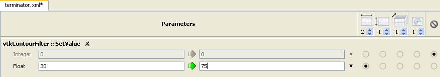

   Setting values for parameter exploration.

.. index::
   pair: parameter exploration; running
   pair: parameter exploration; directions

The five column headings in the upper-right corner of the
main canvas control how the results of the parameter exploration will be displayed in the Spreadsheet. From left to right, the five controls determine:

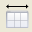

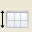

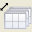

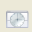

+-------------+----------------------------------+
|   |dirx|    | exploration in the 'x' direction |
+-------------+----------------------------------+
|   |diry|    | exploration in the 'y' direction |
+-------------+----------------------------------+
|   |dirz|    | exploration in the 'z' direction |
+-------------+----------------------------------+
|  |dirtime|  | exploration in time              |
+-------------+----------------------------------+
|   |dirno|   | none; do not vary this parameter |
+-------------+----------------------------------+ 

The spinner beneath each
of these icons lets you control the number of parameter values to be explored in that direction. For each parameter, you must select one of
the radio buttons corresponding to a direction of exploration ('x', 'y', 'z', time, or none).   Note that choosing the final column disables
exploration for that parameter.

To run a parameter exploration,
click the ``Execute`` button in the |vistrails| toolbar or
select ``Execute`` from the ``Workflow`` menu.

We now reinforce the above discussion with three examples, motivated by the problem of finding isosurfaces for medical imaging.  In the examples that follow, we'll look at determining the interfaces between different types of tissue captured by CT scans.  

.. topic:: Try it now!

   To begin, load the :vtl:`terminator.vt` vistrail, select the "Isosurface" node in the version tree, and switch to parameter exploration.  From the ``Pipeline Methods`` panel, click and drag the ``SetValue`` method of the ``vtkContourFilter`` module to the center canvas.

   We'd like to compare different values for the isosurfaces so change the start and end values of the "Float" parameter to "30" and "75".  Since side-by-side visualization will look better on most monitors, select the radio button below the 'x' dimension control, and increase the value of the control to 2 (see Figure :ref:`Setting values for parameter exploration <fig-paramexp-adding>`). Execute the exploration and switch to the Spreadsheet to view the results.  They should match Figure :ref:`Parameter Exploration of two isovalues... <fig-paramexp-terminator2>`. :vtl:`(Open result) <pe1.vt>`

.. _fig-paramexp-terminator2:

.. figure:: /figures/parameter_exploration/fig6_7.png
   :align: center
   :height: 2.2in

   Parameter Exploration of two isovalues as displayed in the Spreadsheet.

.. topic:: Next Step!

   While these two isovalues show interesting features, we may wish to examine other intermediate isosurfaces.  To do so, switch back to the main |vistrails| window and increase the number of results to generate in the 'x' direction to four.  |vistrails| will calculate the intermediate values via linear interpolation, and your execution of this new exploration should match Figure :ref:`Parameter Exploration of four isovalues... <fig-paramexp-terminator4>`. :vtl:`(Open result) <pe2.vt>`

.. _fig-paramexp-terminator4:

.. figure:: /figures/parameter_exploration/fig6_8.png
   :align: center
   :height: 2.2in

   Parameter Exploration of four isovalues as displayed in the Spreadsheet.

In our next example, we demonstrate how multiple parameter values can be explored simultaneously. We will use both ``X`` and ``Y`` exploration directions to change the values of two parameters at the same time in the same spreadsheet.

.. topic:: Try it now!

   In the :vtl:`terminator.vt` example vistrail, make sure you're working with the "Isosurface" version of the workflow, then go to the ``Pipeline`` view. Add the module ``vtkImageResample`` to the pipeline, and insert it between ``vtkStructuredPointsReader`` and ``vtkContourFilter``, connecting the output of the reader to input of the resampler and the output of the resampler to the input of the contour filter as shown in Figure :ref:`Inserting a vtkImageResample module... <fig-paramexp-vtk_image_resample>`.  Finally, select the ``vtkImageResample`` module and set the ``SetAxisMagnificationFactor`` to 0 and 0.2.  See Chapter :ref:`chap-creating` for reminders on how to accomplish these tasks.
   After modifying the workflow, switch back to the ``Exploration`` view. Inside the ``Set Methods`` panel, select the ``SetValue`` method from the ``vtkContourFilter`` module, and drag it to the center canvas.  Also select the ``SetAxisMagnificationFactor`` method from the ``vtkImageResample`` module and drag it to the canvas. Set the values as in the previous example, and set the range of the "Float" parameter of "SetAxisMagnificationFactor" to start at 0.2 and end at 1.0.  Also, set the magnification factor to vary over the 'y' direction.  Finally, set the exploration to generate 16 results, four in the 'x' direction, and four in the 'y' direction.  Your exploration setup should match Figure :ref:`Setting up parameter exploration <fig-fig6_9>`, and after executing, you should see a result that resembles Figure :ref:`Resulting spreadsheet <fig-fig6_10>`.  Notice that the isosurface changes from left to right while the images have less artifacts as the magnification factor approaches 1.0 from top to bottom. :vtl:`(Open result) <pe3.vt>`

.. _fig-paramexp-vtk_image_resample:

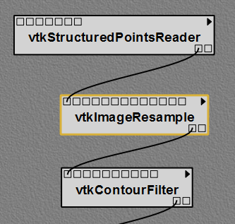

   Inserting a ``vtkImageResample`` module into the "terminator.vt" example pipeline.

.. _fig-fig6_9:

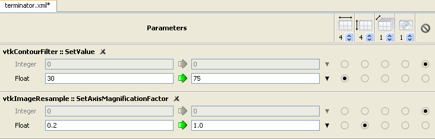

   Setting up parameter exploration.

.. _fig-fig6_10:

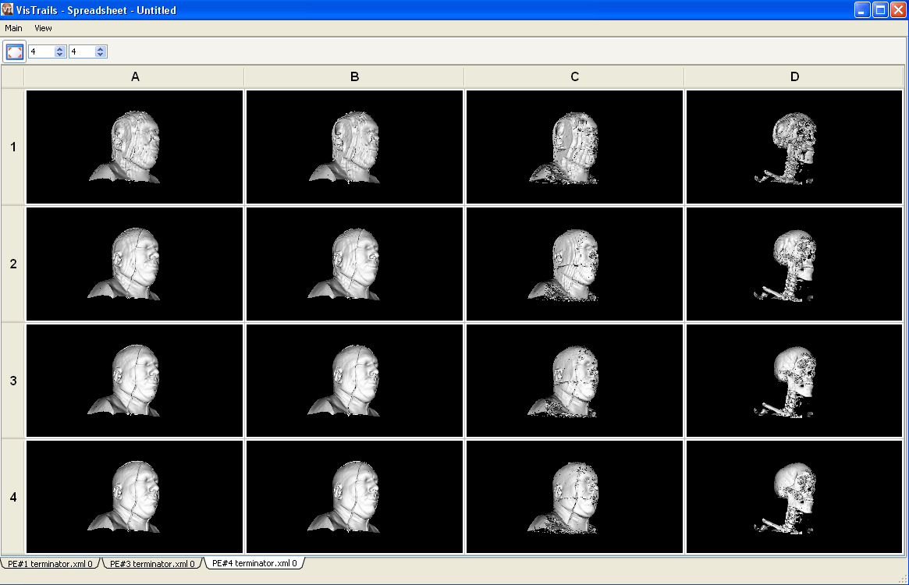

   Resulting spreadsheet.

   Using parameter exploration with two parameters.

Our third example shows how to create an animation by exploring parameter values in *time*, rather than in 'X' or 'Y'.

.. index:: animation

.. topic:: Try it now!

   To create an animation, we'll use the same :vtl:`terminator <terminator.vt>` example (make sure that you have the "Isosurface" version selected).  Follow the same steps as in the first example, but this time, use the range from 30 to 80 and select "time" as the dimension to explore, setting the number of results to generate to 7.  See Figure :ref:`Setting up parameter exploration <fig-fig6_11>` to check your settings.  After executing, the Spreadsheet will show a *single* cell, but if you select that cell, you will be able to click the ``Play`` button in the toolbar.  You should see an animation where each frame is the result of choosing a different isovalue.  A sample frame is displayed in Figure :ref:`One frame from the resulting animation <fig-fig6_12>`. :vtl:`(Open result) <pe4.vt>`

.. _fig-fig6_11:

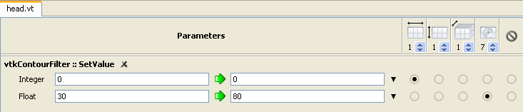

   Setting up parameter exploration.

.. _fig-fig6_12:

.. figure:: figures/parameter_exploration/fig6_12.png
   :align: center
   :width: 50%

   One frame from the resulting animation.

Alternatives to Linear Interpolation
====================================

In each of the examples above, we used linear interpolation to vary the parameter values in 'X' and 'Y' and time. However, linear interpolation is only one of three methods for exploring a range of parameter values. The other two are to iterate through a simple list of values, or use a user-defined function.  You can choose the desired method
from the drop-down menu on the right side of the parameter input field (Figure :ref:`Choose from linear interpolation, list, or user-defined function <fig-paramexp-popup_menu>`).
For linear interpolation, the starting and ending values must be
specified; for a list, the entire comma-separated list must be
specified, and for a user-defined function, a Python function must be
specified.  For the list and user-defined functions, you can access an
editor via the '...' button.  (See Figure :ref:`Editors for lists of values <fig-paramexp-edit_dialogs>` for examples of the list editor and Python editor widgets.)  As an alternative to the list editor,
you can manually enter a list using Python notation; for example,
``[30, 36, 45, 75]``.  As before, to set the direction in which to explore a
given parameter, simply select the radio button in the column for the
specified direction.

.. _fig-paramexp-popup_menu:

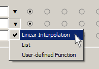

   Choose from linear interpolation, list, or user-defined function.

.. _fig-paramexp-edit_dialogs:

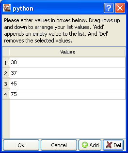

   Editors for lists of values.

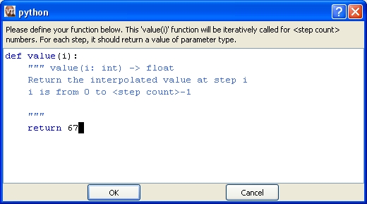

   Editors for user-defined functions.

In both the ``Set Methods`` and ``Annotated Pipeline`` panels, you may see numbered red circles.  See Figure :ref:`The panels of the Parameter Exploration window... <fig-paramexp-virtual_cell>` for an example of what this looks like.
These circles appear when there is more than one module of a given type in
a workflow.  For each type satisfying this criteria, the instances are
numbered and displayed so that you can identify which part of the
pipeline a module in the ``Set Methods`` panel corresponds
to.

.. _fig-paramexp-panels:

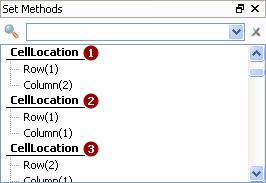

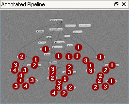

.. _fig-paramexp-virtual_cell:

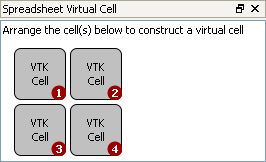

   The panels of the Parameter Exploration window.  ``Set Methods`` (Top) will appear in the right panel and the others will be on the left.  The numbered red circles in the ``Annotated Pipeline`` (Middle) distinguish duplicate modules, and the cells in the ``Spreadsheet Virtual Cell`` (Bottom) determine the layout for spreadsheet results.

Saving Parameter Explorations
=============================

.. index::
   pair: spreadsheet; parameter exploration
   pair: spreadsheet; saving parameter exploration

New parameter explorations are saved automatically when they are executed. The :ref:`inspector (below) <fig-paramexp-inspector>` has buttons for moving back and forward through the history of parameter explorations. Explorations can be tagged with a name, which will make them visible in the workspace view.

.. _fig-paramexp-inspector:

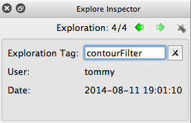

   The parameter exploration inspector

"Virtual Cell" Layout
=====================

.. index::
   pair: spreadsheet; parameter exploration
   pair: spreadsheet; virtual cell

As stated earlier, the Spreadsheet provides integrated support
for parameter explorations.  Each of the directions of exploration
corresponds to a visual dimension in the spreadsheet: the 'x'
direction corresponds to columns; the 'y' direction to rows; the
'z' direction to sheets; and time to animations.  However, when
a workflow already outputs to more than one cell, you can layout the
group of cells as it will be replicated during the exploration.  For
example, given a workflow with two output cells and an exploration for
three parameter values in the 'x' direction, the resulting
spreadsheet could be :math:`1\times6` or :math:`2\times3`.  The
``Spreadsheet Virtual Cell`` panel controls the layout of
the pattern.  Drag and drop cells to position them.  See
Figures :ref:`The panels of the Parameter Exploration window (Bottom) <fig-paramexp-virtual_cell>` and :ref:`Results of the Virtual Cell arrangement <fig-paramexp-vc_results>`
for an example.

.. _fig-paramexp-vc_results:

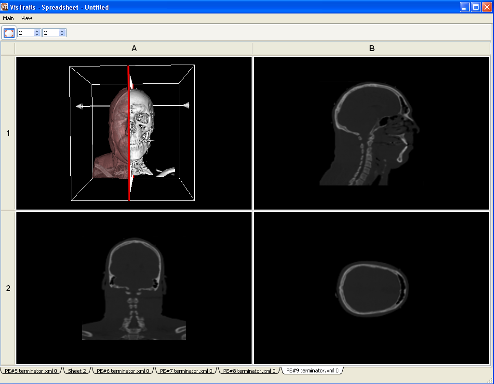

   Results of the Virtual Cell arrangement.

.. %TODO insert an example here!

.. index:: parameter exploration
