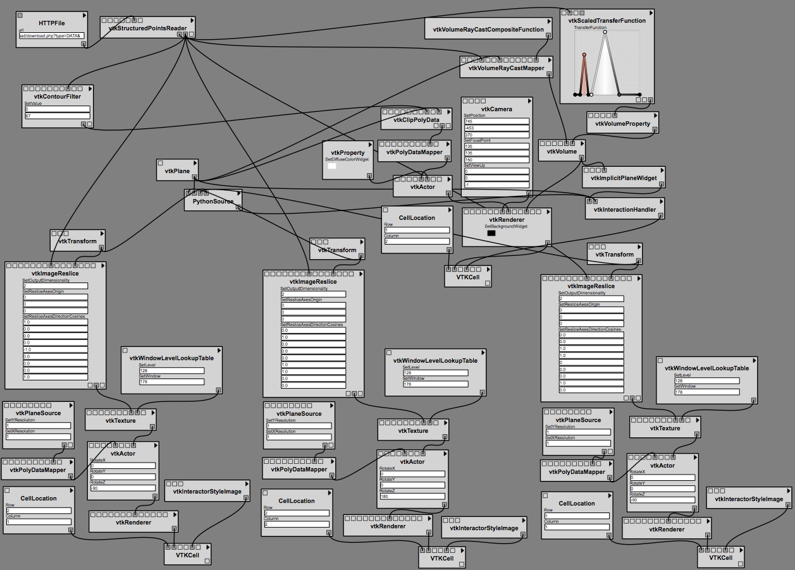
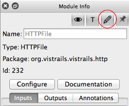
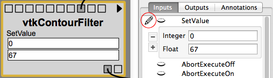

.. _chap-parameter-widgets:

*****************
Parameter Widgets
*****************

.. index::  parameter widgets

Introduction to Parameter Widgets
=================================

Parameter widgets are editable parameters inside modules in the pipeline
view. They can be used to give an overview of the parameters in a workflow, or to
quickly edit parameters without the usual clicking on a module and selecting
the parameter in the 'Module Info' panel.
:ref:`Figure 1 <fig-edit-widgets-example>` shows a complete workflow
using parameter widgets. :vtl:`(open in vistrails) <parameter_widgets.vt>`

.. _fig-edit-widgets-example:

   Figure 1 - Complex Workflow with Parameter Widgets.

Enabling Parameter Widgets
^^^^^^^^^^^^^^^^^^^^^^^^^^

Parameter widgets are hidden by default, but can be enabled by toggling the
pencil icon in the 'Module Info' panel (See :ref:`Figure 2 <fig-enabling-edit-widgets>`).
This will show all existing parameter widgets as well as the pencil icons
in 'Module Info' for adding new ones.

.. _fig-enabling-edit-widgets:

   Figure 2 - How to enable/disable the Parameter Widgets mode.

Adding a parameter widget to a module
^^^^^^^^^^^^^^^^^^^^^^^^^^^^^^^^^^^^^

A parameter widget can be enabled or disabled in the 'Module Info' panel by
toggling the pencil icon (See :ref:`Figure 3 <fig-edit-widget>`). Only
parameters of constant type that have widgets for editing can be added.

Constant modules such as String and Integer show a parameter widget for 'value'
by default, but it can be removed using the 'Module Info' panel if needed.

.. _fig-edit-widget:

   Figure 3 - How to add/remove Parameter Widgets from modules.

Limitations
^^^^^^^^^^^

On some platforms (Such as Mac) some parameter widgets may look unsharp or
pixelated. This is because no widget for that type has been created for use
in the pipeline view, and the default one from the 'Module Info' pane has been used instead.

Only one parameter widget per port can be visible right now. In the 'Module Info' pane it is
possible to specify several function parameters for each port.

Zooming out will hide all the edit widgets for performance reasons, it would also
be difficult to edit anything in that size.

