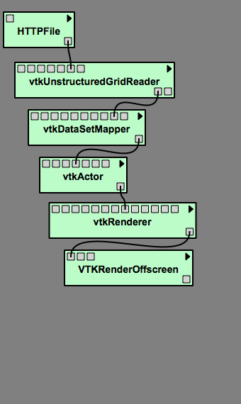
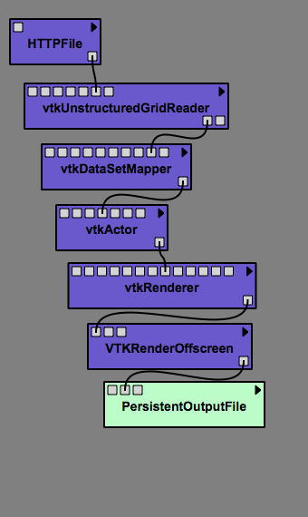
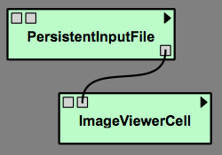
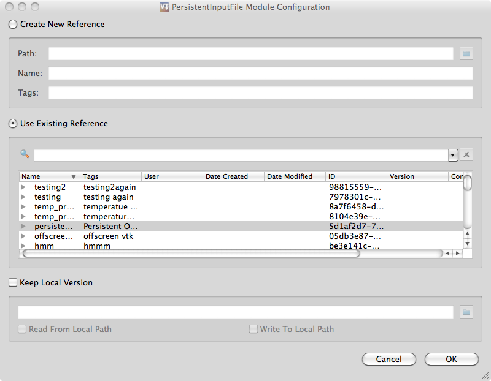
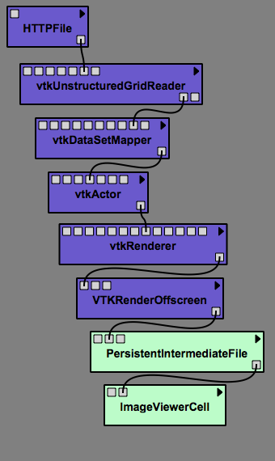
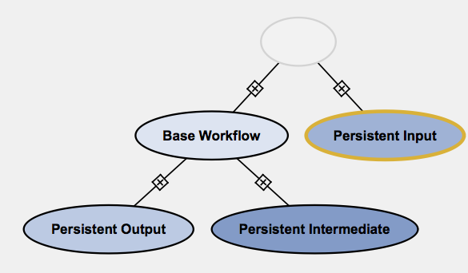

.. _chap-persistence:

*************************
Persistence in VisTrails
*************************

.. index::persistence

The ``Persistence`` package in Vistrails helps improve reproducibility by associating versions of data files with their provenance, and minimize the need to rerun lengthy executions by keeping intermediate persistent files. 
Although, we will focus primarily on the use of persistent files, persistent directories are used in the same manner.  The difference is that a persistent directory deals with multiple files within a directory rather than a single file.

Getting Started With Persistence
================================

A persistent file is simply a file that is kept in a repository and identified by an id and version string and annotated with a signature and content hash.  To begin, notice that there are three persistent file/directory types: input, intermediate, and output. It is helpful to understand the differences among these files as well as their distinguishing characteristics and configuration options.

Input Files
^^^^^^^^^^^

.. index::
   pair: persistent files; input

To use a persistent input file, after dragging it onto the canvas, it is necessary to edit the configuration (Ctrl+E).  For an input file, one can either create a new reference to an existing local file, or use a file that exists in the database.  To create a new reference, select ``Create New Reference`` and either enter the path to the file, or select the folder icon on the right to browse local directories for a file.  Then, give the file a name and any appropriate tags to help identify the file.  Select ``OK``.  The file will be added to the repository.  If the file is already in the repository, select ``Use Existing Reference`` and select the appropriate file.  You may use the search box to search for particular files by name, tag, ID, or content hash.

.. topic:: Note

   A new version of a persistent file is created each time its contents change.  A persistent input file will always use the most recent version of a file if it is assigned to the root of the file tree.

The ``PersitentInputFile`` module can also be used to read or write data directly from or to a local file.  To use this feature, you will need to set ``localPath`` to point to a local file.  This can be done in the Set Methods Panel, the Configuration Dialog, or by connecting a file to the localPath input port.  Then, the local file will be read when readLocal is set to true and written when writeLocal is set to true.  To do this using the Configuration Dialog, select ``Keep Local Version``, enter the file location or click on the folder icon to select a file, then select ``Read From Local Path``.

Output Files
^^^^^^^^^^^^

.. index::
   pair: persistent files; output

To use a persistent output file, after dragging it onto the canvas, it is necessary to edit the configuration (Ctrl+E).  Notice that the Configuration Dialog for the output file is the same as that of the input file except that an option to ``Always Create New Reference`` exists.  Selecting this new option will cause a new file to be created and added to the persistent store each time the workflow is executed.  The new file does not get a name or tag, so it can be difficult to identify the newly created file.

If you prefer to have a new version of the file created each time the workflow is changed rather than executed, you should choose either of the other options (``Create New Reference``, or ``Use Existing Reference``).  The other two options and the option to read from or write to a local path are used in the same manner as with the input file.  However, when the input file is read from a local path, it is not also read from the persistent store.  In contrast, when an output file is written to a local path, it is also written to the selected entry in the persistent store.

Intermediate Files
^^^^^^^^^^^^^^^^^^

.. index::
   pair: persistent files; intermediate

An intermediate file is the same as the output file except that its contents can be used in further calculations.  Thus, lengthy computations upstream of the intermediate file will only be recalculated when the upstream workflow changes, but will not need to be rerun when only the downstream workflow changes.  Intermediate files by default are set to always create a new reference.  Since these files do not need to be manually annotated or named, configuration is optional, but is the same as the output file configuration.

Using the Output of One Workflow as Input for Another
=====================================================

You need to configure the persistence modules using the module's configuration dialog. After adding a PersistentOutputFile to the workflow, click on the triangle in the upper-right corner of the PersistentOutputFile, and select "Edit Configuration" from the menu that appears. In this dialog, select "Create New Reference" and give the reference a name (and any space-delimited tags). Upon running that workflow, the data will be written to the persistent store. In the second workflow where you wish to use that file, add a PersistentInputFile and go to its configuration dialog in the same manner as with the output file. In that dialog, select "Use Existing Reference" and select the data that you just added in the first workflow from the list of files below. Now, when you run that workflow, it will grab the data from the persistent store.

Managing Files in the Store
===========================

You may manage the files in the store by selecting ``Packages -> Persistence -> Manage Store``.  You are then free to save files from the store to local files, or delete files from the store.  However, please be aware that files deleted from the store are not recoverable.  Also, for versioned files, a specific version of a file can not be deleted without deleting all versions of that file.  To delete all versions of the file, select the root version and press ``Delete``.

Examples
========

.. topic:: Try it Now!

   **Base Workflow**

   1) Drag the following modules to the canvas and connect them in the order in which they are named:  ``HTTPFile``, ``vtkUnstructuredGridReader``, ``vtkDataSetMapper``, ``vtkActor``, ``vtkRenderer``, ``VTKRenderOffscreen``.  Refer to Figure :ref:`Example 1.1 <fig-pers-example-base>` to ensure connections are correct.

   2) Select the ``HTTPFile`` module and set the url to: 
      
      http://www.vistrails.org/download/download.php?type=DATA&id=spx.vtk

   3) (Optional) Select the ``vtkRenderer`` module and select ``SetBackgroungWidget`` from the ``Module Information's`` ``Inputs`` tab.  Select the background color of your choice.

   **Persistent Output**

   4) Switch to the ``History`` view and tag the current version as "Base Workflow".  Then, switch back to the pipeline view.

   5) Enable the persistence package.

   6) Drag the ``PersistentOutputFile`` module to the canvas and connect the output from ``VTKRenderOffscreen`` to its value port. See Figure :ref:`Example 1.2 <fig-pers-example-output>`.

   7) With the ``PersistentOutputFile`` module selected, press Ctrl-E to edit the module configuration. 

   8) Select ``Create New Reference``, name it "persistence1_1", and give it a "Persistent Output" tag.  Select ``Save``.

   9) Execute the workflow.

   **Persistent Input**

   10) Switch to the History view again and tag the current version as "Persistent Output".  Then, select the root of the version tree and go back to the pipeline view.

   11) Drag the ``PersistentInputFile`` and ``ImageViewerCell`` modules to the canvas and connect them. See Figure :ref:`Example 1.3 <fig-pers-example-input>`.

   12) Edit the configuration of the ``PersitentInputFile``.  Select "Use Existing Reference" and select the file named "persistence1_1" with the "Persistent Output" tag.  Select ``Save``. See Figure :ref:`Example 1.4 <fig-pers-example-conf>`.

   13) Execute the workflow.  An image should be displayed in the VisTrails spreadsheet.

   **Persistent Intermediate**

   14) Switch to the ``History`` view and tag the version with "Persistent Input", then select the "Base Workflow" version and switch to the pipeline view again.

   15) Drag the ``PersistentIntermediateFile`` and ``ImageViewerCell`` modules to the canvas and connect them as shown in Figure :ref:`Example 1.5 <fig-pers-example-intermediate>`.

   16) Execute the workflow.

   17) In the History view, tag the version with "Persistent Intermediate".  See Figure :ref:`Example 1.6 <fig-pers-example-ver>`.

   **Experimentation**

   You can now change the background color in the "Persistent Output" version and execute the pipeline.  The changes should show up when you execute the pipeline of the "Persistent Input" version.  You can also change the background color in the "Persistent Intermediate" version, but this example merely demonstrates how to use the module.  Performance increase will not be seen here due to the lack of lengthy computations.

.. _fig-pers-example-base:

.. _fig-pers-example-output:

+-----------------------+------------------------------------+
| |fig1|                |  |fig2|                            |
+-----------------------+------------------------------------+
| Example 1.1 - Base    |  Example 1.2 - Persistent Output   |
| Workflow - An example |  File                              |
| pipeline without      |                                    |
| persistence.          |                                    |
+-----------------------+------------------------------------+

.. _fig-pers-example-input:

   Example 1.3 - Persistent Input File

.. _fig-pers-example-conf:

   Example 1.4 - Selecting an existing reference

.. _fig-pers-example-intermediate:

   Example 1.5 - Persistent Intermediate File

.. _fig-pers-example-ver:

   Example 1.6 - The History Tree