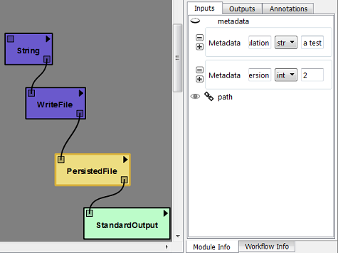
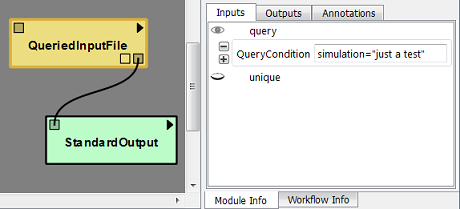
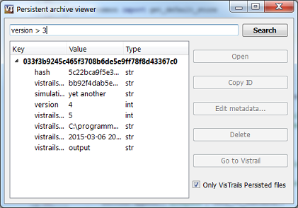

.. _chap-persistence:

*************************
Persistence in VisTrails
*************************

.. index::persistence

The ``Persistent Archive`` package in |vistrails| provides a persistent file store with searchable metadata. It makes it easy for users to store files permanently with meaningful information so that they can be retrieved and exploited later, without having to manually organize and reference them.

At the simplest level, you can use it to cache files to disk, so that your pipelines can retrieve them later and avoid lengthy recomputations by inserting a ``CachedFile`` module.

Getting Started With Persistence
================================

This package builds upon the `file_archive tool <https://github.com/remram44/file_archive>`_. Should you need to insert or extract files from the store from outside VisTrails, you will find the store in ``~/.vistrails/file_archive``.

Files are stored uncompressed in the store, along with metadata in the form of key-value pairs. |vistrails| stores the generating module location and signature in their, but you can add all the meaningful metadata you might need for later identification.

|vistrails| provides 4 types of modules:

PersistedInputDir and PersistedInputFile
^^^^^^^^^^^^^^^^^^^^^^^^^^^^^^^^^^^^^^^^

This allows you to persist an input file inside the store. It will use the matching file from the store, unless a new file is provided and differs from the store.

Use it for example to record the result of a computation, or to keep track of your experiment's input for later reference even though you might change or delete the original.

PersistedDir and PersistedFile
^^^^^^^^^^^^^^^^^^^^^^^^^^^^^^

These modules insert data into the store, along with metadata. Additionally, if an entry can be found for the signature of the upstream subpipeline, the module will simply use that file, skipping the execution of these upstream modules.

Use it for example to persistent an important result that is part of your pipeline.

CachedDir and CachedFile
^^^^^^^^^^^^^^^^^^^^^^^^

These are variants of PersistedDir and PersistedFile that don't accept additional metadata. Files will be marked as cache files and won't be shown by default in the viewer. You can use this for unimportant pieces of data that you only persist to speed up your pipeline.

QueriedInputDir and QueriedInputFile
^^^^^^^^^^^^^^^^^^^^^^^^^^^^^^^^^^^^

These simply get a previous result, or any entry from the store, from conditions on the metadata. It accepts more general queries than PersistedInputFile which only compares for equality of the metadata.

Use it for example to analyse previous results.

Managing the store
==================

All the files currently stored in the archive can be listed by clicking on the *Packages* menu > *Persistent Archive* > *Show archive content*.

Examples
========

   Example: Using PersistedFile in a workflow with metadata. Upstream is not re-executed.

   Example: Querying a file from the archive with text conditions.

   Example: Searching for archive entries with the *Show archive content* dialog.
