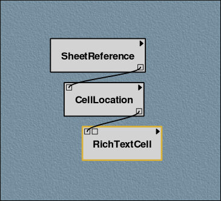
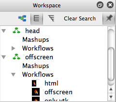
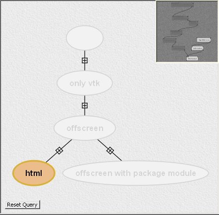
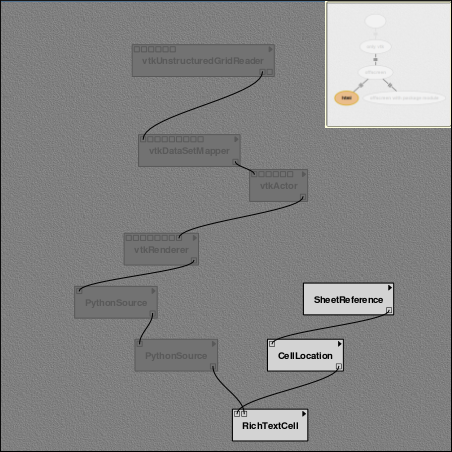
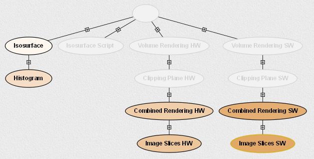
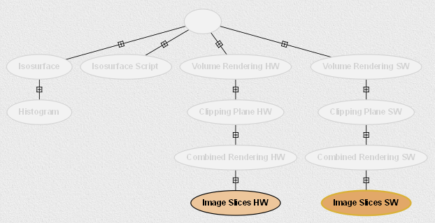
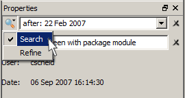

.. _chap-querying:

*************************
Querying the Version Tree
*************************

.. role:: red

.. index:: queries

|vistrails| is designed for manipulating collections of workflows, and
an integral part of this design is the ability to quickly search
through these collections.  |vistrails| provides two methods for
querying vistrails and workflows.  The first is a Query by Example
interface which allows you to build query workflows and search for
those with similar structures and parameters. The second is a
textual interface with a straightforward syntax.  For each interface,
the results are *visual*: each matching version is
highlighted in the ``History`` view, and if the query
involves specific workflow characteristics, any matching entities are
also highlighted in the ``Pipeline`` view for the current
version.

Query By Example
================

.. index::
   pair: queries; by example

One of the problems faced when trying to query a collection of
workflows is the fact that structure is important.  Suppose that you
want to find only workflows where two modules are used in sequence.
Instead of trying to translate this into a text-based syntax, it is
easier to construct this relationship visually.  |vistrails| provides such an
interface which mirrors the ``Pipeline`` view, allowing
you to construct a (partial) workflow to serve as the search criteria.

To use the Query by Example interface, click on the
``Search`` button on the toolbar.  This view is extremely
similar to the ``Pipeline`` view and pipelines can be built
in a similar manner.  Just like the ``Pipeline`` view,
modules are added by dragging them from the list on the left side of
the window, connections are added by clicking and dragging from a port
on one module to a corresponding port on another module.  Setting module parameters in this view will narrow the search to matching modules whose parameters fall within the specified range of values.  Figure :ref:`Example pipeline in Search mode <fig-querying-query>` shows an example pipeline that has been built in the query builder.

.. _fig-querying-query:

   Example pipeline in ``Search`` mode.

.. %TODO what are the next few sentences actually trying to say?
.. %, and parameters can be edited on the right-side of the window.  One major difference between the ``Pipeline`` view and the ``Search`` view is that you can use comparison operations in parameter values.  For example, instead of searching for a pipeline that contains a Float with a value of ``4.5``, you can search for a pipeline that contains a Float with a value ``'< 4.5'`` or ``'> 4.5'``.

.. index::
   pair: queries; viewing results

The next step is to decide whether to search the ``Current Vistrail``, ``Current Workflow``, or all ``Open Vistrails``.  The results of the first option are displayed on a version tree as well as in the ``Workspace`` panel.  Non-matching versions in the version tree will be grayed out while matching versions will be displayed in the tree as normal.  In contrast, the ``Workspace`` panel will display matching results and omit versions with no matches.  Double-clicking a version from the ``Workspace's`` results will bring up the associated pipeline with matching modules highlighted.  See Figures :ref:`Workspace... <fig-querying-workspace>` and :ref:`Pipeline... <fig-querying-pipeline>`.  

The remaining two options are ``Current Workflow`` and ``Open Vistrails``.  The ``Current Workflow`` option is the simplest and will display the pipeline with matching modules highlighted.  The ``Open Vistrails`` option will put all of its results in the ``Workspace`` panel, listing open vistrails with their matching versions.   From here, double-clicking on a vistrail will bring up a version tree which emphasizes matching versions, or double-clicking on a version will bring up the associated pipeline with matching modules highlighted.

After constructing a pipeline and selecting the appropriate search option, click the ``Execute`` button to begin the query.  This button will be available as long as the query window is not empty.  However, you may need to press the ``Back to Search`` button to return to the query window to re-execute.

.. topic:: Note

   You may leave the ``Query`` either through use of the toolbar or by pressing the ``Edit`` button.  However, the search results will persist until the search is cleared (press ``Clear Search``), returning the workspace to its normal form.

.. topic:: Try it now!

   Let's practice making a simple query. Open the "offscreen.vt" example vistrail. Click on the ``Search`` button to enter ``Search`` mode.  Create a query like the one shown in Figure :ref:`Example pipeline in Search mode <fig-querying-query>` by dragging the modules ``SheetReference``, ``CellLocation``, and ``RichTextCell`` onto the Search canvas. (These modules can be found under the "|vistrails| Spreadsheet" header in the Modules panel.) Connect the input and output ports of the modules as shown, then click the ``Execute`` button to perform the query. |vistrails| will automatically switch to the ``History`` view, with all matching versions highlighted (Figure :ref:`History... <fig-querying-history>`).  Notice that the query results are also displayed in the ``Workspace`` tab.  Double-click on the html version in the workspace to open the results in the pipeline view.  

.. _fig-querying-workspace:

   Workspace - The query results displayed in the workspace.

.. _fig-querying-history:

   History - Search results in the ``History`` view.

.. _fig-querying-pipeline:

   Pipeline - The results in the ``Pipeline`` view.

Note that Query by Example provides the capability to iteratively
refine searches by adding more criteria.  For example, if you were
interested in workflows that contain a certain module, you may find that
such a query returns too many results.  You could then refine the query
to find only those workflows where the given module has a parameter
setting that falls within a given range.
This is done by specifying parameter values in the ``Methods`` panel on the right side of the window.
One major difference between the ``Pipeline`` view and the ``Search`` view is that you can use comparison operations, such as '<' and '>', in parameter values. The following example illustrates this.

.. topic:: Try it now!

   Open the "terminator.vt" example file, and enter ``Search`` mode. Drag the ``vtkActor`` module from the Modules panel onto the Search canvas. ``Execute`` the query, and see which versions of the workflow contain a ``vtkActor`` module. Select ``Back to Search`` to return to the ``Search`` view, select the ``vtkActor`` module, then select ``RotateZ`` method from the ``Module Information`` tab. In the ``RotateZ`` text field, select ``'>'`` and then enter '90'. When you ``Execute`` the query this time, you will notice that the results are different. This is because we are searching for versions that not only contain a ``vtkActor`` module, but that also use a value greater than 90 in this module's ``RotateZ`` method. Your results should resemble those in Figure :ref:`Query result showing all workflows... <fig-querying-vtkActor_example>`.

.. _fig-querying-vtkActor_example:

   Query result showing all workflows in the "terminator.vt" example that contain the module ``vtkActor``.

   The same query refined to show only those workflows whose ``RotateZ`` value is greater than 90.

Textual Queries
===============

.. %Removing this figure as the addition of the next example makes it redundant.
.. %\begin{figure}
.. %\centering
.. %\includegraphics[width=3in]{query4.png}
.. %\caption{A query made to find any changes made before February 21.}
.. %\label{fig:querying:date}
.. %\end{figure}

.. index::
   pair: queries; textual

There are many ways to search for versions in the version tree using textual queries, but they all rely on a simple
text box for input.  Begin a search by selecting ``Search`` on the toolbar.  The search box is at the top of the center panel and has a magnifying glass icon next to it.  If you enter query text, |vistrails|
will attempt to match logical categories, but if your query is more
specific, |vistrails| has special syntax to markup the query.
To execute a query, simply press the 'Enter' key after typing your query.

.. raw:: latex

   \linebreak

.. %Figure :ref:`fig-querying-date` shows an example query.

.. _tab-querying-syntax:

.. table:: Syntax for querying specific information using textual queries.

   ==============  ================================================================
    Search Type    Syntax                                                        
   ==============  ================================================================
   User name       ``user:`` *user name*
   Annotation      ``notes:`` *phrase*
   Tag             ``name:`` *version tag*
   Date            ``before:`` *date* ``|`` *relative time*
   \               ``after:`` *date* ``|`` *relative time*
   ==============  ================================================================

.. topic:: Note

   Since we allow regular expressions in our search box, question marks are treated as meta-characters. Thus, searching for "?" returns everything and "abc?" will return everything containing "abc". You need to use "\\?" instead to search for "?". So the search for "??" would be "\\?\\?".

Table :ref:`tab-querying-syntax` lists the different ways to markup a
query.  Note that you can search by user name to see which changes a
particular user has made, and also by date to see which changes were
made in a specific time frame.  When searching by date, you can search
for all changes before or after a given date or an amount of time
relative to the present.  If searching for changes before or after a
specific date, the date can be entered in a variety of formats.  The
simplest is '*day* *month* *year*,' but if the
year is omitted, the current year is used.  The month may be specified
by either its full name or an abbreviation.  For example, ``'before: 18 November 2004'`` and ``'after: 20 Dec'`` are both valid queries.  If searching by relative time,
you can prepend the amount of time relative to the present including
the units to 'ago'.  An example of this type of query is
``'after: 30 minutes ago'``.  The available units are seconds,
minutes, hours, days, months, or years.

You can concatenate simple search statements to create a compound
query to search across different criteria or for a specific range.
For example, to search for workflows whose tag includes
``'brain'`` *and* were created by the user ``'johnsmith'``,
the query would be ``'name: brain user: johnsmith'``.  To search
for all workflows created between April 1 and June 1, the query would
be ``'after: April 1 before: June 1'``.

.. topic:: Try it now!

   Open the "terminator.vt" example file, and enter ``Search`` mode.  Let's look for all workflows that were created after November 24, 2010. In the search box in the ``Search`` panel, type ``'after: 24 nov 2010'`` and press 'Enter'. The expected result is shown in Figure :ref:`Results of a query to find any changes make after November 24, 2010 <fig-querying-july1>`.

.. _fig-querying-july1:

.. figure:: figures/querying/textquery.png
   :width: 3.5in
   :align: center

   Results of a query to find any changes made after November 24, 2010.

In addition, |vistrails| keeps track of the most recent textual
queries, and repeating or clearing these queries can be accomplished by selecting the recent query from the dropdown menu attached to the search box.  Finally, the 'X' button next to the search box will reset the query.

.. _sec-querying-results:

Refining the Results
^^^^^^^^^^^^^^^^^^^^

.. %TODO consider dropping this section, and merging its content into the other sections. 

.. index:: search; refine

While in the ``Search`` view, you can select two different
ways of viewing search results.  The magnifying glass icon to the left of the textual search box contains a dropdown menu with two options: "Search" and "Refine" (Figure :ref:`Clicking the button to the left... <fig-querying-search_or_refine>`).  The first displays results by simply highlighting the matching nodes while the second condenses the tree to show only the versions that match.  For large vistrails, this second method can help you determine relationships between the matching versions more easily.

.. %TODO I'm not sure that this button actually works as intended.

.. _fig-querying-search_or_refine:

   Clicking the button to the left of the query text box accesses a dropdown menu.

.. index:: queries
