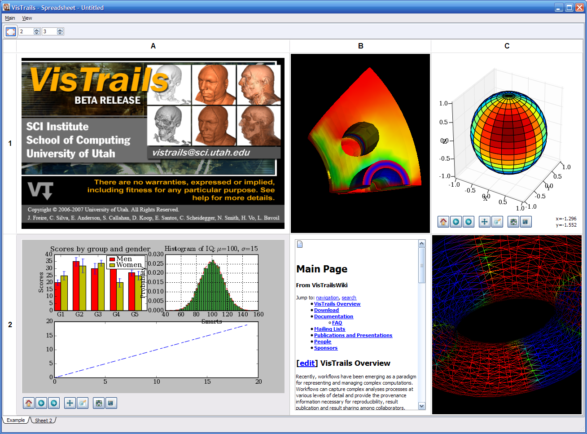
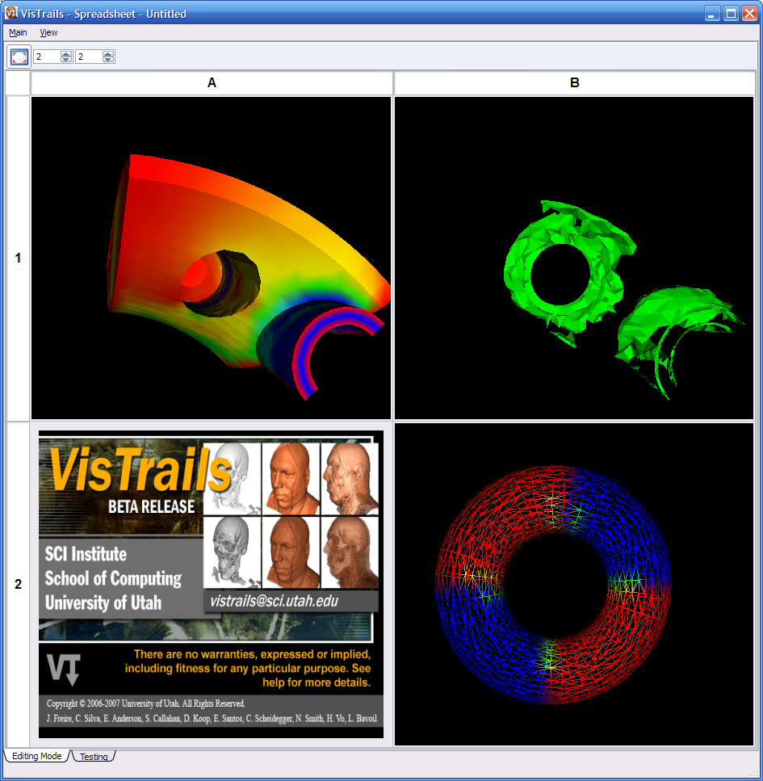
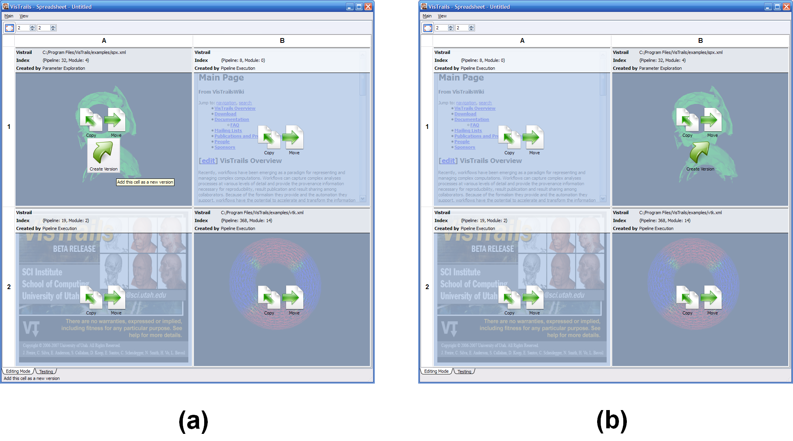

.. _chap-spreadsheet:

***********
Spreadsheet
***********

.. index:: spreadsheet

.. _fig-spreadsheet:

   The VisTrails Spreadsheet.

As described in Section :ref:`sec-versions-diff`, |vistrails| has a
powerful built-in mechanism to compare workflows.  However, this
comparison shows changes in the *design* of the workflows, and we
are often also interested in differences in the *results* of
workflows.  The |vistrails| Spreadsheet provides a simple, flexible,
and extensible interface to display and compare results from
workflows.  Coupled with the version differences, users can explore
the evolution of their workflows.

The Spreadsheet package is installed with |vistrails| by default, and
it can display a variety of data ranging from VTK renderings to
webpages without additional configuration.  To view the spreadsheet if it is hidden, select ``Packages`` :math:`\rightarrow` ``Spreadsheet`` :math:`\rightarrow` ``Show Spreadsheet.``

..  %% TODO add this sentence back in once the Custom Cell chapter is complete!
..  %In addition to the included types of viewers, users can create and register additional viewers using customized cell widgets (see Chapter :ref:`chap-custom_cells`).

.. _sec-spreadsheet-layout:

The Spreadsheet Layout
======================

.. index::
   pair: spreadsheet; layout

As should be expected, the |vistrails| Spreadsheet consists of one or more sheets, each with a customizable number of rows and columns.  

.. _sec-spreadsheet-custom:

Custom Layout Options
^^^^^^^^^^^^^^^^^^^^^

.. index::
   pair: spreadsheet; rows
   pair: spreadsheet; columns
   pair: spreadsheet; cells

To modify the layout for the active sheet, you can change both the number of rows and columns and resize individual cells.  The number of rows is controlled by the left spinner in the toolbar and the number of columns by the right spinner.  To resize a given row or column, click and drag on one edge of the row or column header.  In addition, you can resize an individual cell by moving the mouse to lower-right corner of the cell until the cursor changes and clicking and dragging to the desired size (see
Figure :ref:`Different states of a spreadsheet cell \(d\) <fig-cell_states>`).  Note that this will affect the entire
layout, compressing or expanding rows and columns to generate or fill
space for the resized cell.

.. index::
   pair: spreadsheet; default values

To adjust the default number of rows and columns in the spreadsheet: select   ``preferences`` from the ``VisTrails`` menu, select ``spreadsheet`` from the ``Enabled Packages`` portion of the ``Module Packages`` tab, press the ``Configure`` button, and adjust the values as for rowCount and colCount as desired.

Multiple Spreadsheets
^^^^^^^^^^^^^^^^^^^^^

.. index::
   triple: spreadsheet; sheets; adding
   triple: spreadsheet; sheets; deleting
   triple: spreadsheet; sheets; docking
   triple: spreadsheet; sheets; ordering

|VisTrails| supports the use of multiple spreadsheets which can be added, docked, ordered and deleted.  Sheets are added either by clicking the ``New Sheet`` button in the ``Spreadsheet`` toolbar or choosing the menu item with the same name from the ``Main`` menu.  Each of these sheets can optionally be displayed as a dock widget separated from the main spreadsheet window by dragging its tab name out of the tab bar at the bottom of the spreadsheet, allowing multiple spreadsheets to be visible at the same time.  To dock a sheet back to the main window, drag it back to the tab bar or double-click on its title bar.  Similarly, sheets are ordered by dragging sheet names to desired locations within the tab bar.  Finally, a sheet can be deleted by clicking the 'X' button in the lower-right corner or choosing the ``Delete Sheet`` menu item.    

Sending Output to the Spreadsheet
=================================

.. index::
   triple: spreadsheet; cells; positioning

Users may send results to the spreadsheet by using a spreadsheet cell.  Upon inspecting the VisTrails Spreadsheet package (in the list of packages, to the left of the pipeline builder), one can see there are built-in cells for different kinds of data, e.g., RichTextCell to display HTML and plain text.

By default, an unoccupied cell on the active sheet will be chosen to display the result. However, you can specify in the pipeline exactly where a spreadsheet cell will be placed by using CellLocation and SheetReference. CellLocation specifies the location (row and column) of a cell when connecting to a spreadsheet cell (VTKCell, ImageViewerCell, ...). Similarly, a SheetReference module (when connecting to a CellLocation) will specify which sheet the cell will be put on given its name, minimum row size and minimum column size. There is an example of this in examples/vtk.vt (select the Cell Location version).

Advanced Cell Options
^^^^^^^^^^^^^^^^^^^^^

.. index::
   triple: spreadsheet; cells; creating

The user can define new cell types to display application-specific data. For example, we have developed VtkCell, MplFigureCell, and OpenGLCell. It is possible to display pretty much anything on the Spreadsheet!

Examples of writing cell modules can be found in:  RichTextCell: packages/spreadsheet/widgets/richtext/richtext.py VTK: packages/vtk/vtkcell.py

Here is the summary of some requirements on a cell widget:

(1) It must be a Qt widget. It should inherit from spreadsheet_cell.QCellWidget in the spreadsheet package. Although any Qt Widget would work, certain features such as animation will not be available (without rewriting it).

(2) It must re-implement the updateContents() function to take a set of inputs (usually coming from input ports of a wrapper Module) and display on the cells. VisTrails uses this function to update/reuse cells on the spreadsheet when new data comes in.

(3) It needs a wrapper VisTrails Module (inherited from basic_widgets.SpreadsheetCell of the spreadsheet package). Inside the compute() method of this module, it may call self.display(CellWidgetType, (inputs)) to trigger the display event on the spreadsheet.

Interacting with the Spreadsheet
================================

.. index:: 
   pair: spreadsheet; modes

Currently, there are two operating modes in the Spreadsheet: Interactive Mode and Editing Mode.  Interactive Mode allows users to view and interact with the spreadsheet cells, while Editing Mode provides operations for manipulating cells.  The modes can be toggled via the ``View`` menu or their corresponding keyboard shortcuts ('Ctrl-Shift-I') and ('Ctrl-Shift-E').

Interactive Mode
^^^^^^^^^^^^^^^^

.. index::
  triple: spreadsheet; modes; interactive

In Interactive Mode, users can interact directly with the viewer for an individual cell, interact with multiple cells at once, or change the layout of the sheet.  Because cells can differ in their contents, interacting with a cell changes based on the type of data displayed.  For example, in a cell displaying VTK data (a ``VTKCell``), a user can rotate, pan, and zoom in or out using the mouse.

.. index::
   pair: spreadsheet; cells

In a sheet, a cell can be both *active* and *selected*.  There can only be one active cell, and that cell is highlighted by a yellow or grey border.  Clicking on any cell will make it active.  This active cell will respond to keyboard shortcuts as well as mouse input.  In constrast to the active cell, one or more cells can be selected, and the active cell need not be selected.  To select multiple cells, either click on a row or column heading to toggle selection or 'Ctrl'-click to add or remove a cell from the group of selected cells.  The backgrounds of selected cells are highlighted using a platform-dependent selection color.  See Figure :ref:`Different states of a spreadsheet cell... <fig-cell_states>` for examples of the different cell states.

Depending on the cell type, additional controls may appear in the
toolbar when a cell is activated. These controls affect only the
active cell, and change for different cell types. As shown by
Figure :ref:`Different states of a spreadsheet cell \(d\) <fig-cell_states>`, a cell optimized for rendering 2D images (a ``ImageViewerCell``) adds controls for resizing, flipping, and rotating the image in the active cell.

.. _fig-cell_states:

.. figure:: figures/spreadsheet/cell_states.png
   :width: 6.5in
   :align: center

   Different states of a spreadsheet cell. \(a\) inactive and unselected, \(b\) active and unselected, \(c\) active and selected, \(d\) an active cell with its toolbar and resizer.

The Camera
++++++++++
Spreadsheet cells that display VTK data typically are associated with a vtkRenderer, which is associated with a vtkCamera.  If the camera is not assigned in the workflow, a default one is created.  If the rendered geometry is not visible in the window, pressing 'r' will invoke the renderer's ResetCamera() command, which centers the geometry.  Also, pressing 'i' will initiate interactions with interactive vtk objects.

Arranging Cells
+++++++++++++++

As described in Section :ref:`sec-spreadsheet-custom`, cells can be
resized by either resizing rows, columns, or an individual cell.  In
addition to resizing, a row or column can be moved by clicking on its
header and dragging it along the header bar to the desired position.
See Section :ref:`sec-spreadsheet-editing` for instructions on moving a
specific cell to a different location.

Synchronizing Cells
+++++++++++++++++++

Often, when a group of cells all display results from similar workflows, it is useful to interact with all of these cells at the same time.  For example, for a group of ``VTKCells``, it is instructive to rotate or zoom in on multiple cells at once and compare the results.  For this reason, if a group of cells is selected, mouse and keyboard events for a single cell of the selection are propogated to each of the other selected cells.  Currently, this feature only works for ``VTKCells``, but we plan to add this to other cell types as well.  An example of this functionality is shown in Figure :ref:`When selecting all cells... <fig-spreadsheet_sync>`.

.. _fig-spreadsheet_sync:

   When selecting all cells, interacting with one VTK cell \(A1\) causes the other two VTK cells \(B1 and B2\) to change their camera to the same position.

.. _sec-spreadsheet-editing:

Editing Mode
^^^^^^^^^^^^

.. index::
   triple: spreadsheet; modes; editing

Recall that Editing Mode can be entered either by accessing the ``View`` menu or by keying 'Ctrl-Shift-E'. Editing Mode provides more
operations to layout and organize spreadsheet cells.  In this mode,
the view for each cell is frozen and overlaid with additional
information and controls (see Figure :ref:`The spreadsheet in editing mode... <fig-editing_mode>`).  The top
of the overlay displays information about which vistrail, version, and
type of execution were used to generate the cell.  The bottom piece of
the overlay contains a variety of controls to manipulate the cell
depending on the its state.

Cells can be moved or copied to different locations on the spreadsheet
by clicking and dragging the appropriate icons (``Move`` or
``Copy``) for a given cell to its desired location.  To move
a cell to a location on a different sheet, drag the icon over the
target sheet tab to bring that sheet into focus first and then drop it
at the desired location. If you move a cell to an already-occupied
cell, the contents of the two cells will be swapped.  See
Figure :ref:`The spreadsheet in editing mode... <fig-editing_mode>` for an example of swapping two cells.

.. _fig-editing_mode:

   The spreadsheet in Editing Mode. \(a\) All cell widgets are replaced with an information widget \(b\) Two cells are swapped after drag and drop the 'Move' icon from A1 to B1.

Clicking the ``Locate Version`` icon will highlight the node in the version tree (in the ``History`` view) from which the visualization in that cell was generated. The next two icons, ``Create Analogy`` and ``Apply Analogy``, help with creating visualizations by analogy. Please refer to Chapter :ref:`chap-analogies` for information about this feature.

If a cell was generated via parameter exploration (see
Chapter :ref:`chap-paramexploration`), the ``Create Version``
button will be available to save the workflow that generated the
result back to the vistrail.  Clicking this button modifies the
vistrail from which the cell was generated by adding a new version
with the designated parameter settings.  Thus, if you go back to the
``History`` mode of the |vistrails| Builder for that
vistrail, you will find that a new version has been added to the
version tree.

Launching a Web Browser
=======================

.. index::
   triple: spreadsheet; cells; web browser

It is sometimes difficult to view web pages within a spreadsheet cell due to limited space.  It may therefore be desirable to launch a web browser from within the spreadsheet cell.  While this functionality is not provided by |Vistrails|, here are some possible solutions:

(1) You can use parameter exploration to generate multiple sheets so you might have an exploration that opens each page in a new sheet. Use the third column/dimension in the exploration interface to have a parameter span sheets.

(2) The spreadsheet is extensible so you can write a custom spreadsheet cell widget that has a button or label with the desired link (a QLabel with openExternalLinks set to True, for example).

(3) You can tweak the existing RichTextCell by adding the line "self.browser.setOpenExternalLinks(True)" at line 63 of the source file "vistrails/packages/spreadsheet/widgets/richtext/richtext.py". Then, if your workflow creates a file with html markup text like "<a href="http://www.vistrails.org">VisTrails</a>" connected to a RichTextCell, clicking on the rendered link in the cell will open it in a web browser. You need to add the aforementioned line to the source to let Qt know that you want the link opened externally; by default, it will just issue an event that isn't processed. 

Saving a Spreadsheet
====================

.. warning::

   This is currently an experimental feature and as such is not robust.  If you rename or move the vistrails used by the saved spreadsheet, the spreadsheet will not load correctly.

.. index::
   pair: spreadsheet; saving

Because spreadsheets can include several workflow executions or parameter explorations, it is helpful to be
able to save the layout of the current spreadsheet.  To save a
spreadsheet, simply choose the ``Save`` menu item from the
``Main`` menu, and complete the dialog.  After saving a
spreadsheet, you can reopen it using the ``Open`` menu item.  A whole sheet can also be saved by selecting Export (either from the menu or from the toolbar).

Saving a Spreadsheet Image
^^^^^^^^^^^^^^^^^^^^^^^^^^

.. index::
   triple: spreadsheet; saving; image

To save an image from the spreadsheet, click on the image's cell to make it active.  Then select the camera on the toolbar to take a snapshot. The system will prompt you for the location and file name where it should be saved. The other icons can be used for saving multiple images that can be used for generating an animation on demand. 

.. index:: spreadsheet
