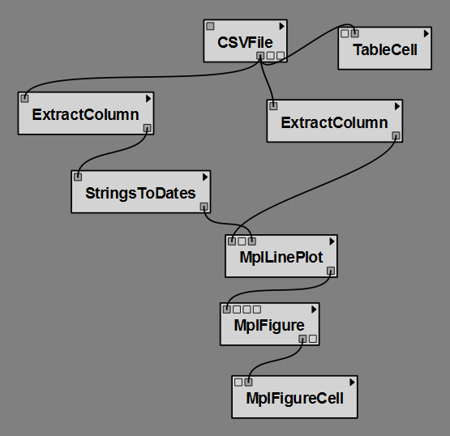
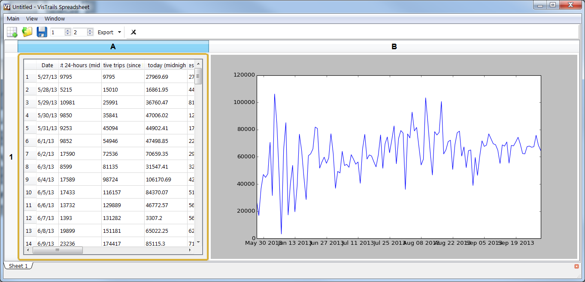

.. _chap-tabledata:

********************
Tabular data package
********************

The tabledata package provides facilities to load and manipulate data in table
formats.

It provides modules to read tables from CSV files and numpy arrays (including
plain binary files) and extract or convert columns.

.. topic:: Try it Now!

  This example shows how to use tabledata together with matplotlib to
  visualize trip data from `NYC Citibike's open data
  <http://www.citibikenyc.com/system-data>`_.

  Note that you can find the completed example here: :vtl:`bikes.vt`.

  Start by dragging the following modules to the canvas:

   * ``HTTPFile`` (from the HTTP package)
   * ``CSVFile`` (under ``read/csv``)
   * ``TableCell``
   * Two ``ExtractColumn`` modules
   * ``StringToDates`` (under ``convert/dates``)
   * ``MplLinePlot`` from the matplotlib package
   * ``MplFigure`` from the matplotlib package
   * ``MplFigureCell`` from the matplotlib package

  Connect the modules as shown in Figure :ref:`fig-tabledata-pipeline`.

.. _fig-tabledata-pipeline:

   The pipeline for the Bikes example

.. topic:: Next Step!

  Set the 'url' input of HTTPFile to ``http://www.vistrails.org/download/download.php?type=DATA&id=citibike_from_launch.csv``.
  Make sure 'header_present' is checked on CSVFile.

  Set the 'column_name' parameters on both ExtractColumn modules to ``Date`` (for the one on the left) and ``Miles traveled today (midnight to 11:59 pm)`` (for the one on the right). Alternatively, you can set column_index to 0 and 3.

  The workflow is now ready. On execution, you will see a graphical view of the
  CSV file as a table, and a line plot showing the variations of the total
  distance traveled daily.

.. _fig-tabledata-results:

   The result in the |vistrails| Spreadsheet
