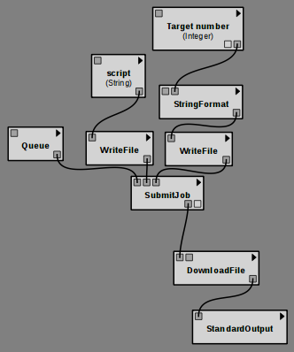

.. _chap-tej:

***********************************
Running commands on a remote server
***********************************

The ``tej`` tool provides a way to start job on any remote server through SSH, associate it with an identifier, and monitor its status. When the job is complete, it can download the resulting files through SCP.

In VisTrails, the subpipeline's signature is used as the job identifier. This means that once you have run your pipeline one and the job has been submitted, running it again will match it to the existing job, and will either wait for the job to complete or download the existing results without running it again.

Referencing a queue
===================

The first thing you need to do is setup a ``Queue`` module that indicates which server to connect to (and optionally, where on the filesystem should the jobs be stored).

No setup is required on the server (though VisTrails/tej needs to be able to connect to it via SSH, so you might want to setup public key authentication), the directory will be created on the server with the necessary structure and helpers.

Submitting a job
================

The ``SubmitJob`` module upload a job to a server if it doesn't exist there already (checking for the same subpipeline) and returns a Job object suitable for downloading its results. Regardless of whether the job is created or it already existed, VisTrails will wait for it to complete before carrying on executing your workflow; if you click "cancel" however, it will add the job to the job monitor and keep tabs on the server, alerting you when the job is done so you can resume executing the workflow.

The job is simply a directory that will be uploaded to the server, with a start.sh script that will be executed there (or whatever name is set on the ``script`` input port). Remember to use relative paths in there so that different jobs don't overwrite their files.

A different module, ``SubmitShellJob``, makes it easy to submit a job consisting of a single shell script that you can enter directory in the module configuration window. Its output (stdout, stderr) is downloaded and returned as files on the corresponding output ports.

Downloading output files
========================

You can connect SubmitJob's output to ``DownloadFile`` modules to retrieve generated files from the server and use them in the following steps of your pipeline. The module only needs a ``filename`` parameter, which is relative to the job's directory. The ``DownloadDirectory`` module works in the same way but downloads a whole subdirectory recursively.

Example
=======

In this example, we'll submit a simple Python script to a server via SSH. That script searches for the largest prime factor of a given number and prints it to the console.

..  topic:: Try it Now!

    First, create the Python script. You can use the ``String`` module, entering the script in the configuration widgets; connect it to a ``WriteFile`` module to get a file suitable for uploading.

    ::

        #!/usr/bin/env python
        with open('input') as fp:
            number = int(fp.read().strip())

        largest = None
        n = 2
        while n <= number:
            while number % n == 0:
                number /= n
            if number == 1:
                largest = n
                break
            n += 1

        with open('output', 'w') as fp:
            if largest is not None:
                fp.write("%d" % largest)

    As you can see, this script reads the target number from a file, ``input``, and writes the result to another file, ``output``. You can create the ``input`` file from an Integer using the ``StringFormat`` module (setting the `format` to ``{target}`` for example).

    Add a ``DownloadFile`` module to download ``output`` and print the file with ``StandardOutput`` for example.

    The end result should look like this :vtl:`(or open it from here) <tej-primes.vt>`:

Running it will start the job on the server. The job monitor window will pop up to indicate that it knows about the remote job, and that it is currently running. Clicking the "check" button or re-running the workflow will update the status, and eventually run the rest of the pipeline when the job is done, displaying the result.

Because the job identifier is computed from the signature of the subpipeline consisting of ``SubmitJob`` and its upstream modules, anyone running the same job on the same server will hit the same job, and will reuse your results without triggering a recomputation. But if you change the script, or choose a different target number to factorize, a new job will be submitted, that will not affect the result seen by other users and other workflows.

Setting up ssh keys
===================

tej requires the servers ssh key to be registered in ``known_hosts`` in a format supported by Paramiko.

If the key is missing, or in the wrong format, you will see something like::

    paramiko.SSHException: Unknown server 127.0.0.1

The easiest way to add the key is to connect with ssh and accept the prompt ("Are you sure you want to continue connecting?"); ssh will add the server to the known hosts automatically and you can disconnect.

If this does not work, the key used by SSH is probably in a format not supported by Paramiko (like ECDSA). To force using the RSA key (from `here <http://askubuntu.com/questions/133172/how-can-i-force-ssh-to-give-an-rsa-key-instead-of-ecdsa>`__)::

    ssh -o HostKeyAlgorithms=ssh-rsa -o FingerprintHash=md5 user@yourserver.com
