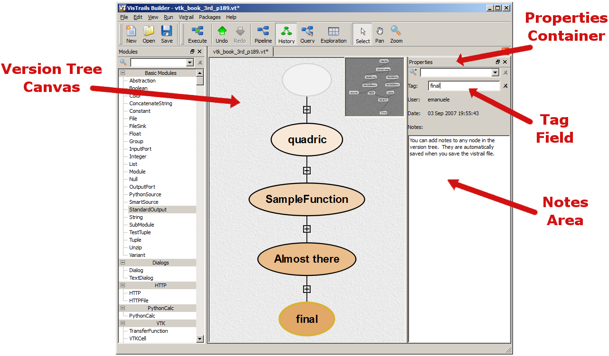
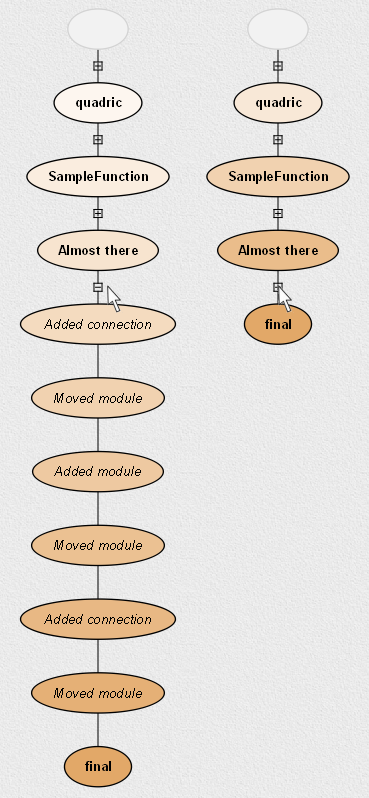
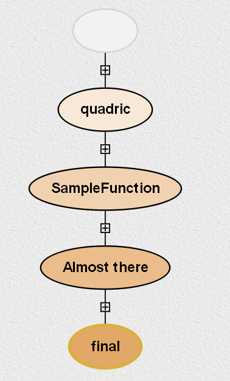
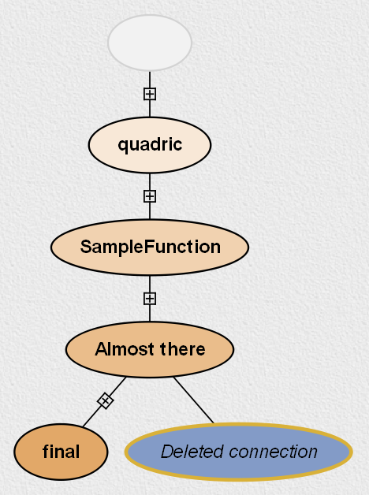
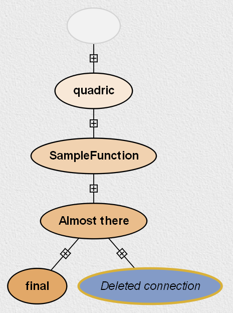
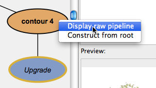
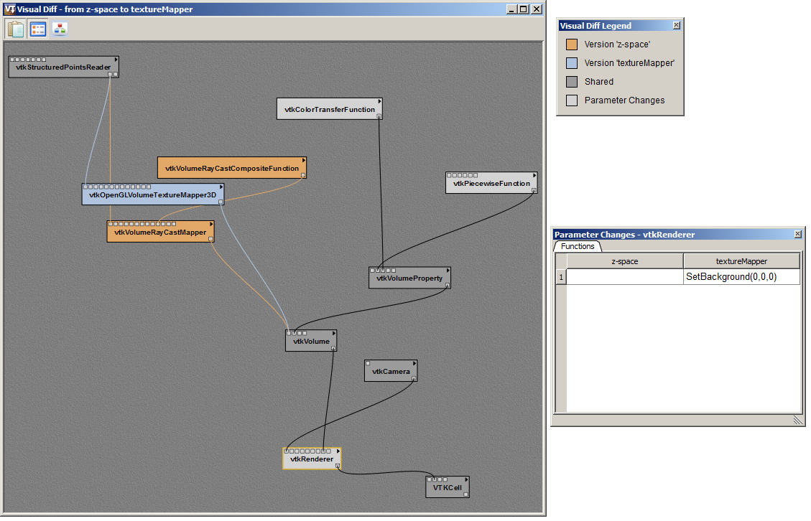

.. _chap-version_tree:

*********************************
Interacting with the Version Tree
*********************************

.. index:: versions

Version Tree View
=================

.. index::
   pair: versions;viewing
   single: history

The ``History`` button on the |vistrails| toolbar lets users interact with a workflow history. It consists of a tree view in the center and the ``Properties`` tool container on the right for querying and managing version properties  (see Figure :ref:`In History mode, you can examine... <fig-version_tree_screenshot_labeled>`). Versions are displayed as ellipses in the tree view where the root of the tree is displayed at the top of the view. The nodes of the tree correspond to a version of a workflow while an edge between two nodes indicates that one was derived from the other.

.. _fig-version_tree_screenshot_labeled:

   In ``History`` mode, you can examine and annotate different versions of a workflow.

.. %TODO hmm... what exactly is the scheme for when version nodes are visible or invisible under the "new regime"?

.. index:: tags

The nodes are displayed as colored ellipses, and are either blue or orange.  A blue color denotes that the corresponding version was created by the current user while orange nodes were created by other users.  The brightness of each node indicates how recently a version was created; brighter nodes were created more recently than dimmer ones.  Each node may also have a *tag* that describes the version, and this tag is displayed as a text label in the center of the ellipse of the corresponding version.

The nodes are connected by a solid line if the child node is a direct descendent of the parent node; that is, if you have made only a single change from the older version to the newer version. By default, only nodes that: are leaves, have more than one child node, are specially tagged (see Section :ref:`sec-adding_deleting_tags`), or are current version will be
displayed. To save space, other nodes will be "collapsed," or hidden from view.  Collapsed nodes are marked by the appearance of a small expansion button along an edge connecting two nodes. Clicking this button expands the
version tree to reveal the hidden versions (Figure :ref:`To conserve space... <fig-expand_collapse_versions>`). The tree expansion is smoothly
animated to help you maintain context from one view to the next. Clicking the button a second time collapses the nodes once again. Because most non-trivial changes to a workflow take more than one action, most edges in a the
version tree will be shown with these expansion buttons.

.. _fig-expand_collapse_versions:

   To conserve space, linear sequences of non-tagged nodes may be hidden from view.  They can be restored by clicking on the expansion button, which resembles a plus sign (+) inside a small box.

.. %All of the versions are connected to each other by either solid or
.. %broken lines. A solid line indicates that the child node is a direct
.. %descendant of the parent node, meaning the user has made only a single
.. %change from the older version to the newer version. Likewise, a broken
.. %line indicates that more than one change has been made, but the
.. %intermediate versions have not been tagged.  Because most non-trivial
.. %changes to a workflow take more than action, most edges in a the
.. %version tree will be shown as these broken lines.

.. topic:: Try it now!

   To see an example of a version tree, load the example vistrail "vtk\_book\_3rd\_p189.vt." All versions will be shown in orange unless your username happens to be "emanuele."  Recall that this tree displays the structure of changes to a workflow, so let's make some changes to see their effect on the version history. In the ``History`` view, select the node tagged ``Almost there``, and then click on the ``Pipeline`` button to switch to a view of the workflow.  Select a connection and delete it.  Now, switch back to the ``History`` view, and notice that there is a new child node connected to ``Almost there``.  In addition, the line connecting the new node to its parent is solid, indicating that only a single change has been made.  If we delete more connections, an expansion button would appear (Figures :ref:`All versions created..., Deleting a connection..., and More interations... <fig-creating_versions>`).

.. _fig-creating_versions:

.. _fig-creating_versions_A:

   All versions created by other users are shown in orange.

.. _fig-creating_versions_B:

   Deleting a connection results in a blue version connected by a solid line.

.. _fig-creating_versions_C:

   More interactions on this version cause additional versions to be created. To save space, these intermediate nodes are hidden, and an expansion button appears on the edge between the current node and the last tagged node.

.. _sec-adding_deleting_tags:

Adding and Deleting Tags
========================

.. index::
   pair: tags; adding
   pair: tags; deleting

.. %As noted above, only certain nodes, including specially tagged ones, are shown by default in the version tree.  To tag a version, simply add meaningful text to the tag text box in the ``Properties`` container and press 'Enter'.  If you would like to change the tag to different text, click in the same text box and modify the string, again hitting 'Enter' when finished.  Note that deleting all of the text in the tag field effectively deletes the tag.  A second way to delete a tag is to click the 'X' button to the right of the text box. Removing a tag from a node may cause it to not be displayed in the default version tree view if it doesn't satisfy any of the other criteria for display.

As noted above, only certain nodes, including specially tagged ones, are shown by default in the version tree.  To tag a version, simply 
click inside a selected node and type some meaningful text. The tag is created when you either click outside the node or press 'Enter'. If you would like to change the tag's text, click inside the node again and modify the text as before. 
(Alternately, you can also create and modify tags using the ``Tag`` text field in the ``Properties`` panel.)

Note that deleting all of the text in the tag field effectively deletes the tag. A second way to delete a tag is to click the 'X' button to the right of the text box. Removing a tag from a node may cause it to not be displayed in the default version tree view if it doesn't satisfy any of the other criteria for display.

Upgrading Versions
==================

.. index::
   pair: tags; upgrading

As module packages are continuously updated, with new versions being released periodically, VisTrails is set up to automatically incorporate module upgrades into existing workflows before they are executed.  In other words, VisTrails upgrades the current vistrail's current version after the execute button is pressed, but prior to execution.  When this happens, a new version is created in the version tree and tagged 'Upgrade'.  You are then free to rename this version if desired.   

After an upgrade, you will not be able to select the original version because the focus is passed to the upgraded version.  However, if you right-click on the original version and select 'Display raw pipeline', this version will keep the focus, which allows you to see its pipeline by pressing the ``Pipeline`` button on the toolbar.  See figure :ref:`Original Pipeline... <fig-raw-pipeline>`.

.. _fig-raw-pipeline:

   Original Pipeline - This figure shows how to view the original pipeline after an upgrade has occurred.

Finally, although VisTrails tags the new version with 'Upgrade' by default, some users prefer the original version's name to be transferred to the upgraded version.  VisTrails will do this if you: select ``Preferences`` from the ``VisTrails`` menu, select the ``Expert Configuration`` tab, and change the ``migrateTags`` value to 'True'. 

Adding Version Annotations
==========================

.. index::
   pair: versions; annotations
   single: notes

In addition to the tag field, the ``Properties`` panel displays information about the user who created the selected version
and when that version was created.  Also, the ``Notes`` field which allows users to store notes or annotations related to a version.  As with tags, adding notes to a version is as easy as selecting the desired version and modifying the text field.  Notes are
automatically saved when you save the vistrail file.  Finally, a thumbnail is displayed in the preview portion of the panel if the version has been successfully executed.

Navigating Versions
===================

.. index::
   pair: versions; navigating
   single: undo
   single: redo

Clicking on nodes in the version tree is not the only way to navigate different versions of a workflow; you can also use ``Undo`` (Ctrl-z) and ``Redo`` (Ctrl-Shift-z).  Because the version tree captures all changes to a workflow, undo and redo not only revert or reinstate changes to a workflow, but also change the currently selected version in the version tree.  More precisely, undoing a change in a workflow is exactly the same as selecting the parent of the current node in the version tree.  Note that because the current version is always shown in the version tree, undo and redo provide an effective way to navigate between two nodes whose intermediate versions might be currently hidden from view.

.. _sec-versions-diff:

Comparing Versions
==================

.. index::
   pair: versions; comparing
   single: visual diff; see versions, comparing
   single: diff; see versions, comparing

While selecting versions in the ``History`` view and using the ``Pipeline`` view to examine each version is extremely useful, this approach can be cumbersome when trying to compare two different versions.  To help with such a comparison, |vistrails| provides a ``Version Difference`` mechanism for quickly comparing two versions.  This is done by dragging one version and dropping it onto another, after which a ``Visual Diff`` tab will open (see Figure :ref:`A Visual Diff showing the difference... <fig-visual_diff>`). 

.. index::
   single: legend
   pair: parameters; differences

In the new tab, the difference is displayed in a manner that is very similar to the pipeline view, but modules and connections are colored based on similarity.  Dark gray indicates those modules and connections that are shared between the two versions; orange and blue show modules and connections that exist in one workflow and not the other; and light gray modules are those where parameters between the two versions differ.  The Legend, which is displayed in the ``Diff Properties`` panel on the right, will remind you of these color correspondences.  If the ``Diff Properties`` panel is not visible on the right, you may enable it by selecting ``Diff Properties`` under the ``View`` menu.  This panel also shows the differences in parameters for light gray colored modules that are selected.

.. _fig-visual_diff:

   A ``Visual Diff`` showing the difference between version ``z-space`` and version ``textureMapper``.

.. topic:: Try it now!

  To try out this feature, open the "lung.vt" example vistrail, and click the ``History`` button. Within the version tree, click and drag the ``z-space`` version to the ``textureMapper`` version.  After the diff appears, select ``View`` :math:`\rightarrow` ``Diff Properties`` (if the ``Diff Properties`` panel is not visible), and then click on the ``vtkRenderer`` module to see the parameter differences.  We can see that one of the changes from ``z-space`` to ``textureMapper`` was to add a black background. Figure :ref:`A Visual Diff showing the difference... <fig-visual_diff>` shows the result of this comparison.

.. index:: versions
